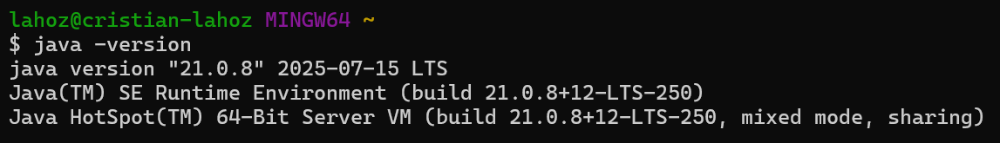
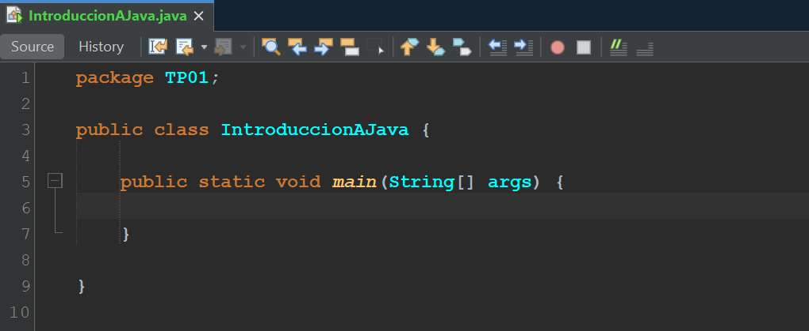
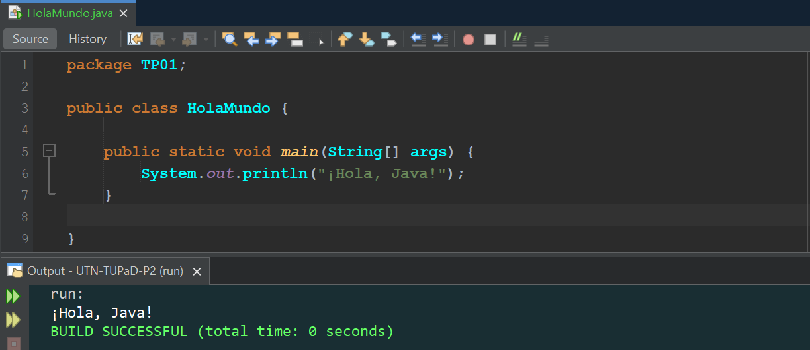
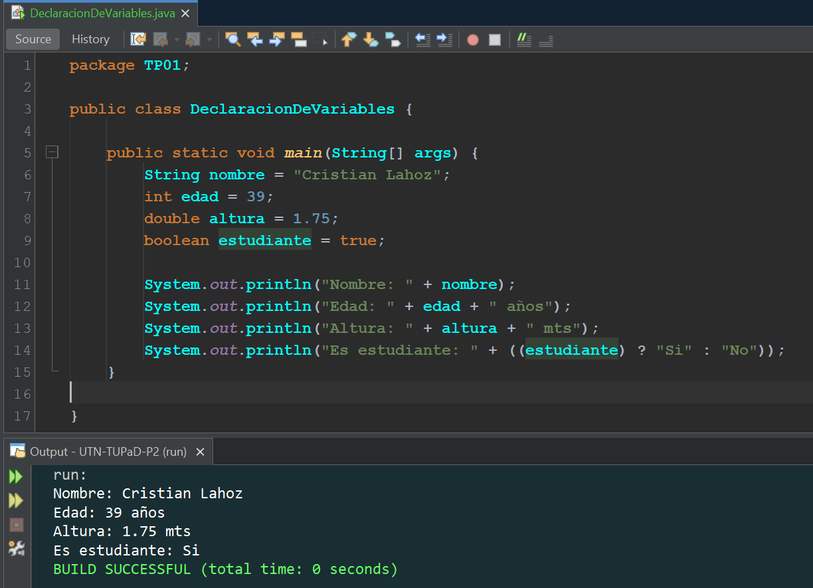
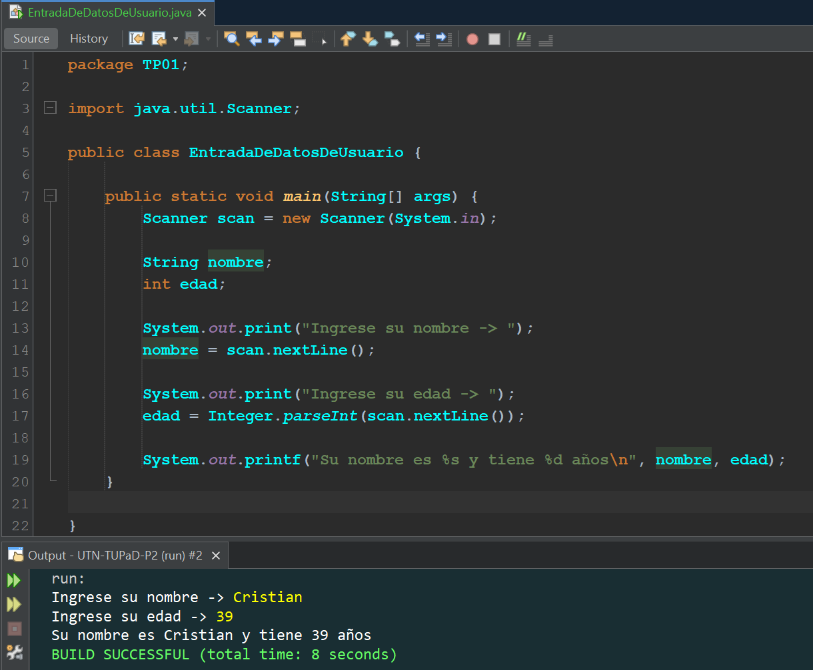
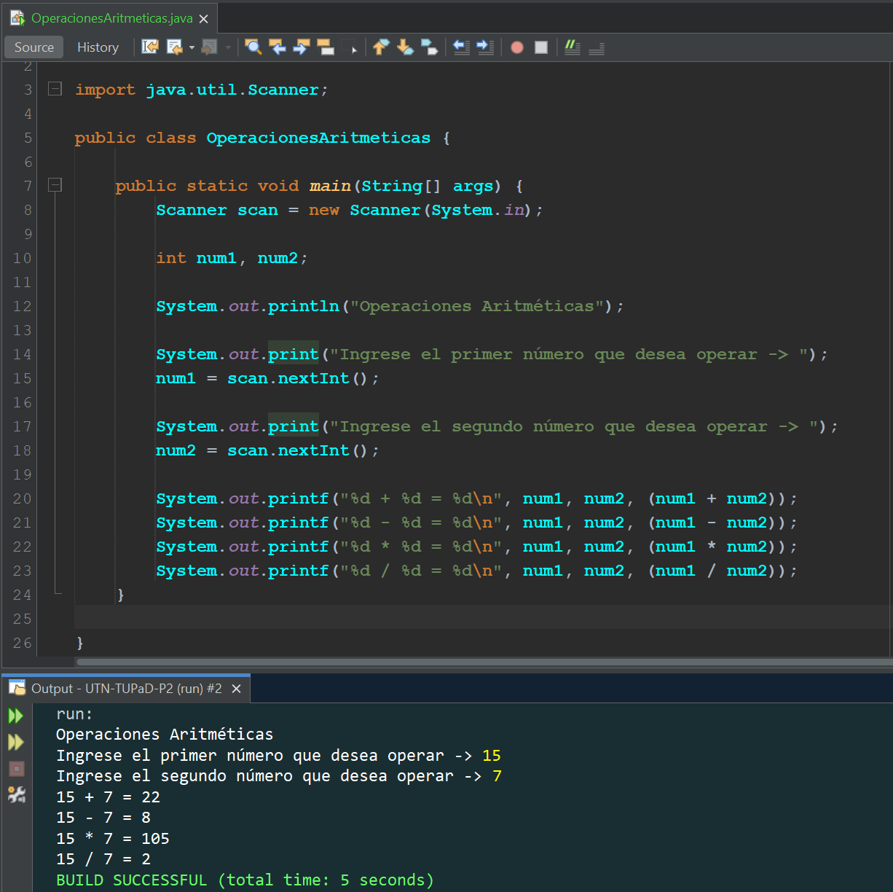
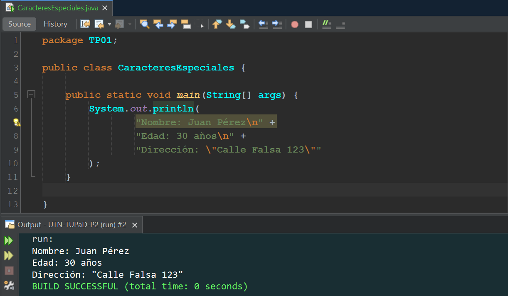
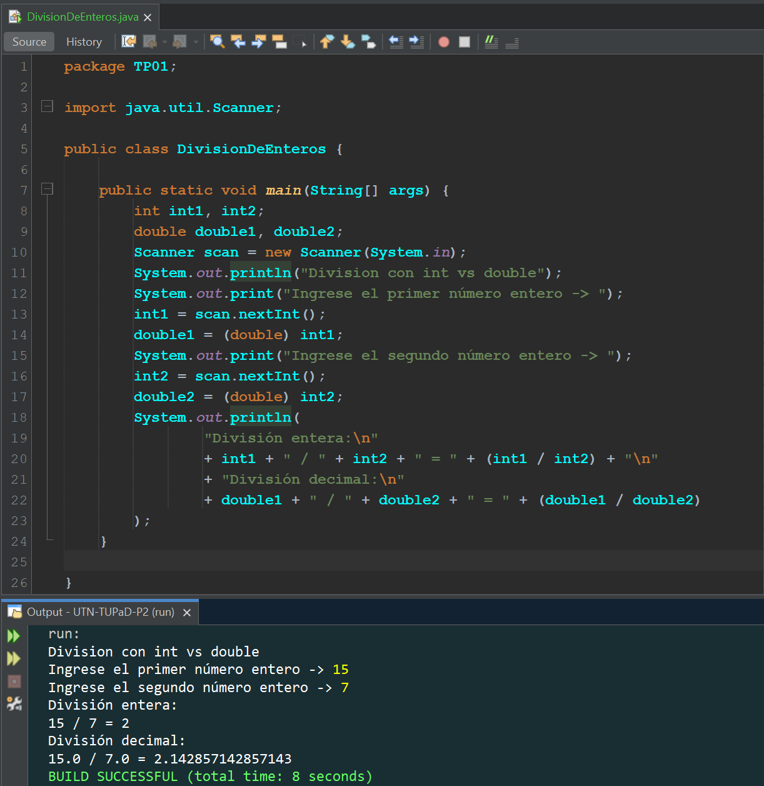

# TP01 - Introducción a Java

   [](https://github.com/m415x/UTN-TUPaD-P2/tree/main/src/TP01)

## ✨ Alumno

- **Nombre:** Cristian Daniel Lahoz Piantanida
- **Matrícula:** 101424
- **Comisión:** Ag25-2C 08

## 🎯 Objetivo general

Aplicar los conocimientos adquiridos sobre la instalación y configuración del entorno de desarrollo, manipulación de datos, operadores matemáticos y depuración de código en Java, mediante ejercicios prácticos introductorios.

---

## 📚 Marco teórico

| Concepto                      | Aplicación en el proyecto                                                |
| ----------------------------- | ------------------------------------------------------------------------ |
| Instalación y entorno         | Almacenan el conjunto de países                                          |
| Variables y tipos de datos    | Representan los datos de cada país (nombre, población, superficie, etc.) |
| Entrada y salida              | Separan las operaciones: carga, búsqueda, estadísticas, ordenamientos    |
| Operadores aritméticos        | Aplican filtros y validaciones según criterios                           |
| Caracteres especiales         | Permiten ordenar países por población, nombre, superficie, etc.          |
| Expresiones e instrucciones   | Permiten obtener indicadores clave del dataset                           |
| Tipos de datos y conversiones | Lectura del dataset desde un archivo CSV                                 |
| Debugging y errores comunes   | Identificación y corrección de errores de compilación                    |
| Pruebas de escritorio         | Análisis paso a paso de ejecución de código                              |

---

## 🧪 Caso práctico

El trabajo consiste en resolver una serie de ejercicios introductorios en Java que
permitan:

- Configurar correctamente el entorno de desarrollo (Java JDK y NetBeans).
- Crear programas básicos que imprimen mensajes en consola.
- Declarar variables de distintos tipos y manipular sus valores.
- Leer datos ingresados por el usuario usando Scanner.
- Realizar operaciones aritméticas básicas.
- Aplicar caracteres de escape para dar formato a la salida.
- Analizar diferencias entre expresiones e instrucciones.
- Detectar y corregir errores simples en el código.
- Comprender el comportamiento del lenguaje mediante pruebas de escritorio.

### 1. Verificar instalación del entorno

- Confirmar instalación de Java con `java –version`:
  
- Abrir NetBeans, crear nuevo proyecto y activar modo oscuro.
- Captura de pantalla del entorno configurado:
  

### 2. Programar "Hola Mundo"

- Crear clase `HolaMundo`.
- Imprimir en consola: `¡Hola, Java!`
- Captura de ejecución:
  

### 3. Declaración de variables

- Declarar y asignar valores:
  - `String nombre`
  - `int edad`
  - `double altura`
  - `boolean estudiante`
- Imprimir los valores en pantalla usando `System.out.println()`:
  

### 4. Entrada de datos del usuario

- Solicitar nombre y edad. Mostrar por consola usando `Scanner`:
  

### 5. Operaciones aritméticas

- Solicitar dos enteros y realizar:
  - Suma
  - Resta
  - Multiplicación
  - División
- Mostrar resultado en consola:
  

### 6. Formato con caracteres especiales

- Imprimir por consola:

  ```cmd
    Nombre: Juan Pérez
    Edad: 30 años
    Dirección: "Calle Falsa 123"
  ```

- Usar `\n` y `\"` en `System.out.println()`:
  

### 7. Expresiones e instrucciones

- Analizar este código y distinguir expresiones/instrucciones:

  ```java
    int x = 10;             // Instrucción (declaración y asignación)
    x = x + 5;              // Instrucción (asignación de una expresión)
    System.out.println(x);  // Instrucción (llamada a método)
  ```

- Explicar diferencia:
  - Expresión es cualquier fragmento de código que produce un valor. Puede estar sola o formar parte de una instrucción.
  - Instrucción es una línea de código que realiza una acción específica, como declarar una variable, asignar un valor o llamar a una función.

### 8. Conversión de tipos

- Dividir dos enteros ingresados.
- Repetir usando `double`:
  
- Comparar resultados: La división de enteros da como resultado un numero entero. La división de decimales (utilizando los mismos números) da como resultado un número decimal.

### 9. Corrección de errores

- Código con error:

  ```java
    import java.util.Scanner;

    public class ErrorEjemplo {

        public static void main(String[] args) {
            Scanner scanner = new Scanner(System.in);
            System.out.print("Ingresa tu nombre: ");
            String nombre = scanner.nextInt();          // ERROR
            System.out.println("Hola, " + nombre);
        }
    }
  ```

- Explicar el error y corregirlo: `scanner.nextInt()` lee un número entero, pero se está intentando guardar en una variable de tipo `String`, lo cual es incompatible. Además, no se espera que alguien ingrese un número como nombre. Para corregirlo se reemplazó `scanner.nextInt()` por `scanner.nextLine()`, que permite leer una línea completa de texto y es adecuado para leer nombres, frases, etc.

  ```java
    import java.util.Scanner;

    public class ErrorEjemplo {

        public static void main(String[] args) {
            Scanner scanner = new Scanner(System.in);
            System.out.print("Ingresa tu nombre: ");
            //String nombre = scanner.nextInt();        // ERROR
            String nombre = scanner.nextLine();         // CORREGIDO
            System.out.println("Hola, " + nombre);
        }
    }
  ```

### 10. Prueba de escritorio

- Analizar y completar ejecución del siguiente código:

  ```java
  1   public class PruebaEscritorio {
  2       public static void main(String[] args) {
  3           int a = 5;
  4           int b = 2;
  5           int resultado = a / b;
  6           System.out.println("Resultado: " + resultado);
  7       }
  8   }
  ```

  | Línea              | <center>int a</center> | <center>int b</center> | <center>int resultado</center> |
  | ------------------ | ---------------------- | ---------------------- | ------------------------------ |
  | <center>1</center> | <sin_definir>          | <sin_definir>          | <sin_definir>                  |
  | <center>2</center> | <sin_definir>          | <sin_definir>          | <sin_definir>                  |
  | <center>3</center> | <center>5</center>     | <sin_definir>          | <sin_definir>                  |
  | <center>4</center> | <center>5</center>     | <center>2</center>     | <sin_definir>                  |
  | <center>5</center> | <center>5</center>     | <center>2</center>     | <center>2</center>             |
  | <center>6</center> | <center>5</center>     | <center>2</center>     | <center>2</center>             |
  | <center>7</center> | <center>5</center>     | <center>2</center>     | <center>2</center>             |
  | <center>8</center> | <center>5</center>     | <center>2</center>     | <center>2</center>             |

---

## ✅ Conclusiones esperadas

- Reforzar conceptos fundamentales de Java.
- Familiarizarse con la estructura básica de un programa.
- Aprender a depurar errores comunes.
- Comprender conversiones de tipo y expresiones.
- Manejar entradas/salidas y variables.
- Usar NetBeans y herramientas de depuración.
