# TP02 - Programación Estructurada

   [](https://github.com/m415x/UTN-TUPaD-P2/tree/main/src/TP02)

## ✨ Alumno

- **Nombre:** Cristian Daniel Lahoz Piantanida
- **Matrícula:** 101424
- **Comisión:** Ag25-2C 08

## 🎯 Objetivo general

Desarrollar habilidades en programación estructurada en Java, abordando desde conceptos básicos como operadores y estructuras de control hasta temas avanzados como funciones, recursividad y estructuras de datos. Se busca fortalecer la capacidad de análisis y solución de problemas mediante un enfoque práctico.

---

## 📚 Marco teórico

| Concepto                      | Aplicación en el proyecto                           |
| ----------------------------- | --------------------------------------------------- |
| Estructuras condicionales     | Clasificación de edad, verificación de año bisiesto |
| Ciclos (for, while, do-while) | Repetición de ingreso de datos y cálculos           |
| Funciones                     | Cálculo modular de descuentos, envíos, stock        |
| Arrays                        | Gestión de precios de productos                     |
| Recursividad                  | Impresión recursiva de arrays                       |

---

## 🧪 Caso práctico

### Estructuras condicionales

#### 1. Verificación de Año Bisiesto

- Consigna:

  > Escribe un programa en Java que solicite al usuario un año y determine si es bisiesto. Un año es bisiesto si es divisible por 4, pero no por 100, salvo que sea divisible por 400.

- Código:

  ```java
    package TP02;
    import java.util.Scanner;
    public class VerificarAnioBisiesto {
        public static void main(String[] args) {
            int anio;
            Scanner scan = new Scanner(System.in);
            System.out.print("Ingrese un año: ");
            anio = scan.nextInt();
            if ((anio % 4 == 0) && (anio % 100 != 0 || anio % 400 == 0)) {
                System.out.printf("El año %d es bisiesto\n", anio);
            } else {
                System.out.printf("El año %d no es bisiesto\n", anio);
            }
        }
    }
  ```

- Captura de ejecución:

  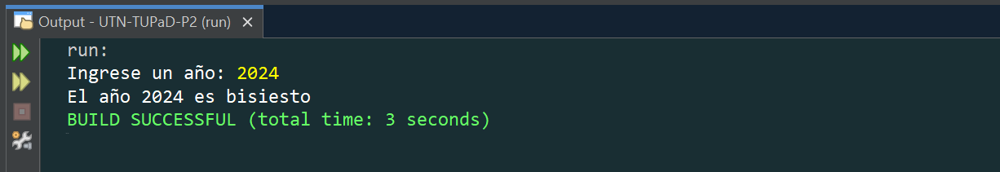
  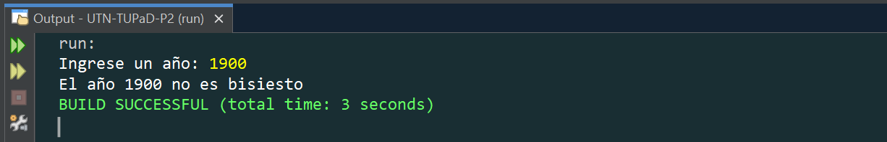

#### 2. Determinar el Mayor de Tres Números

- Consigna:

  > Escribe un programa en Java que pida al usuario tres números enteros y determine cuál es el mayor.

- Código:

  ```java
    package TP02;
    import java.util.Scanner;
    public class MayorDeTresNumeros {
        public static void main(String[] args) {
            int num1, num2, num3;
            Scanner scan = new Scanner(System.in);
            System.out.print("Ingrese el primer número: ");
            num1 = scan.nextInt();
            System.out.print("Ingrese el segundo número: ");
            num2 = scan.nextInt();
            System.out.print("Ingrese el tercer número: ");
            num3 = scan.nextInt();
            if (num1 > num2 && num1 > num3) {
                System.out.println("El mayor es: " + num1);
            } else if (num2 > num1 && num2 > num3) {
                System.out.println("El mayor es: " + num2);
            } else {
                System.out.println("El mayor es: " + num3);
            }
        }
    }
  ```

- Captura de ejecución:

  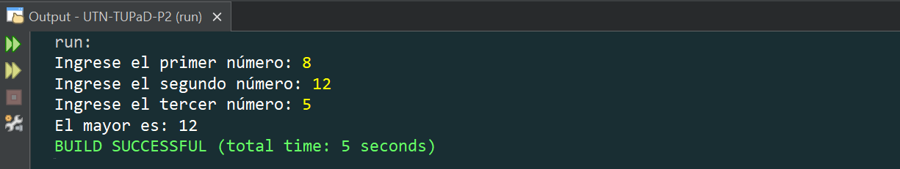

#### 3. Clasificación de Edad

- Consigna:

  > Escribe un programa en Java que solicite al usuario su edad y clasifique su etapa de vida según la siguiente tabla:
  >
  > | Rango              | Clasificación  |
  > | ------------------ | -------------- |
  > | Menor de 12 años   | "Niño"         |
  > | Entre 12 y 17 años | "Adolescente"  |
  > | Entre 18 y 59 años | "Adulto"       |
  > | 60 años o más      | "Adulto mayor" |

- Código:

  ```java
    package TP02;
    import java.util.Scanner;
    public class ClasificarEdad {
        public static void main(String[] args) {
            int edad;
            Scanner scan = new Scanner(System.in);
            System.out.print("Ingrese su edad: ");
            if (edad < 12) {
                System.out.println("Eres un Niño");
            } else if (edad >= 12 && edad <= 17) {
                System.out.println("Eres un Adolescente");
            } else if (edad >= 18 && edad <= 59) {
                System.out.println("Eres un Adulto");
            } else if (edad >= 60) {
                System.out.println("Eres un Adulto mayor");
            }
        }
    }
  ```

- Captura de ejecución:

  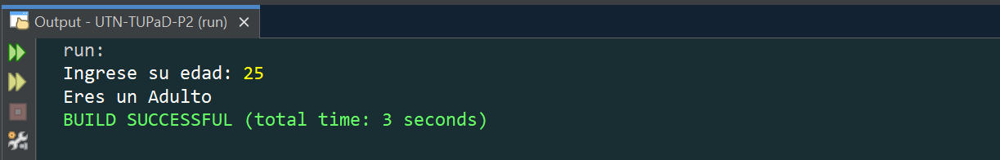
  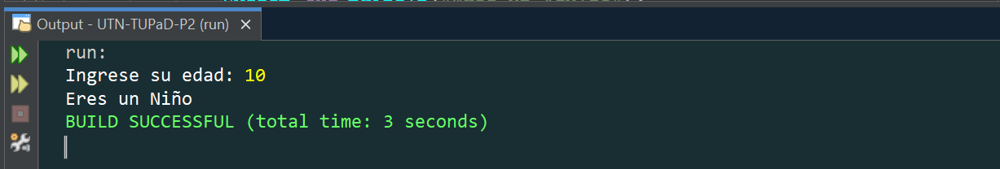

#### 4. Calculadora de Descuento según Categoría

- Consigna:

  > Escribe un programa que solicite al usuario el precio de un producto y su categoría (A, B o C).
  > Luego, aplique los siguientes descuentos:
  >
  > | Categoría | Descuento |
  > | --------- | --------- |
  > | A         | 10%       |
  > | B         | 15%       |
  > | C         | 20%       |
  >
  > El programa debe mostrar el precio original, el descuento aplicado y el precio final

- Código:

  ```java
    package TP02;
    import java.util.Scanner;
    public class CalculadoraDeDescuento {
        public static void main(String[] args) {
            double precio, precioFinal;
            char categoria;
            String descuentoAplicado;
            Scanner scan = new Scanner(System.in);
            System.out.print("Ingrese el precio del producto: ");
            precio = Double.parseDouble(scan.nextLine());
            System.out.print("Ingrese la categoría del producto (A, B o C): ");
            categoria = scan.next().charAt(0);
            switch (categoria) {
                case 'A':
                    descuentoAplicado = "10%";
                    precioFinal = precio * 0.9;
                    break;
                case 'B':
                    descuentoAplicado = "15%";
                    precioFinal = precio * 0.85;
                    break;
                case 'C':
                    descuentoAplicado = "20%";
                    precioFinal = precio * 0.8;
                    break;
                default:
                    System.out.println("Categoría incorrecta!");
                    descuentoAplicado = "Ninguno";
                    precioFinal = precio;
            }
            System.out.println("Descuento aplicado: " + descuentoAplicado);
            System.out.println("Precio final: " + precioFinal);
        }
    }
  ```

- Captura de ejecución:

  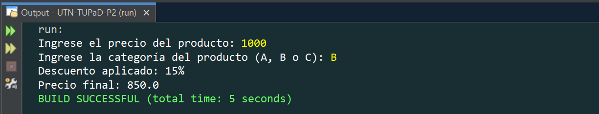

---

### Estructuras de repetición

#### 5. Suma de Números Pares (while)

- Consigna:

  > Escribe un programa que solicite números al usuario y sume solo los números pares. El ciclo debe continuar hasta que el usuario ingrese el número 0, momento en el que se debe mostrar la suma total de los pares ingresados.

- Código:

  ```java
    package TP02;
    import java.util.Scanner;
    public class SumaDeNumerosPares {
        public static void main(String[] args) {
            int num, suma = 0;
            Scanner scan = new Scanner(System.in);
            System.out.print("Ingrese un número (0 para terminar): ");
            num = scan.nextInt();
            while(num != 0){
                if (num % 2 == 0) suma += num;
                System.out.print("Ingrese un número (0 para terminar): ");
                num = scan.nextInt();
            }
            System.out.println("La suma de los números pares es: " + suma);
        }
    }
  ```

- Captura:

  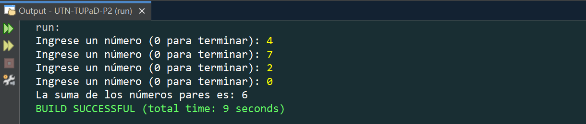

#### 6. Contador de Positivos, Negativos y Ceros (for)

- Consigna:

  > Escribe un programa que pida al usuario ingresar 10 números enteros y cuente cuántos son positivos, negativos y cuántos son ceros.

- Código:

  ```java
    package TP02;
    import java.util.Scanner;
    public class ContadorPositivosNegativosYCeros {
        public static void main(String[] args) {
            int num, contPos = 0, contNeg = 0, cont0 = 0;
            Scanner scan = new Scanner(System.in);
            for (int i = 0; i < 10; i++) {
                System.out.print("Ingrese el número " + (i + 1) + ": ");
                num = scan.nextInt();
                if (num > 0) {
                    contPos++;
                } else if (num < 0) {
                    contNeg++;
                } else {
                    cont0++;
                }
            }
            System.out.printf(
                    "Resultados:\n"
                    + "Positivos: %d\n"
                    + "Negativos: %d\n"
                    + "Ceros: %d\n",
                    contPos, contNeg, cont0
            );
        }
    }
  ```

- Captura:

  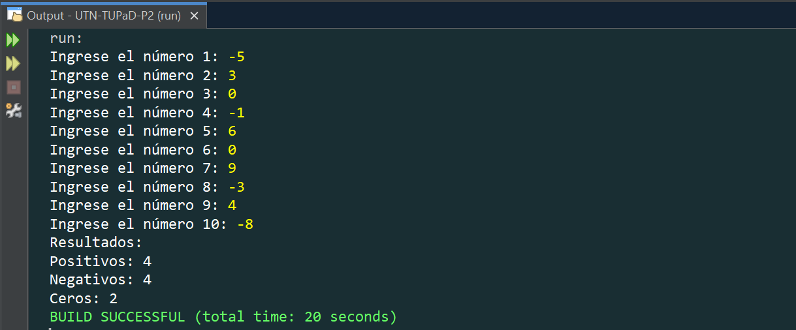

#### 7. Validación de Nota entre 0 y 10 (do-while)

- Consigna:

  > Escribe un programa que solicite al usuario una nota entre 0 y 10. Si el usuario ingresa un número fuera de este rango, debe seguir pidiéndole la nota hasta que ingrese un valor válido.

- Código:

  ```java
    package TP02;
    import java.util.Scanner;
    public class ValidarNota {
        public static void main(String[] args) {
            int nota;
            Scanner scan = new Scanner(System.in);
            do {
                System.out.print("Ingrese una nota (0-10): ");
                nota = scan.nextInt();
                if (nota < 0 || nota > 10) {
                    System.out.println("Error: Nota inválida. Ingrese una nota "
                            + "entre 0 y 10.");
                } else {
                    System.out.println("Nota guardada correctamente.");
                }
            } while (nota < 0 || nota > 10);
        }
    }
  ```

- Captura:

  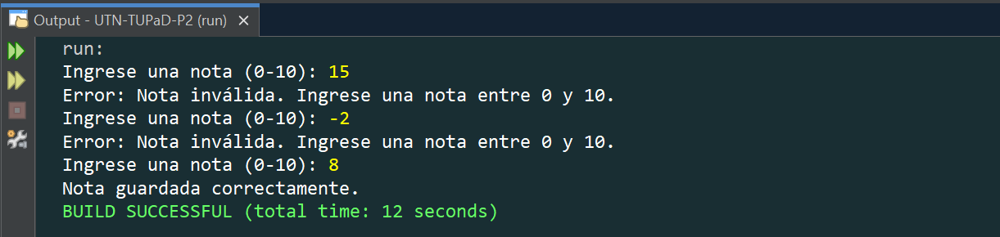

---

### Funciones

#### 8. Cálculo del Precio Final con Impuesto y Descuento

- Consigna:

  > Crea un método `calcularPrecioFinal(double impuesto, double descuento)` que calcule el precio final de un producto en un e-commerce. La fórmula es:
  > `PrecioFinal = PrecioBase + (PrecioBase * Impuesto) − (PrecioBase * Descuento)`
  > Desde `main()`, solicita el precio base del producto, el porcentaje de impuesto y el porcentaje de descuento, llama al método y muestra el precio final.

- Código:

  ```java
    package TP02;
    import java.util.Scanner;
    public class CalcularPrecioFinal {
      public static void main(String[] args) {
          double precio, impuesto, descuento;
          Scanner scan = new Scanner(System.in);
          System.out.print("Ingrese el precio base del producto: ");
          precio = scan.nextDouble();
          System.out.print("Ingrese el impuesto en porcentaje "
                  + "(Ejemplo: 10 para 10%): ");
          impuesto = scan.nextDouble();
          System.out.print("Ingrese el descuento en porcentaje "
                  + "(Ejemplo: 5 para 5%): ");
          descuento = scan.nextDouble();
          System.out.println("El precio final del producto es: "
                  + calcularPrecioFinal(precio, impuesto, descuento));
      }
      /**
      * Método que solicita el precio base del producto, el porcentaje de
      * impuesto y el porcentaje de descuento, retorna el precio final calculado.
      *
      * @param precioBase
      * @param impuesto
      * @param descuento
      * @return precio final
      */
      public static double calcularPrecioFinal(
            double precioBase,
            double impuesto,
            double descuento
      ) {
          double precioFinal;
          precioFinal = precioBase
                  + (precioBase * impuesto / 100)
                  - (precioBase * descuento / 100);
          return precioFinal;
      }
    }
  ```

- Captura:

  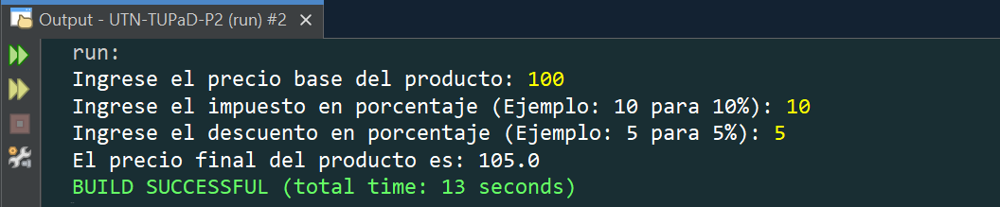

#### 9. Costo de Envío y Total de Compra

- Consigna:

  > a. `calcularCostoEnvio(double peso, String zona)`: Calcula el costo de envío basado en la zona de envío (Nacional o Internacional) y el peso del paquete.
  >
  > | Zona          | Costo      |
  > | ------------- | ---------- |
  > | Nacional      | $5 por kg  |
  > | Internacional | $10 por kg |
  >
  > b. `calcularTotalCompra(double precioProducto, double costoEnvio)`: Usa `calcularCostoEnvio` para sumar el costo del producto con el costo de envío.
  > Desde `main()`, solicita el peso del paquete, la zona de envío y el precio del producto. Luego, muestra el total a pagar.

- Código:

  ```java
    package TP02;
    import java.util.Scanner;
    public class CalcularCostoEnvioYTotalCompra {
        public static void main(String[] args) {
            double peso = 1, precio = 0, envio;
            String zona = "";
            Scanner scan = new Scanner(System.in);
            System.out.print("Ingrese el precio del producto: ");
            precio = Double.parseDouble(scan.nextLine());
            System.out.print("Ingrese el peso del paquete en kg: ");
            peso = Double.parseDouble(scan.nextLine());
            System.out.print("Ingrese la zona de envío (Nacional/Internacional): ");
            zona = scan.nextLine();
            envio = calcularCostoEnvio(peso, zona);
            System.out.println("El costo de envío es: " + envio);
            System.out.println("El total a pagar es: "
                    + calcularTotalCompra(precio, envio));
        }
        /**
        * Método que calcula el costo de envío basado en la zona de envío
        * (Nacional o Internacional) y el peso del paquete.
        *
        * @param peso
        * @param zona
        * @return costo de envío por peso según zona
        */
        public static double calcularCostoEnvio(double peso, String zona) {
            return (zona.equalsIgnoreCase("Nacional")) ? 5 * peso : 10 * peso;
        }
        /**
        * Método que calcula el total a pagar por el producto.
        * @param precioProducto
        * @param costoEnvio
        * @return total a pagar
        */
        public static double calcularTotalCompra(
                double precioProducto,
                double costoEnvio
        ) {
            return precioProducto + costoEnvio;
        }
    }
  ```

- Captura:

  

#### 10. Actualización de Stock a partir de venta y recepción de productos

- Consigna:

  > Crea un método `actualizarStock(int stockActual, int cantidadVendida, int cantidadRecibida)`, que calcule el nuevo stock después de una venta y recepción de productos:
  > `NuevoStock = StockActual − CantidadVendida + CantidadRecibida`.
  > `NuevoStock = CantidadVendida + CantidadRecibida`.
  > Desde `main()`, solicita al usuario el stock actual, la cantidad vendida y la cantidad recibida, y muestra el stock actualizado.

- Código:

  ```java
    package TP02;
    import java.util.Scanner;
    public class ActualizarStock {
        public static void main(String[] args) {
            int stock, vendido, recibido;
            Scanner scan = new Scanner(System.in);
            System.out.print("Ingrese el stock actual del producto: ");
            stock = scan.nextInt();
            System.out.print("Ingrese la cantidad vendida: ");
            vendido = scan.nextInt();
            System.out.print("Ingrese la cantidad recibida: ");
            recibido = scan.nextInt();
            System.out.println("El nuevo stock del producto es: "
                    + actualizarStock(stock, vendido, recibido));
        }
        /**
        * Método que calcula el nuevo stock después de una venta y recepción de
        * productos.
        *
        * @param stockActual
        * @param cantidadVendida
        * @param cantidadRecibida
        * @return cantidad de unidades disponibles después de actualizar el stock
        */
        public static int actualizarStock(
                int stockActual,
                int cantidadVendida,
                int cantidadRecibida
        ) {
            return stockActual - cantidadVendida + cantidadRecibida;
        }
    }
  ```

- Captura:

  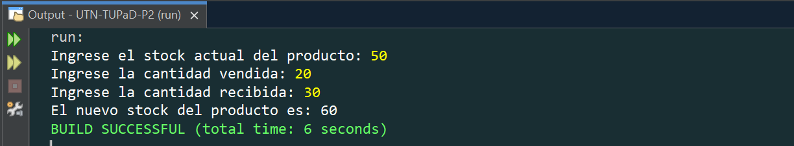

#### 11. Cálculo de Descuento Especial

- Consigna:

  > Declara una variable global `double descuentoEspecial = 0.10`. Luego, crea un método `calcularDescuentoEspecial(double precio)` que use la variable global para calcular el descuento especial del 10%.
  > Dentro del método, declara una variable local `descuentoAplicado`, almacena el valor del descuento y muestra el precio final con descuento.

- Código:

  ```java
    package TP02;
    import java.util.Scanner;
    public class CalcularDescuentoEspecial {
        public static double descuentoEspecial = 0.10;
        public static void main(String[] args) {
            double precio;
            Scanner scan = new Scanner(System.in);
            System.out.print("Ingrese el precio del producto: ");
            precio = scan.nextDouble();
            calcularDescuentoEspecial(precio);
        }
        /**
        * Método que calcula y muestra el descuento especial y el precio final.
        *
        * @param precio
        */
        public static void calcularDescuentoEspecial(double precio) {
            double descuentoAplicado = precio * descuentoEspecial;
            double precioFinal = precio - descuentoAplicado;
            System.out.println("El descuento especial aplicado es: "
                    + descuentoAplicado);
            System.out.println("El precio final con descuento es: "
                    + precioFinal);
        }
    }
  ```

- Captura:

  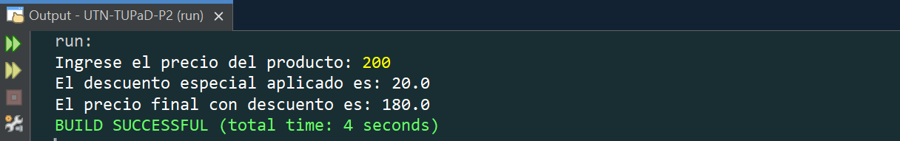

---

### Arrays y Recursividad

#### 12. Modificación de un Array de Precios

- Consigna:

  > Crea un programa que:
  > a. Declare e inicialice un array con los precios de algunos productos.
  > b. Muestre los valores originales de los precios.
  > c. Modifique el precio de un producto específico.
  > d. Muestre los valores modificados.

- Código:

  ```java
    package TP02;
    public class ModificarArrayDePrecios {
        public static void main(String[] args) {
            double[] precios = {199.99, 299.5, 149.75, 399, 89.99};
            System.out.println("Precios originales:");
            mostrarPrecios(precios);
            precios[2] = 129.99;
            System.out.println("Precios modificados:");
            mostrarPrecios(precios);
        }
        /**
        * Método que muestra los precios almacenados en un array.
        *
        * @param precios
        */
        public static void mostrarPrecios(double[] precios) {
            for (double precio : precios) {
                System.out.println("Precio: $" + precio);
            }
        }
    }
  ```

- Captura:

  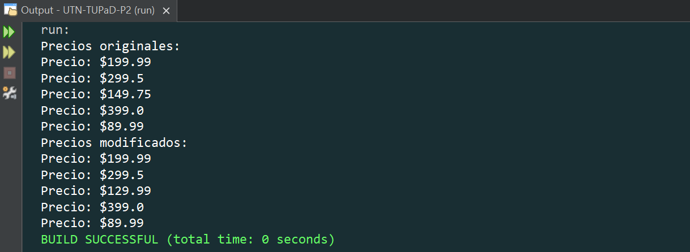

- Conceptos Clave Aplicados:
  ✔ Uso de arrays (double[]) para almacenar valores.
  ✔ Recorrido del array con for-each para mostrar valores.
  ✔ Modificación de un valor en un array mediante un índice.
  ✔ Reimpresión del array después de la modificación.

#### 13. Impresión Recursiva de Arrays

- Consigna:

  > Crea un programa que:
  > a. Declare e inicialice un array con los precios de algunos productos.
  > b. Use una función recursiva para mostrar los precios originales.
  > c. Modifique el precio de un producto específico.
  > d. Use otra función recursiva para mostrar los valores modificados.

- Código:

  ```java
    package TP02;
    public class ImpresionRecursiva {
        public static void main(String[] args) {
            double[] precios = {199.99, 299.5, 149.75, 399, 89.99};
            System.out.println("Precios originales:");
            mostrarPreciosRecursivamente(precios, 0);
            precios[2] = 129.99;
            System.out.println("Precios modificados:");
            mostrarPreciosRecursivamente(precios, 0);
        }
        /**
        * Método recursivo para mostrar los precios de un array.
        *
        * @param precios
        * @param indice
        */
        public static void mostrarPreciosRecursivamente(
                double[] array,
                int indice
        ) {
            // Caso base
            if (indice >= array.length) return;
            System.out.println("Precio: $" + array[indice]);
            // Llamada recursiva
            mostrarPreciosRecursivamente(array, indice + 1);
        }
    }
  ```

- Captura:

  

- Conceptos Clave Aplicados:
  ✔ Uso de arrays (double[]) para almacenar valores.
  ✔ Recorrido del array con una función recursiva en lugar de un bucle.
  ✔ Modificación de un valor en un array mediante un índice.
  ✔ Uso de un índice como parámetro en la recursión para recorrer el
  array.

---

## ✅ Conclusiones esperadas

- Aplicar estructuras de control y decisión para resolver problemas.
- Diseñar soluciones usando estructuras iterativas y condicionales.
- Modularizar el código utilizando funciones con y sin retorno.
- Utilizar arrays para almacenamiento y manipulación de datos.
- Comprender y aplicar la recursividad en casos simples.
- Trabajar con variables locales y globales de forma adecuada.
- Fortalecer la capacidad de análisis lógico y la resolución de errores.
- Consolidar el uso del lenguaje Java mediante la práctica estructurada.
