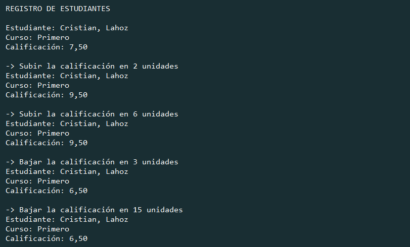
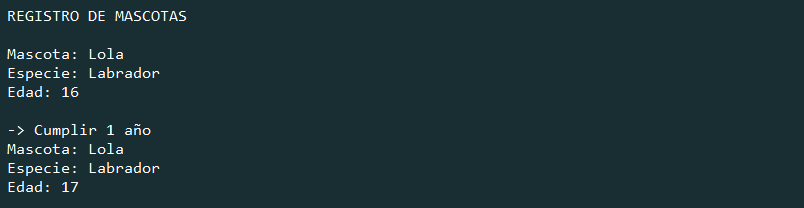
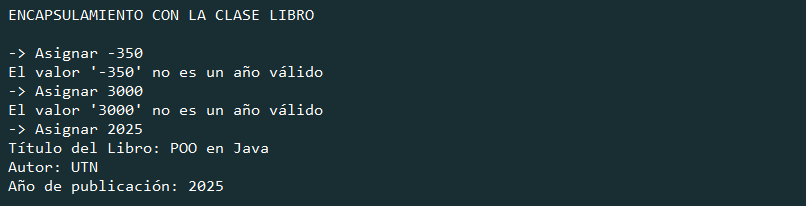
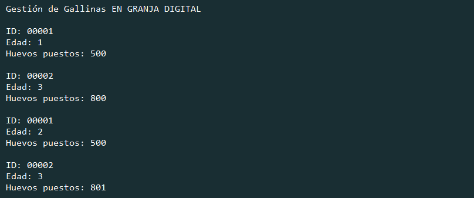
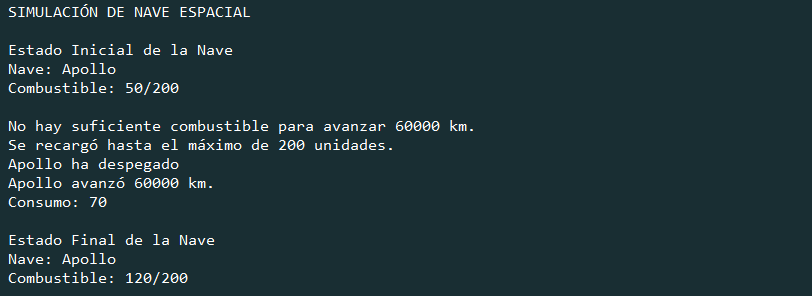

# TP03 - Introducción a la Programación Orientada a Objetos

   [](https://github.com/m415x/UTN-TUPaD-P2/tree/main/src/TP03)

## ✨ Alumno

- **Nombre:** Cristian Daniel Lahoz Piantanida
- **Matrícula:** 101424
- **Comisión:** Ag25-2C 08

## 🎯 Objetivo general

Comprender los fundamentos de la Programación Orientada a Objetos, incluyendo clases, objetos, atributos y métodos, para estructurar programas de manera modular y reutilizable en Java.

---

## 📚 Marco teórico

| Concepto                | Aplicación en el proyecto                                                     |
| ----------------------- | ----------------------------------------------------------------------------- |
| Clases y Objetos        | Modelado de entidades como Estudiante, Mascota, Libro, Gallina y NaveEspacial |
| Atributos y Métodos     | Definición de propiedades y comportamientos para cada clase                   |
| Estado e Identidad      | Cada objeto conserva su propio estado (edad, calificación, combustible, etc.) |
| Encapsulamiento         | Uso de modificadores de acceso y getters/setters para proteger datos          |
| Modificadores de acceso | Uso de private, public y protected para controlar visibilidad                 |
| Getters y Setters       | Acceso controlado a atributos privados mediante métodos                       |
| Reutilización de código | Definición de clases reutilizables en múltiples contextos                     |

---

## 🧪 Caso práctico

### 1. Registro de Estudiantes

- Consigna:

  > Crear una clase `Estudiante` con atributos `nombre`, `apellido`, `curso`, `calificación`.  
  > Métodos: `mostrarInfo()`, `subirCalificacion(puntos)`, `bajarCalificacion(puntos)`.  
  > Tarea: Instanciar un estudiante, mostrar info, aumentar y disminuir calificaciones.

- Código:

  ```java
    package TP03;
    public class Main {
        public static void main(String[] args) {
            System.out.println("\nRegistro de estudiantes\n".toUpperCase());
            // Instanciar la clase Estudiante
            Estudiante estudiante = new Estudiante();
            // Asignar valores a los atributos
            estudiante.nombre = "Cristian";
            estudiante.apellido = "Lahoz";
            estudiante.curso = "Primero";
            estudiante.calificacion = 7.5;
            // Mostrar estado
            estudiante.mostrarInfo();
            // Modificar estado a través de métodos y mostrarlos
            System.out.println("-> Subir la calificación en 2 unidades");
            estudiante.subirCalificacion(2);
            estudiante.mostrarInfo();
            System.out.println("-> Subir la calificación en 6 unidades");
            estudiante.subirCalificacion(6);
            estudiante.mostrarInfo();
            System.out.println("-> Bajar la calificación en 3 unidades");
            estudiante.bajarCalificacion(3);
            estudiante.mostrarInfo();
            System.out.println("-> Bajar la calificación en 15 unidades");
            estudiante.bajarCalificacion(15);
            estudiante.mostrarInfo();
        }
    }
    public class Estudiante {
        // Atributos de la clase
        String nombre;
        String apellido;
        String curso;
        double calificacion;
        // Métodos de la clase
        public void mostrarInfo() {
            System.out.printf(
                    "Estudiante: %s, %s\n"
                    + "Curso: %s\n"
                    + "Calificación: %.2f\n\n",
                    apellido, nombre, curso, calificacion
            );
        }
        public void subirCalificacion(double puntos) {
            if (puntos > 0 && (puntos + calificacion) <= 10) {
                calificacion += puntos;
            }
        }
        public void bajarCalificacion(double puntos) {
            if (puntos > 0 && calificacion >= puntos) {
                calificacion -= puntos;
            }
        }
    }
  ```

- Captura de ejecución:



### 2. Registro de Mascotas

- Consigna:

> Clase `Mascota` con atributos `nombre`, `especie`, `edad`.
> Métodos: `mostrarInfo()`, `cumplirAnios()`.
> Tarea: Crear mascota, mostrar info, simular paso del tiempo y verificar cambios.

- Código:

  ```java
    package TP03;
    public class Main {
        public static void main(String[] args) {
            System.out.println("\nRegistro de mascotas\n".toUpperCase());
            // Instanciar la clase Mascota
            Mascota perro = new Mascota();
            // Asignar valores a los atributos
            perro.nombre = "Lola";
            perro.especie = "Labrador";
            perro.edad = 16;
            // Mostrar estado
            perro.mostrarInfo();
            // Modificar estado a través de métodos y mostrarlos
            System.out.println("-> Cumplir 1 año");
            perro.cumplirAnios();
            perro.mostrarInfo();
        }
    }
    public class Mascota {
        // Atributos de la clase
        String nombre;
        String especie;
        int edad;
        // Métodos de la clase
        public void mostrarInfo() {
            System.out.printf(
                    "Mascota: %s\n"
                    + "Especie: %s\n"
                    + "Edad: %d\n\n",
                    nombre, especie, edad
            );
        }
        public void cumplirAnios() {
            edad ++;
        }
    }
  ```

- Captura de ejecución:

  

### 3. Encapsulamiento con la Clase Libro

- Consigna:

  > Clase Libro con atributos privados `titulo`, `autor`, `anioPublicacion`.
  > Métodos: Getters para todos los atributos y Setter con validación para anioPublicacion.
  > Tarea: Crear libro, intentar modificar con año inválido y luego válido, mostrar info final.

- Código:

  ```java
    package TP03;
    public class Main {
        public static void main(String[] args) {
            System.out.println(
                    "\nEncapsulamiento con la Clase Libro\n".toUpperCase()
            );
            // Instanciar la clase Libro
            Libro libro = new Libro();
            // Asignar valores a los atributos
            System.out.println("-> Asignar -350");
            libro.setAnioPublicacion(-350);
            System.out.println("-> Asignar 3000");
            libro.setAnioPublicacion(3000);
            System.out.println("-> Asignar 2025");
            libro.setAnioPublicacion(2025);
            System.out.printf(
                    "Título del Libro: %s\n"
                    + "Autor: %s\n"
                    + "Año de publicación: %d\n\n",
                    libro.getTitulo(),
                    libro.getAutor(),
                    libro.getAnioPublicacion()
            );
        }
    }
    public class Libro {
        // Atributos privados de la clase
        private String titulo = "POO en Java";
        private String autor = "UTN";
        private int anioPublicacion;
        // Getters de la clase
        public String getTitulo() {
            return titulo;
        }
        public String getAutor() {
            return autor;
        }
        public int getAnioPublicacion() {
            return anioPublicacion;
        }
        // Setter de la clase
        public void setAnioPublicacion(int anioPublicacion) {
            if (anioPublicacion > 0 && anioPublicacion <= 2025) {
                this.anioPublicacion = anioPublicacion;
            } else {
                System.out.printf(
                        "El valor '%d' no es un año válido\n", anioPublicacion
                );
            }
        }
    }
  ```

- Captura de ejecución:

  

### 4. Gestión de Gallinas en Granja Digital

- Consigna:

  > Clase `Gallina` con atributos `idGallina`, `edad`, `huevosPuestos`.
  > Métodos: `ponerHuevo()`, `envejecer()`, `mostrarEstado()`.
  > Tarea: Crear dos gallinas, simular acciones y mostrar estado.

- Código:

  ```java
    package TP03;
    public class Main {
        public static void main(String[] args) {
            System.out.println(
                    "\nGestión de Gallinas "
                            + "en Granja Digital \n".toUpperCase()
            );
            // Instanciar dos clases Gallina con edad y huevos puestos
            Gallina gallina1 = new Gallina(1, 500);
            Gallina gallina2 = new Gallina(3, 800);
            // Mostrar estados iniciales
            gallina1.mostrarEstado();
            gallina2.mostrarEstado();
            // Modificar estado a través de métodos y mostrarlos
            gallina1.envejecer();
            gallina2.ponerHuevo();
            gallina1.mostrarEstado();
            gallina2.mostrarEstado();
        }
    }
    public class Gallina {
        // Atributos de la clase
        private static int contadorId = 0; // Atributo estático
        private int idGallina;
        private int edad;
        private int huevosPuestos;
        // Método Constructor
        public Gallina(int edad, int huevosPuestos) {
            this.idGallina = ++contadorId;
            this.edad = edad;
            this.huevosPuestos = huevosPuestos;
        }
        // Métodos de la clase
        public void ponerHuevo() {
            huevosPuestos++;
        }
        public void envejecer() {
            edad++;
        }
        public void mostrarEstado() {
            System.out.printf(
                    "ID: %05d\n"
                    + "Edad: %d\n"
                    + "Huevos puestos: %d\n\n",
                    idGallina, edad, huevosPuestos
            );
        }
    }
  ```

- Captura de ejecución:

  

---

### 5. Simulación de Nave Espacial

- Consigna:

  > Clase `NaveEspacial` con atributos `nombre`, `combustible`.
  > Métodos: `despegar()`, `avanzar(distancia)`, `recargarCombustible(cantidad)`, `mostrarEstado()`.
  > Reglas: Validar combustible antes de avanzar y evitar superar el límite al recargar.
  > Tarea: Crear nave con 50 unidades de combustible, intentar avanzar sin recargar, luego recargar y avanzar correctamente. Mostrar estado final.

- Código:

  ```java
    package TP03;
    public class Main {
        public static void main(String[] args) {
            System.out.println(
                    "\nSimulación de Nave Espacial\n".toUpperCase()
            );
            // Instanciar dos clase NaveEspacial
            NaveEspacial nave = new NaveEspacial("Apollo", 50);
            // Mostrar estado inicial
            System.out.println("Estado Inicial de la Nave");
            nave.mostrarEstado();
            // Intentar avanzar sin recargar
            nave.avanzar(60000);
            // Recargar combustible
            nave.recargarCombustible(180);
            // Despegar y avanzar correctamente
            nave.despegar();
            nave.avanzar(60000);
            // Estado final
            System.out.println("\nEstado Final de la Nave");
            nave.mostrarEstado();
        }
    }
    public class NaveEspacial {
        // Atributos de la clase
        private String nombre;
        private int combustible = 0;
        private final int MAX_COMBUSTIBLE = 200; // capacidad máxima
        // Método Constructor
        public NaveEspacial(String nombre, int combustible) {
            this.nombre = nombre;
            this.combustible = combustible;
        }
        // Métodos de la clase
        public void despegar() {
            if (combustible >= 10) {
                combustible -= 10;
                System.out.println(nombre + " ha despegado");
            } else {
                System.out.println(
                        "No hay suficiente combustible para despegar."
                );
            }
        }
        public void avanzar(int distancia) {
            int consumo = distancia / 1000; // 1 unidad cada 1000 km
            if (combustible >= consumo) {
                combustible -= consumo;
                System.out.println(
                        nombre + " avanzó " + distancia + " km."
                        + "\nConsumo: " + consumo
                );
            } else {
                System.out.println(
                        "No hay suficiente combustible para avanzar "
                        + distancia + " km."
                );
            }
        }
        public void recargarCombustible(int cantidad) {
            if (cantidad <= 0) {
                System.out.println("La cantidad a recargar debe ser positiva.");
                return;
            } else {
                int nuevoNivel = combustible + cantidad;
                if (nuevoNivel > MAX_COMBUSTIBLE) {
                    combustible = MAX_COMBUSTIBLE;
                    System.out.println(
                            "Se recargó hasta el máximo de "
                            + MAX_COMBUSTIBLE + " unidades."
                    );
                } else {
                    combustible = nuevoNivel;
                    System.out.println(""
                            + "Se recargaron " + cantidad
                            + " unidades de combustible."
                    );
                }
            }
        }
        public void mostrarEstado() {
            System.out.println(
                    "Nave: " + nombre
                    + "\nCombustible: " + combustible + "/" + MAX_COMBUSTIBLE
                    + "\n"
            );
        }
    }
  ```

- Captura:

  

---

## ✅ Conclusiones esperadas

- Comprender la diferencia entre clases y objetos.
- Aplicar principios de encapsulamiento para proteger datos.
- Usar getters y setters para gestionar atributos privados.
- Implementar métodos que definen comportamientos de los objetos.
- Manejar el estado y la identidad de los objetos correctamente.
- Aplicar buenas prácticas en la estructuración del código orientado a objetos.
- Reforzar el pensamiento modular y la reutilización del código en Java.
