# TP05 - Relaciones UML 1 a 1

   [](https://github.com/m415x/UTN-TUPaD-P2/tree/main/src/TP05)

## ✨ Alumno

- **Nombre:** Cristian Daniel Lahoz Piantanida
- **Matrícula:** 101424
- **Comisión:** Ag25-2C 08

## 🎯 Objetivo general

Modelar clases con relaciones 1 a 1 utilizando diagramas UML. Identificar correctamente el tipo de relación (asociación, agregación, composición, dependencia) y su dirección, y llevarlas a implementación en Java.

---

## 📚 Marco teórico

| Concepto                | Aplicación en el proyecto                                                             |
| ----------------------- | ------------------------------------------------------------------------------------- |
| Asociación              | Relación entre clases con referencia mutua o directa, puede ser uni o bidireccional   |
| Agregación              | Relación de “tiene un” donde los objetos pueden vivir independientemente              |
| Composición             | Relación fuerte de contención, el ciclo de vida del objeto contenido depende del otro |
| Dependencia de uso      | Una clase usa otra como parámetro en un método, sin almacenarla como atributo         |
| Dependencia de creación | Una clase crea otra dentro de un método, sin conservarla como atributo                |

---

## 🧪 Caso práctico

Cada ejercicio debe incluir:

- **Diagrama UML**
- **Tipo de relación**
- **Dirección (uni/bidireccional)**
- **Implementación en Java**

---

### Ejercicios de Relaciones 1 a 1

#### 1. Pasaporte - Foto - Titular

> - **Composición**: Pasaporte → Foto
> - **Asociación bidireccional**: Pasaporte ↔ Titular
> - **Clases y atributos**:
>   - Pasaporte: numero, fechaEmision
>   - Foto: imagen, formato
>   - Titular: nombre, dni

- **Diagrama UML**

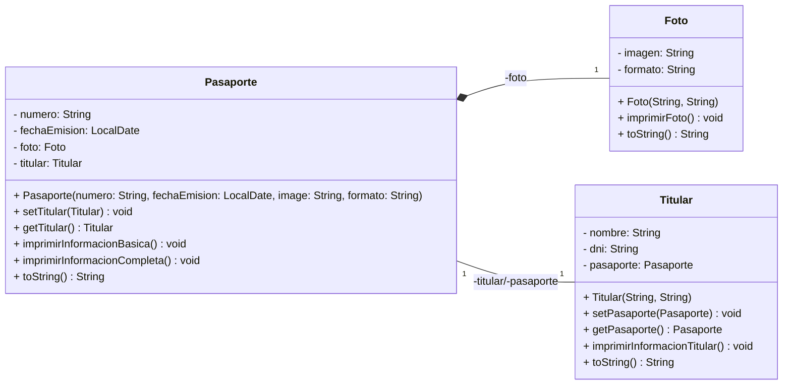
```mermaid
    classDiagram
    direction LR
        class Pasaporte {
            - numero: String
            - fechaEmision: LocalDate
            - foto: Foto
            - titular: Titular
            + Pasaporte(numero: String, fechaEmision: LocalDate, image: String, formato: String)
            + setTitular(Titular) void
            + getTitular() Titular
            + imprimirInformacionBasica() void
            + imprimirInformacionCompleta() void
            + toString() String
        }
        class Foto {
            - imagen: String
            - formato: String
            + Foto(String, String)
            + imprimirFoto() void
            + toString() String
        }
        class Titular {
            - nombre: String
            - dni: String
            - pasaporte: Pasaporte
            + Titular(String, String)
            + setPasaporte(Pasaporte) void
            + getPasaporte() Pasaporte
            + imprimirInformacionTitular() void
            + toString() String
        }
        Pasaporte *-- "1" Foto : -foto
        Pasaporte "1" -- "1" Titular : -titular/-pasaporte
```

<!-- 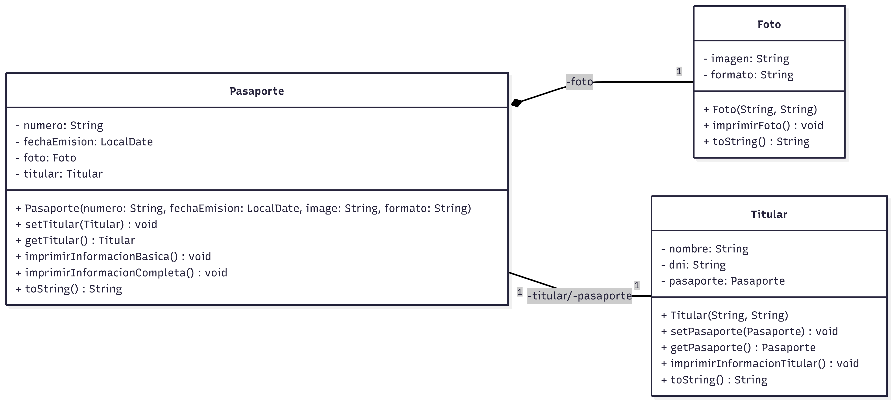 -->

- **Código**

```java
    package TP05.ejercicio01;
    import java.time.LocalDate;
    public class Ejercicio01 {
        public static void main(String[] args) {
            Titular titular = new Titular("Juan Pérez", "22584759");
            Pasaporte pasaporte = new Pasaporte("x16564S564", LocalDate.now(),
                "foto_juan", "JPG");
            pasaporte.setTitular(titular);
            System.out.println("--- Información del titular ---");
            titular.imprimirInformacionTitular();
            System.out.println("\n--- Información completa del pasaporte ---");
            pasaporte.imprimirInformacionCompleta();
        }
    }
```

```java
    package TP05.ejercicio01;
    import java.time.LocalDate;
    public class Pasaporte {
        private String numero;
        private LocalDate fechaEmision;
        private Foto foto;
        private Titular titular;
        public Pasaporte(String numero, LocalDate fechaEmision, String imagen,
            String formato) {
            this.numero = numero;
            this.fechaEmision = fechaEmision;
            this.foto = new Foto(imagen, formato);
        }
        public void setTitular(Titular titular) {
            this.titular = titular;
            if (titular != null && titular.getPasaporte() != this) {
                titular.setPasaporte(this);
            }
        }
        public Titular getTitular() {
            return titular;
        }
        public void imprimirInformacionBasica() {
            System.out.println("Pasaporte: " + numero
                    + " (Emitido: " + fechaEmision + ")");
        }
        public void imprimirInformacionCompleta() {
            System.out.println("Pasaporte N°: " + numero);
            System.out.println("Fecha Emisión: " + fechaEmision);
            if (titular != null) {
                titular.imprimirInformacionTitular();
            }
            foto.imprimirFoto();
        }
        @Override
        public String toString() {
            return "Pasaporte{" + "numero=" + numero
                    + ", fechaEmision=" + fechaEmision
                    + ", foto=" + foto
                    + ", titular=" + titular + '}';
        }
    }
```

```java
    package TP05.ejercicio01;
    public class Foto {
        private String imagen;
        private String formato;
        public Foto(String imagen, String formato) {
            this.imagen = imagen;
            this.formato = formato;
        }
        public void imprimirFoto() {
            System.out.println("Foto: " + imagen + "." + formato);
        }
        @Override
        public String toString() {
            return "Foto{" + "imagen=" + imagen
                    + ", formato=" + formato + '}';
        }
    }
```

```java
    package TP05.ejercicio01;
    public class Titular {
        private String nombre;
        private String dni;
        private Pasaporte pasaporte;
        public Titular(String nombre, String dni) {
            this.nombre = nombre;
            this.dni = dni;
        }
        public void setPasaporte(Pasaporte pasaporte) {
            this.pasaporte = pasaporte;
            if (pasaporte != null && pasaporte.getTitular() != this) {
                pasaporte.setTitular(this);
            }
        }
        public Pasaporte getPasaporte() {
            return pasaporte;
        }
        public void imprimirInformacionTitular() {
            System.out.println("Titular: " + nombre);
            if (pasaporte != null) {
                pasaporte.imprimirInformacionBasica();
            } else {
                System.out.println("No tiene pasaporte asignado");
            }
        }
        @Override
        public String toString() {
            return "Titular{" + "nombre=" + nombre
                    + ", dni=" + dni
                    + ", pasaporte=" + pasaporte + '}';
        }
    }
```

- **Consola**

```console
    --- Información del titular ---
    Titular: Juan Pérez
    Pasaporte: x16564S564 (Emitido: 2025-09-13)

    --- Información completa del pasaporte ---
    Pasaporte N°: x16564S564
    Fecha Emisión: 2025-09-13
    Titular: Juan Pérez
    Pasaporte: x16564S564 (Emitido: 2025-09-13)
    Foto: foto_juan.JPG
```

---

#### 2. Celular - Batería - Usuario

> - **Agregación**: Celular → Batería
> - **Asociación bidireccional**: Celular ↔ Usuario
> - **Clases y atributos**:
>   - Celular: imei, marca, modelo
>   - Batería: modelo, capacidad
>   - Usuario: nombre, dni

- **Diagrama UML**

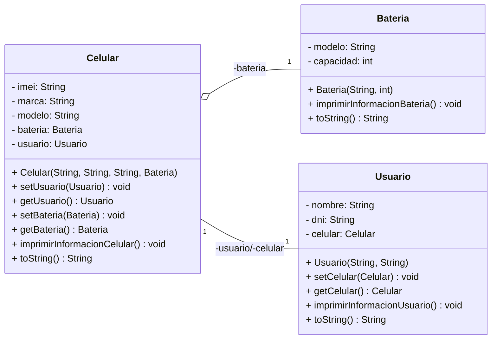
```mermaid
    classDiagram
    direction LR
        class Celular {
            - imei: String
            - marca: String
            - modelo: String
            - bateria: Bateria
            - usuario: Usuario
            + Celular(String, String, String, Bateria)
            + setUsuario(Usuario) void
            + getUsuario() Usuario
            + setBateria(Bateria) void
            + getBateria() Bateria
            + imprimirInformacionCelular() void
            + toString() String
        }
        class Bateria {
            - modelo: String
            - capacidad: int
            + Bateria(String, int)
            + imprimirInformacionBateria() void
            + toString() String
        }
        class Usuario {
            - nombre: String
            - dni: String
            - celular: Celular
            + Usuario(String, String)
            + setCelular(Celular) void
            + getCelular() Celular
            + imprimirInformacionUsuario() void
            + toString() String
        }
        Celular o-- "1" Bateria : -bateria
        Celular "1" -- "1" Usuario : -usuario/-celular
```

<!-- 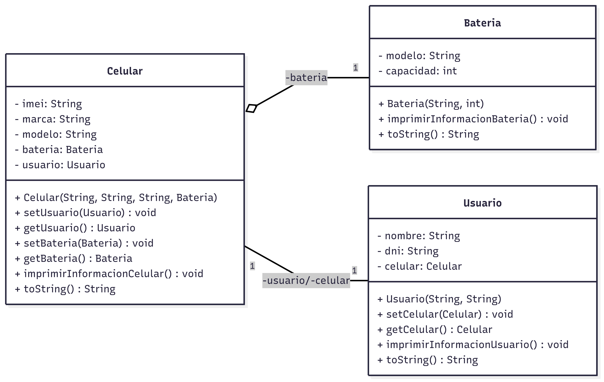 -->

- **Código**

```java
    package TP05.ejercicio02;
    public class Ejercicio02 {
        public static void main(String[] args) {
            Bateria bateria = new Bateria("Li-ion", 5000);
            Usuario usuario = new Usuario("María García", "33445566");
            Celular celular = new Celular("123456789012345", "Samsung",
                                    "Galaxy S23", bateria);
            celular.setUsuario(usuario);
            System.out.println("--- Información del celular ---");
            System.out.println(celular);
        }
    }
```

```java
    package TP05.ejercicio02;
    public class Celular {
        private String imei;
        private String marca;
        private String modelo;
        private Bateria bateria;
        private Usuario usuario;
        public Celular(String imei, String marca, String modelo,
                  Bateria bateria) {
            this.imei = imei;
            this.marca = marca;
            this.modelo = modelo;
            this.bateria = bateria;
        }
        public void setUsuario(Usuario usuario) {
            this.usuario = usuario;
            if (usuario != null && usuario.getCelular() != this) {
                usuario.setCelular(this);
            }
        }
        public Usuario getUsuario() {
            return usuario;
        }
        public void setBateria(Bateria bateria) {
            this.bateria = bateria;
        }
        public Bateria getBateria() {
            return bateria;
        }
        public void imprimirInformacionCelular() {
            System.out.println("Marca: " + marca);
            System.out.println("Modelo: " + modelo);
            System.out.println("IMEI: " + imei);
        }
        @Override
        public String toString() {
            return "Celular{" + "imei=" + imei + ", marca=" + marca +
                  ", modelo=" + modelo + ", " + bateria +
                  ", " + usuario + '}';
        }
    }
```

```java
package TP05.ejercicio02;
public class Bateria {
    private String modelo;
    private int capacidad;
    public Bateria(String modelo, int capacidad) {
        this.modelo = modelo;
        this.capacidad = capacidad;
    }
    public void imprimirInformacionBateria() {
        System.out.println("Batería: " + modelo + " - " + capacidad + " mAh");
    }
    @Override
    public String toString() {
        return "Bateria{" + "modelo=" + modelo
                + ", capacidad=" + capacidad + '}';
    }
}
```

```java
    package TP05.ejercicio02;
    public class Usuario {
        private String nombre;
        private String dni;
        private Celular celular;
        public Usuario(String nombre, String dni) {
            this.nombre = nombre;
            this.dni = dni;
        }
        public void setCelular(Celular celular) {
            this.celular = celular;
            if (celular != null && celular.getUsuario() != this) {
                celular.setUsuario(this);
            }
        }
        public Celular getCelular() {
            return celular;
        }
        public void imprimirInformacionUsuario() {
            System.out.println("Usuario: " + nombre);
            System.out.println("DNI: " + dni);
        }
        @Override
        public String toString() {
            return "Usuario{" + "nombre=" + nombre + ", dni=" + dni + '}';
        }
    }
```

- **Consola**

```console
    --- Información del celular ---
    Celular{imei=123456789012345, marca=Samsung, modelo=Galaxy S23, Bateria{modelo=Li-ion, capacidad=5000}, Usuario{nombre=María García, dni=33445566}}
```

---

#### 3. Libro - Autor - Editorial

> - **Asociación unidireccional**: Libro → Autor
> - **Agregación**: Libro → Editorial
> - **Clases y atributos**:
>   - Libro: titulo, isbn
>   - Autor: nombre, nacionalidad
>   - Editorial: nombre, direccion

- **Diagrama UML**

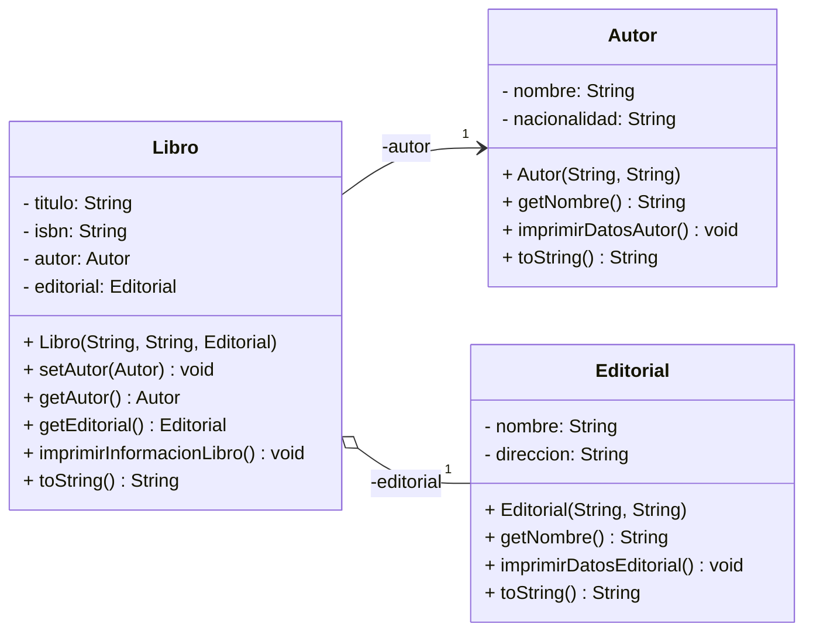
```mermaid
    classDiagram
    direction LR
        class Libro {
            - titulo: String
            - isbn: String
            - autor: Autor
            - editorial: Editorial
            + Libro(String, String, Editorial)
            + setAutor(Autor) void
            + getAutor() Autor
            + getEditorial() Editorial
            + imprimirInformacionLibro() void
            + toString() String
        }
        class Autor {
            - nombre: String
            - nacionalidad: String
            + Autor(String, String)
            + getNombre() String
            + imprimirDatosAutor() void
            + toString() String
        }
        class Editorial {
            - nombre: String
            - direccion: String
            + Editorial(String, String)
            + getNombre() String
            + imprimirDatosEditorial() void
            + toString() String
        }
        Libro --> "1" Autor : -autor
        Libro o-- "1" Editorial : -editorial
```

<!-- 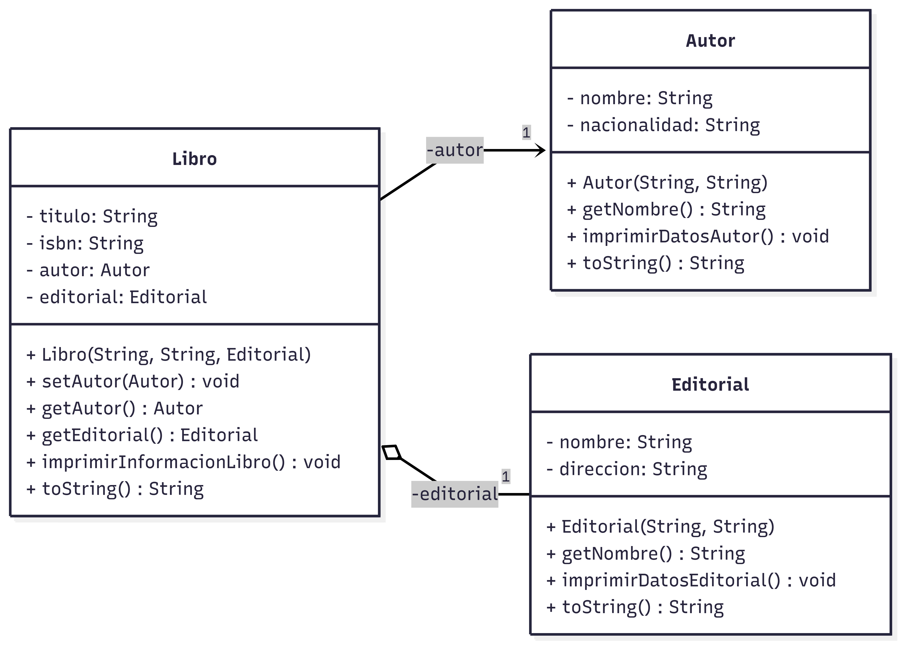 -->

- **Código**

```java
    package TP05.ejercicio03;
    public class Ejercicio03 {
        public static void main(String[] args) {
            Autor autor = new Autor("Gabriel García Márquez", "Colombiano");
            Editorial editorial = new Editorial("Sudamericana",
                    "Buenos Aires, Argentina");
            Libro libro = new Libro("Crónica de una muerte anunciada",
                    "978-81101911013", editorial);
            libro.setAutor(autor);
            System.out.println("--- Información del libro ---");
            libro.imprimirInformacionLibro();
            System.out.println("\n--- Información del autor ---");
            autor.imprimirDatosAutor();
            System.out.println("\n--- Información de la editorial ---");
            editorial.imprimirDatosEditorial();
        }
    }
```

```java
    package TP05.ejercicio03;
    public class Libro {
        private String titulo;
        private String isbn;
        private Autor autor;
        private Editorial editorial;
        public Libro(String titulo, String isbn, Editorial editorial) {
            this.titulo = titulo;
            this.isbn = isbn;
            this.editorial = editorial;
        }
        public void setAutor(Autor autor) {
            this.autor = autor;
        }
        public Autor getAutor() {
            return autor;
        }
        public Editorial getEditorial() {
            return editorial;
        }
        public void imprimirInformacionLibro() {
            System.out.println("Título: " + titulo);
            System.out.println("ISBN: " + isbn);
            if (autor != null) {
                System.out.println("Autor: " + autor.getNombre());
            }
            if (editorial != null) {
                System.out.println("Editorial: " + editorial.getNombre());
            }
        }
        @Override
        public String toString() {
            return "Libro{" + "titulo=" + titulo + ", isbn=" + isbn +
                  ", autor=" + autor + ", editorial=" + editorial + '}';
        }
    }
```

```java
    package TP05.ejercicio03;
    public class Autor {
        private String nombre;
        private String nacionalidad;
        public Autor(String nombre, String nacionalidad) {
            this.nombre = nombre;
            this.nacionalidad = nacionalidad;
        }
        public String getNombre() {
            return nombre;
        }
        public void imprimirDatosAutor() {
            System.out.println("Nombre: " + nombre);
            System.out.println("Nacionalidad: " + nacionalidad);
        }
        @Override
        public String toString() {
            return "Autor{" + "nombre=" + nombre
                    + ", nacionalidad=" + nacionalidad + '}';
        }
    }
```

```java
    package TP05.ejercicio03;
    public class Editorial {
        private String nombre;
        private String direccion;
        public Editorial(String nombre, String direccion) {
            this.nombre = nombre;
            this.direccion = direccion;
        }
        public String getNombre() {
            return nombre;
        }
        public void imprimirDatosEditorial() {
            System.out.println("Editorial: " + nombre);
            System.out.println("Dirección: " + direccion);
        }
        @Override
        public String toString() {
            return "Editorial{" + "nombre=" + nombre
                    + ", direccion=" + direccion + '}';
        }
    }
```

- **Consola**

```console
    --- Información del libro ---
    Título: Crónica de una muerte anunciada
    ISBN: 978-81101911013
    Autor: Gabriel García Márquez
    Editorial: Sudamericana

    --- Información del autor ---
    Nombre: Gabriel García Márquez
    Nacionalidad: Colombiano

    --- Información de la editorial ---
    Editorial: Sudamericana
    Dirección: Buenos Aires, Argentina
```

---

#### 4. TarjetaDeCrédito - Cliente - Banco

> - **Asociación bidireccional**: TarjetaDeCrédito ↔ Cliente
> - **Agregación**: TarjetaDeCrédito → Banco
> - **Clases y atributos**:
>   - TarjetaDeCrédito: numero, fechaVencimiento
>   - Cliente: nombre, dni
>   - Banco: nombre, cuit

- **Diagrama UML**

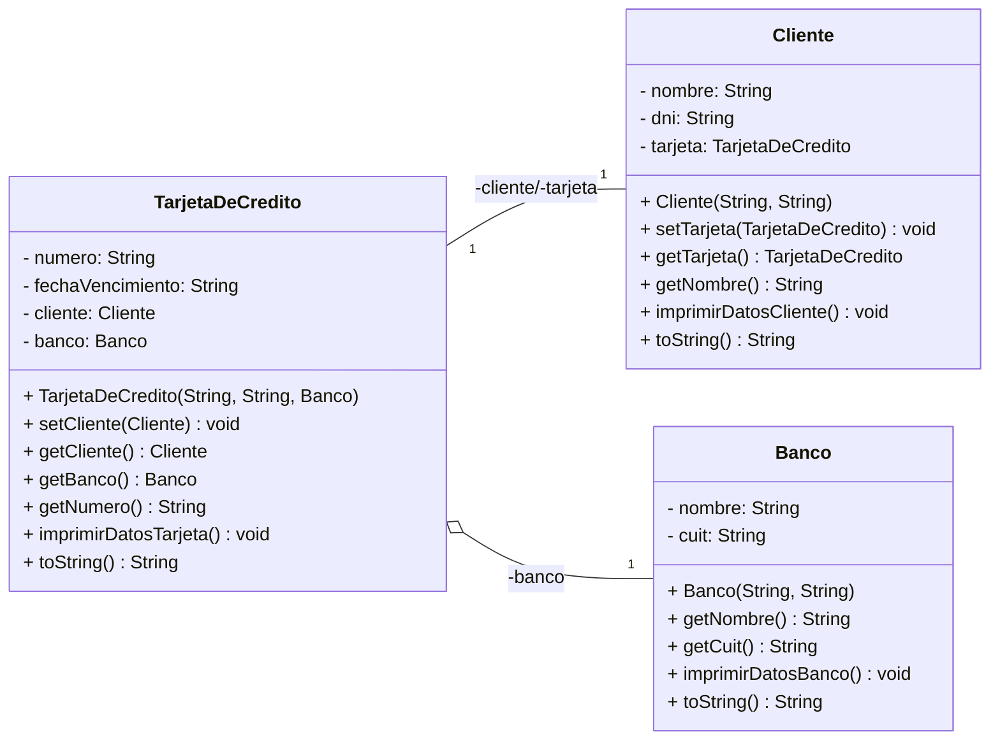
```mermaid
    classDiagram
    direction LR
        class TarjetaDeCredito {
            - numero: String
            - fechaVencimiento: String
            - cliente: Cliente
            - banco: Banco
            + TarjetaDeCredito(String, String, Banco)
            + setCliente(Cliente) void
            + getCliente() Cliente
            + getBanco() Banco
            + getNumero() String
            + imprimirDatosTarjeta() void
            + toString() String
        }
        class Cliente {
            - nombre: String
            - dni: String
            - tarjeta: TarjetaDeCredito
            + Cliente(String, String)
            + setTarjeta(TarjetaDeCredito) void
            + getTarjeta() TarjetaDeCredito
            + getNombre() String
            + imprimirDatosCliente() void
            + toString() String
        }
        class Banco {
            - nombre: String
            - cuit: String
            + Banco(String, String)
            + getNombre() String
            + getCuit() String
            + imprimirDatosBanco() void
            + toString() String
        }
        TarjetaDeCredito "1" -- "1" Cliente : -cliente/-tarjeta
        TarjetaDeCredito o-- "1" Banco : -banco
```

<!-- 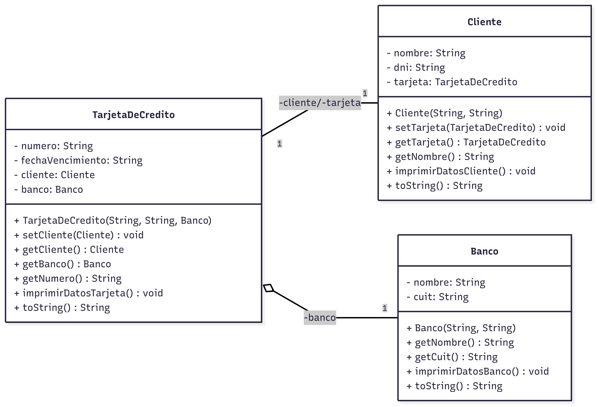 -->

- **Código**

```java
    package TP05.ejercicio04;
    public class Ejercicio04 {
        public static void main(String[] args) {
            Banco banco = new Banco("Banco Nación", "30-50000000-6");
            Cliente cliente = new Cliente("Carlos Rodríguez", "40123456");
            TarjetaDeCredito tarjeta = new TarjetaDeCredito(
                "1234-5678-9012-3456", "12/2027", banco);
            tarjeta.setCliente(cliente);
            System.out.println("--- Información del cliente ---");
            cliente.imprimirDatosCliente();
            System.out.println("\n--- Información de la tarjeta ---");
            tarjeta.imprimirDatosTarjeta();
            System.out.println("\n--- Información del banco ---");
            banco.imprimirDatosBanco();
        }
    }
```

```java
    package TP05.ejercicio04;
    public class TarjetaDeCredito {
        private String numero;
        private String fechaVencimiento;
        private Cliente cliente;
        private Banco banco;
        public TarjetaDeCredito(String numero, String fechaVencimiento,
                           Banco banco) {
            this.numero = numero;
            this.fechaVencimiento = fechaVencimiento;
            this.banco = banco;
        }
        public void setCliente(Cliente cliente) {
            this.cliente = cliente;
            if (cliente != null && cliente.getTarjeta() != this) {
                cliente.setTarjeta(this);
            }
        }
        public Cliente getCliente() {
            return cliente;
        }
        public Banco getBanco() {
            return banco;
        }
        public String getNumero() {
            return numero;
        }
        public void imprimirDatosTarjeta() {
            System.out.println("Número: " + numero);
            System.out.println("Vencimiento: " + fechaVencimiento);
            if (cliente != null) {
                System.out.println("Titular: " + cliente.getNombre());
            }
            if (banco != null) {
                System.out.println("Banco: " + banco.getNombre());
            }
        }
        @Override
        public String toString() {
            return "TarjetaDeCredito{" + "numero=" + numero
                + ", fechaVencimiento=" + fechaVencimiento
                + ", cliente=" + cliente + ", banco=" + banco + '}';
        }
    }
```

```java
    package TP05.ejercicio04;
    public class Cliente {
        private String nombre;
        private String dni;
        private TarjetaDeCredito tarjeta;
        public Cliente(String nombre, String dni) {
            this.nombre = nombre;
            this.dni = dni;
        }
        public void setTarjeta(TarjetaDeCredito tarjeta) {
            this.tarjeta = tarjeta;
            if (tarjeta != null && tarjeta.getCliente() != this) {
                tarjeta.setCliente(this);
            }
        }
        public TarjetaDeCredito getTarjeta() {
            return tarjeta;
        }
        public String getNombre() {
            return nombre;
        }
        public void imprimirDatosCliente() {
            System.out.println("Cliente: " + nombre);
            System.out.println("DNI: " + dni);
            if (tarjeta != null) {
                System.out.println("Tarjeta: "
                        + tarjeta.getNumero().substring(0, 4)
                        + " **** **** ****");
                System.out.println("Banco: " + tarjeta.getBanco().getNombre());
            } else {
                System.out.println("No tiene tarjeta asignada");
            }
        }
        @Override
        public String toString() {
            return "Cliente{" + "nombre=" + nombre
                    + ", dni=" + dni
                    + ", tarjeta=" + tarjeta + '}';
        }
    }
```

```java
    package TP05.ejercicio04;
    public class Banco {
        private String nombre;
        private String cuit;
        public Banco(String nombre, String cuit) {
            this.nombre = nombre;
            this.cuit = cuit;
        }
        public String getNombre() {
            return nombre;
        }
        public String getCuit() {
            return cuit;
        }
        public void imprimirDatosBanco() {
            System.out.println("Banco: " + nombre);
            System.out.println("CUIT: " + cuit);
        }
        @Override
        public String toString() {
            return "Banco{" + "nombre=" + nombre + ", cuit=" + cuit + '}';
        }
    }
```

- **Consola**

```console
    --- Información del banco ---
    Cliente: Carlos Rodríguez
    DNI: 40123456
    Tarjeta: 1234 **** **** ****
    Banco: Banco Nación

    --- Información de la tarjeta ---
    Número: 1234-5678-9012-3456
    Vencimiento: 12/2027
    Titular: Carlos Rodríguez
    Banco: Banco Nación

    --- Información del banco ---
    Banco: Banco Nación
    CUIT: 30-50000000-6
```

---

#### 5. Computadora - PlacaMadre - Propietario

> - **Composición**: Computadora → PlacaMadre
> - **Asociación bidireccional**: Computadora ↔ Propietario
> - **Clases y atributos**:
>   - Computadora: marca, numeroSerie
>   - PlacaMadre: modelo, chipset
>   - Propietario: nombre, dni

- **Diagrama UML**

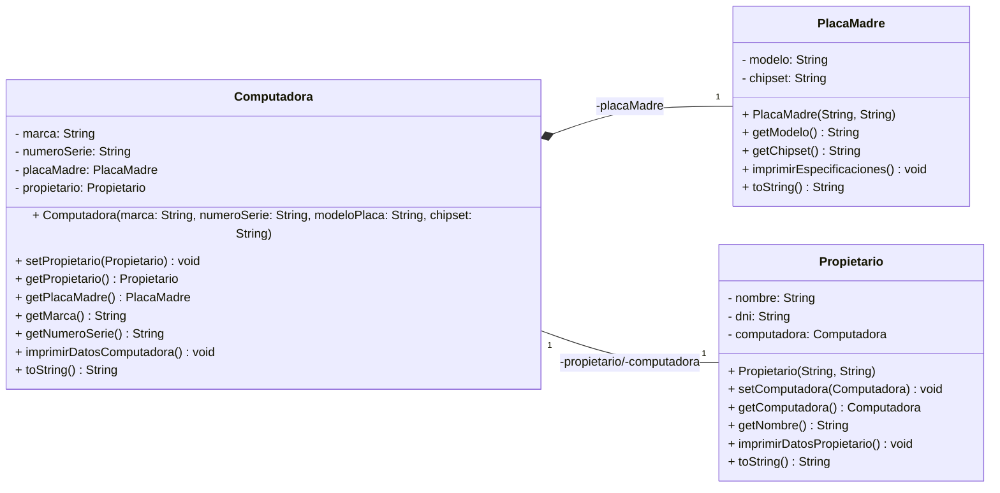
```mermaid
    classDiagram
    direction LR
        class Computadora {
            - marca: String
            - numeroSerie: String
            - placaMadre: PlacaMadre
            - propietario: Propietario
            + Computadora(marca: String, numeroSerie: String, modeloPlaca: String, chipset: String)
            + setPropietario(Propietario) void
            + getPropietario() Propietario
            + getPlacaMadre() PlacaMadre
            + getMarca() String
            + getNumeroSerie() String
            + imprimirDatosComputadora() void
            + toString() String
        }
        class PlacaMadre {
            - modelo: String
            - chipset: String
            + PlacaMadre(String, String)
            + getModelo() String
            + getChipset() String
            + imprimirEspecificaciones() void
            + toString() String
        }
        class Propietario {
            - nombre: String
            - dni: String
            - computadora: Computadora
            + Propietario(String, String)
            + setComputadora(Computadora) void
            + getComputadora() Computadora
            + getNombre() String
            + imprimirDatosPropietario() void
            + toString() String
        }
        Computadora *-- "1" PlacaMadre : -placaMadre
        Computadora "1" -- "1" Propietario : -propietario/-computadora
```

<!-- 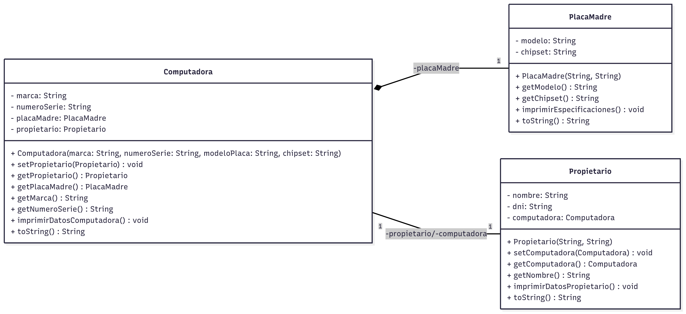 -->

- **Código**

```java
    package TP05.ejercicio05;
    public class Ejercicio05 {
        public static void main(String[] args) {
            Propietario propietario = new Propietario("Ana Martínez", "35123456");
            Computadora computadora = new Computadora(
                "Dell", "DLXPS12345", "ASUS ROG Strix", "Intel Z790");
            computadora.setPropietario(propietario);
            System.out.println("--- Información del propietario ---");
            propietario.imprimirDatosPropietario();
            System.out.println("\n--- Información de la computadora ---");
            computadora.imprimirDatosComputadora();
            System.out.println("\n--- Especificaciones de la placa madre ---");
            computadora.getPlacaMadre().imprimirEspecificaciones();
        }
    }
```

```java
    package TP05.ejercicio05;
    public class Computadora {
        private String marca;
        private String numeroSerie;
        private PlacaMadre placaMadre;
        private Propietario propietario;
        public Computadora(String marca, String numeroSerie, String modeloPlaca,
                      String chipset) {
            this.marca = marca;
            this.numeroSerie = numeroSerie;
            this.placaMadre = new PlacaMadre(modeloPlaca, chipset);
        }
        public void setPropietario(Propietario propietario) {
            this.propietario = propietario;
            if (propietario != null && propietario.getComputadora() != this) {
                propietario.setComputadora(this);
            }
        }
        public Propietario getPropietario() {
            return propietario;
        }
        public PlacaMadre getPlacaMadre() {
            return placaMadre;
        }
        public String getMarca() {
            return marca;
        }
        public String getNumeroSerie() {
            return numeroSerie;
        }
        public void imprimirDatosComputadora() {
            System.out.println("Marca: " + marca);
            System.out.println("Número de Serie: " + numeroSerie);
            if (placaMadre != null) {
                System.out.println("Placa Madre: " + placaMadre.getModelo());
            }
            if (propietario != null) {
                System.out.println("Propietario: " + propietario.getNombre());
            }
        }
        @Override
        public String toString() {
            return "Computadora{" + "marca=" + marca
                    + ", numeroSerie=" + numeroSerie
                    + ", placaMadre=" + placaMadre
                    + ", propietario=" + propietario + '}';
        }
    }
```

```java
    package TP05.ejercicio05;
    public class PlacaMadre {
        private String modelo;
        private String chipset;
        public PlacaMadre(String modelo, String chipset) {
            this.modelo = modelo;
            this.chipset = chipset;
        }
        public String getModelo() {
            return modelo;
        }
        public String getChipset() {
            return chipset;
        }
        public void imprimirEspecificaciones() {
            System.out.println("Modelo: " + modelo);
            System.out.println("Chipset: " + chipset);
        }
        @Override
        public String toString() {
            return "PlacaMadre{" + "modelo=" + modelo
                    + ", chipset=" + chipset + '}';
        }
    }
```

```java
    package TP05.ejercicio05;
    public class Propietario {
        private String nombre;
        private String dni;
        private Computadora computadora;
        public Propietario(String nombre, String dni) {
            this.nombre = nombre;
            this.dni = dni;
        }
        public void setComputadora(Computadora computadora) {
            this.computadora = computadora;
            if (computadora != null && computadora.getPropietario() != this) {
                computadora.setPropietario(this);
            }
        }
        public Computadora getComputadora() {
            return computadora;
        }
        public String getNombre() {
            return nombre;
        }
        public void imprimirDatosPropietario() {
            System.out.println("Propietario: " + nombre);
            System.out.println("DNI: " + dni);
            if (computadora != null) {
                System.out.println("Computadora: " + computadora.getMarca() +
                                " (Serie: " + computadora.getNumeroSerie() + ")");
                System.out.println("Placa Madre: "
                        + computadora.getPlacaMadre().getModelo());
            } else {
                System.out.println("No tiene computadora asignada");
            }
        }
        @Override
        public String toString() {
            return "Propietario{" + "nombre=" + nombre
                    + ", dni=" + dni
                    + ", computadora=" + computadora + '}';
        }
    }
```

- **Consola**

```console
    --- Información del propietario ---
    Propietario: Ana Martínez
    DNI: 35123456
    Computadora: Dell (Serie: DLXPS12345)
    Placa Madre: ASUS ROG Strix

    --- Información de la computadora ---
    Marca: Dell
    Número de Serie: DLXPS12345
    Placa Madre: ASUS ROG Strix
    Propietario: Ana Martínez

    --- Especificaciones de la placa madre ---
    Modelo: ASUS ROG Strix
    Chipset: Intel Z790
```

---

#### 6. Reserva - Cliente - Mesa

> - **Asociación unidireccional**: Reserva → Cliente
> - **Agregación**: Reserva → Mesa
> - **Clases y atributos**:
>   - Reserva: fecha, hora
>   - Cliente: nombre, telefono
>   - Mesa: numero, capacidad

- **Diagrama UML**

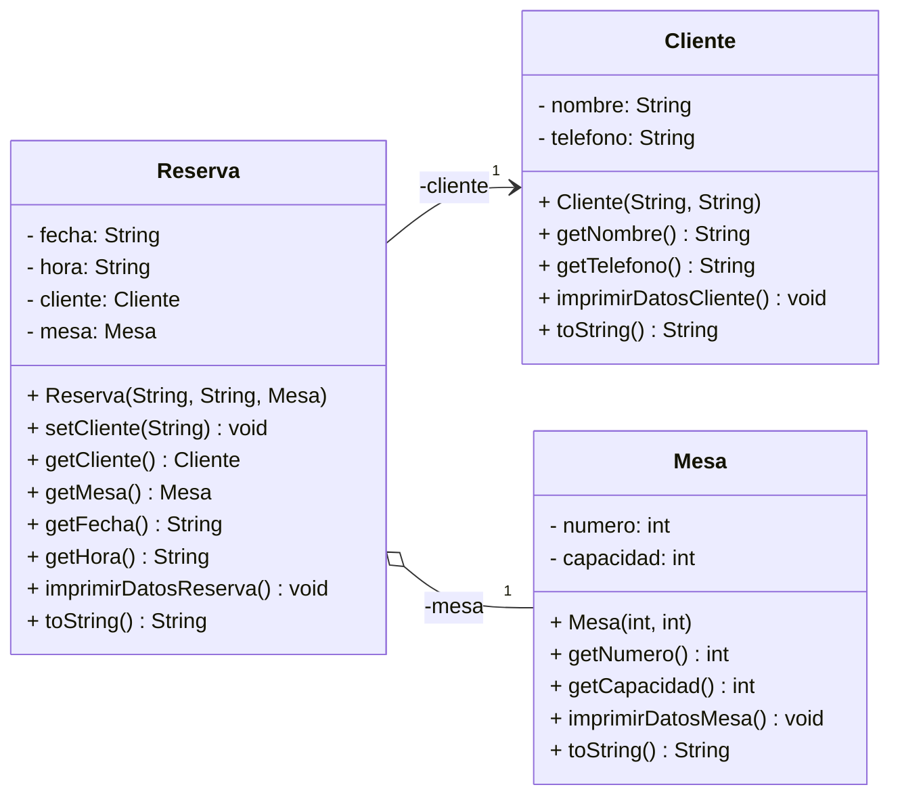
```mermaid
    classDiagram
    direction LR
        class Reserva {
            - fecha: String
            - hora: String
            - cliente: Cliente
            - mesa: Mesa
            + Reserva(String, String, Mesa)
            + setCliente(String) void
            + getCliente() Cliente
            + getMesa() Mesa
            + getFecha() String
            + getHora() String
            + imprimirDatosReserva() void
            + toString() String
        }
        class Cliente {
            - nombre: String
            - telefono: String
            + Cliente(String, String)
            + getNombre() String
            + getTelefono() String
            + imprimirDatosCliente() void
            + toString() String
        }
        class Mesa {
            - numero: int
            - capacidad: int
            + Mesa(int, int)
            + getNumero() int
            + getCapacidad() int
            + imprimirDatosMesa() void
            + toString() String
        }
        Reserva --> "1" Cliente : -cliente
        Reserva o-- "1" Mesa : -mesa
```

<!-- 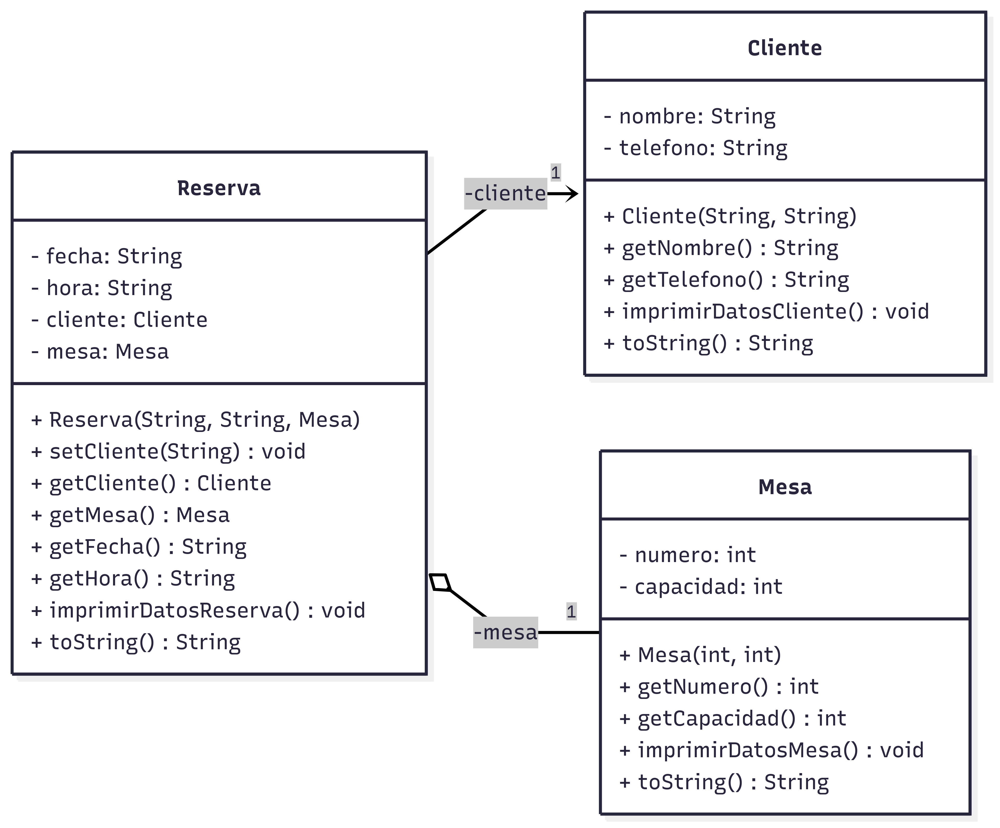 -->

- **Código**

```java
    package TP05.ejercicio06;
    public class Ejercicio06 {
        public static void main(String[] args) {
            Mesa mesa = new Mesa(5, 4);
            Cliente cliente = new Cliente("Laura González", "11-2345-6789");
            Reserva reserva = new Reserva("2024-03-20", "20:30", mesa);
            reserva.setCliente(cliente);
            reserva.imprimirDatosReserva();
            System.out.println("\n--- Información del cliente ---");
            cliente.imprimirDatosCliente();
            System.out.println("\n--- Información de la mesa ---");
            mesa.imprimirDatosMesa();
        }
    }
```

```java
    package TP05.ejercicio06;
    public class Reserva {
        private String fecha;
        private String hora;
        private Cliente cliente;
        private Mesa mesa;
        public Reserva(String fecha, String hora, Mesa mesa) {
            this.fecha = fecha;
            this.hora = hora;
            this.mesa = mesa;
        }
        public void setCliente(Cliente cliente) {
            this.cliente = cliente;
        }
        public Cliente getCliente() {
            return cliente;
        }
        public Mesa getMesa() {
            return mesa;
        }
        public String getFecha() {
            return fecha;
        }
        public String getHora() {
            return hora;
        }
        public void imprimirDatosReserva() {
            System.out.println("=== RESERVA ===");
            System.out.println("Fecha: " + fecha);
            System.out.println("Hora: " + hora);
            if (cliente != null) {
                System.out.println("Cliente: " + cliente.getNombre());
            }
            if (mesa != null) {
                System.out.println("Mesa: " + mesa.getNumero()
                        + " (Capacidad: " + mesa.getCapacidad() + " personas)");
            }
        }
        @Override
        public String toString() {
            return "Reserva{" + "fecha=" + fecha + ", hora=" + hora +
                ", cliente=" + cliente + ", mesa=" + mesa + '}';
        }
    }
```

```java
    package TP05.ejercicio06;
    public class Cliente {
        private String nombre;
        private String telefono;
        public Cliente(String nombre, String telefono) {
            this.nombre = nombre;
            this.telefono = telefono;
        }
        public String getNombre() {
            return nombre;
        }
        public String getTelefono() {
            return telefono;
        }
        public void imprimirDatosCliente() {
            System.out.println("Nombre: " + nombre);
            System.out.println("Teléfono: " + telefono);
        }
        @Override
        public String toString() {
            return "Cliente{" + "nombre=" + nombre
                    + ", telefono=" + telefono + '}';
        }
    }
```

```java
    package TP05.ejercicio06;
    public class Mesa {
        private int numero;
        private int capacidad;
        public Mesa(int numero, int capacidad) {
            this.numero = numero;
            this.capacidad = capacidad;
        }
        public int getNumero() {
            return numero;
        }
        public int getCapacidad() {
            return capacidad;
        }
        public void imprimirDatosMesa() {
            System.out.println("Mesa N°: " + numero);
            System.out.println("Capacidad: " + capacidad + " personas");
        }
        @Override
        public String toString() {
            return "Mesa{" + "numero=" + numero + ", capacidad=" + capacidad + '}';
        }
    }
```

- **Consola**

```console
    === RESERVA ===
    Fecha: 2024-03-20
    Hora: 20:30
    Cliente: Laura González
    Mesa: 5 (Capacidad: 4 personas)

    --- Información del cliente ---
    Nombre: Laura González
    Teléfono: 11-2345-6789

    --- Información de la mesa ---
    Mesa N°: 5
    Capacidad: 4 personas
```

---

#### 7. Vehículo - Motor - Conductor

> - **Agregación**: Vehículo → Motor
> - **Asociación bidireccional**: Vehículo ↔ Conductor
> - **Clases y atributos**:
>   - Vehículo: patente, modelo
>   - Motor: tipo, numeroSerie
>   - Conductor: nombre, licencia

- **Diagrama UML**

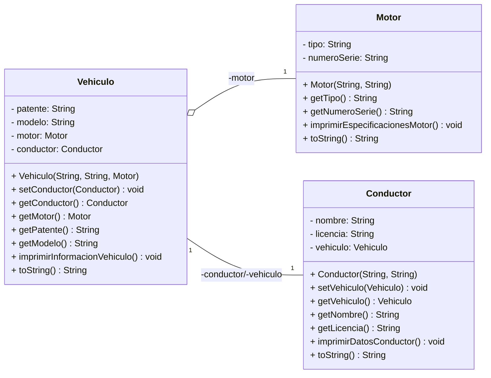
```mermaid
    classDiagram
    direction LR
        class Vehiculo {
            - patente: String
            - modelo: String
            - motor: Motor
            - conductor: Conductor
            + Vehiculo(String, String, Motor)
            + setConductor(Conductor) void
            + getConductor() Conductor
            + getMotor() Motor
            + getPatente() String
            + getModelo() String
            + imprimirInformacionVehiculo() void
            + toString() String
        }
        class Motor {
            - tipo: String
            - numeroSerie: String
            + Motor(String, String)
            + getTipo() String
            + getNumeroSerie() String
            + imprimirEspecificacionesMotor() void
            + toString() String
        }
        class Conductor {
            - nombre: String
            - licencia: String
            - vehiculo: Vehiculo
            + Conductor(String, String)
            + setVehiculo(Vehiculo) void
            + getVehiculo() Vehiculo
            + getNombre() String
            + getLicencia() String
            + imprimirDatosConductor() void
            + toString() String
        }
        Vehiculo o-- "1" Motor : -motor
        Vehiculo "1" -- "1" Conductor : -conductor/-vehiculo
```

<!-- 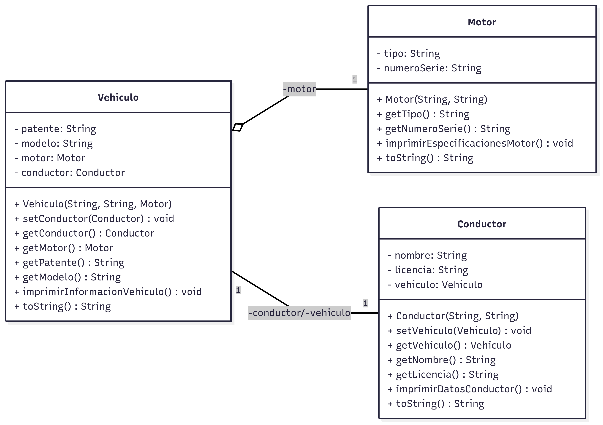 -->

- **Código**

```java
    package TP05.ejercicio07;
    public class Ejercicio07 {
        public static void main(String[] args) {
            Motor motor = new Motor("V8 TwinTurbo", "MTR-2024-001");
            Conductor conductor = new Conductor("Roberto Sánchez", "B123456789");
            Vehiculo vehiculo = new Vehiculo("ABC123", "Ford Mustang GT",
                motor);
            vehiculo.setConductor(conductor);
            System.out.println("--- Información del conductor ---");
            conductor.imprimirDatosConductor();
            System.out.println("\n--- Información del vehículo ---");
            vehiculo.imprimirInformacionVehiculo();
            System.out.println("\n--- Especificaciones del motor ---");
            motor.imprimirEspecificacionesMotor();
        }
    }
```

```java
    package TP05.ejercicio07;
    public class Vehiculo {
        private String patente;
        private String modelo;
        private Motor motor;
        private Conductor conductor;
        public Vehiculo(String patente, String modelo, Motor motor) {
            this.patente = patente;
            this.modelo = modelo;
            this.motor = motor;
        }
        public void setConductor(Conductor conductor) {
            this.conductor = conductor;
            if (conductor != null && conductor.getVehiculo() != this) {
                conductor.setVehiculo(this);
            }
        }
        public Conductor getConductor() {
            return conductor;
        }
        public Motor getMotor() {
            return motor;
        }
        public String getPatente() {
            return patente;
        }
        public String getModelo() {
            return modelo;
        }
        public void imprimirInformacionVehiculo() {
            System.out.println("Patente: " + patente);
            System.out.println("Modelo: " + modelo);
            if (motor != null) {
                System.out.println("Motor: " + motor.getTipo());
            }
            if (conductor != null) {
                System.out.println("Conductor: " + conductor.getNombre());
            }
        }
        @Override
        public String toString() {
            return "Vehiculo{" + "patente=" + patente
                    + ", modelo=" + modelo
                    + ", motor=" + motor
                    + ", conductor=" + conductor + '}';
        }
    }
```

```java
    package TP05.ejercicio07;
    public class Motor {
        private String tipo;
        private String numeroSerie;
        public Motor(String tipo, String numeroSerie) {
            this.tipo = tipo;
            this.numeroSerie = numeroSerie;
        }
        public String getTipo() {
            return tipo;
        }
        public String getNumeroSerie() {
            return numeroSerie;
        }
        public void imprimirEspecificacionesMotor() {
            System.out.println("Tipo de Motor: " + tipo);
            System.out.println("Número de Serie: " + numeroSerie);
        }
        @Override
        public String toString() {
            return "Motor{" + "tipo=" + tipo
                    + ", numeroSerie=" + numeroSerie + '}';
        }
    }
```

```java
    package TP05.ejercicio07;
    public class Conductor {
        private String nombre;
        private String licencia;
        private Vehiculo vehiculo;
        public Conductor(String nombre, String licencia) {
            this.nombre = nombre;
            this.licencia = licencia;
        }
        public void setVehiculo(Vehiculo vehiculo) {
            this.vehiculo = vehiculo;
            if (vehiculo != null && vehiculo.getConductor() != this) {
                vehiculo.setConductor(this);
            }
        }
        public Vehiculo getVehiculo() {
            return vehiculo;
        }
        public String getNombre() {
            return nombre;
        }
        public String getLicencia() {
            return licencia;
        }
        public void imprimirDatosConductor() {
            System.out.println("Conductor: " + nombre);
            System.out.println("Licencia: " + licencia);
            if (vehiculo != null) {
                System.out.println("Vehículo asignado: " + vehiculo.getModelo()
                        + " (Patente: " + vehiculo.getPatente() + ")");
            } else {
                System.out.println("No tiene vehículo asignado");
            }
        }
        @Override
        public String toString() {
            return "Conductor{" + "nombre=" + nombre
                    + ", licencia=" + licencia
                    + ", vehiculo=" + vehiculo + '}';
        }
    }
```

- **Consola**

```console
    --- Información del conductor ---
    Conductor: Roberto Sánchez
    Licencia: B123456789
    Vehículo asignado: Ford Mustang GT (Patente: ABC123)

    --- Información del vehículo ---
    Patente: ABC123
    Modelo: Ford Mustang GT
    Motor: V8 TwinTurbo
    Conductor: Roberto Sánchez

    --- Especificaciones del motor ---
    Tipo de Motor: V8 TwinTurbo
    Número de Serie: MTR-2024-001
```

---

#### 8. Documento - FirmaDigital - Usuario

> - **Composición**: Documento → FirmaDigital
> - **Agregación**: FirmaDigital → Usuario
> - **Clases y atributos**:
>   - Documento: titulo, contenido
>   - FirmaDigital: codigoHash, fecha
>   - Usuario: nombre, email

- **Diagrama UML**

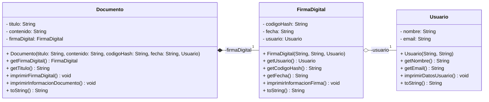
```mermaid
    classDiagram
    direction LR
        class Documento {
            - titulo: String
            - contenido: String
            - firmaDigital: FirmaDigital
            + Documento(titulo: String, contenido: String, codigoHash: String, fecha: String, Usuario)
            + getFirmaDigital() FirmaDigital
            + getTitulo() String
            + imprimirFirmaDigital() void
            + imprimirInformacionDocumento() void
            + toString() String
        }
        class FirmaDigital {
            - codigoHash: String
            - fecha: String
            - usuario: Usuario
            + FirmaDigital(String, String, Usuario)
            + getUsuario() Usuario
            + getCodigoHash() String
            + getFecha() String
            + imprimirInformacionFirma() void
            + toString() String
        }
        class Usuario {
            - nombre: String
            - email: String
            + Usuario(String, String)
            + getNombre() String
            + getEmail() String
            + imprimirDatosUsuario() void
            + toString() String
        }
        Documento *-- "1" FirmaDigital : -firmaDigital
        FirmaDigital o-- "1" Usuario : -usuario
```

<!-- 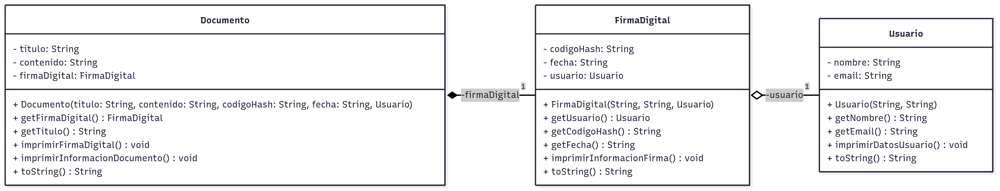 -->

- **Código**

```java
    package TP05.ejercicio08;
    public class Ejercicio08 {
        public static void main(String[] args) {
            Usuario usuario = new Usuario(
                    "Dr. Carlos Mendoza", "carlos.mendoza@empresa.com");
            Documento documento = new Documento(
                    "Contrato de Servicios",
                    "Este documento establece los términos y condiciones...",
                    "a1b2c3d4e5f67890", "2024-03-20 15:30:00", usuario);
            documento.imprimirInformacionDocumento();
            System.out.println("\n--- Información de la firma digital ---");
            documento.imprimirFirmaDigital();
            System.out.println("\n--- Información del usuario ---");
            usuario.imprimirDatosUsuario();
        }
    }
```

```java
    package TP05.ejercicio08;
    public class Documento {
        private String titulo;
        private String contenido;
        private FirmaDigital firmaDigital;
        public Documento(String titulo, String contenido, String codigoHash,
                        String fecha, Usuario usuario) {
            this.titulo = titulo;
            this.contenido = contenido;
            this.firmaDigital = new FirmaDigital(codigoHash, fecha, usuario);
        }
        public FirmaDigital getFirmaDigital() {
            return firmaDigital;
        }
        public String getTitulo() {
            return titulo;
        }
        public String getContenido() {
            return contenido;
        }
        public void imprimirFirmaDigital() {
            firmaDigital.imprimirInformacionFirma();
        }
        public void imprimirInformacionDocumento() {
            System.out.println("=== DOCUMENTO ===");
            System.out.println("Título: " + titulo);
            System.out.println("Contenido: "
                    + (contenido.length() > 50 ? contenido.substring(0, 50)
                    + "..." : contenido));
            if (firmaDigital != null) {
                System.out.println("Estado: Firmado digitalmente");
                System.out.println("Fecha de firma: " + firmaDigital.getFecha());
            } else {
                System.out.println("Estado: Pendiente de firma");
            }
        }
        @Override
        public String toString() {
            return "Documento{" + "titulo=" + titulo + ", contenido="
                    + (contenido.length() > 30 ? contenido.substring(0, 30)
                    + "..." : contenido) + ", firmaDigital=" + firmaDigital + '}';
        }
    }
```

```java
    package TP05.ejercicio08;
    public class FirmaDigital {
        private String codigoHash;
        private String fecha;
        private Usuario usuario;
        public FirmaDigital(String codigoHash, String fecha, Usuario usuario) {
            this.codigoHash = codigoHash;
            this.fecha = fecha;
            this.usuario = usuario;
        }
        public Usuario getUsuario() {
            return usuario;
        }
        public String getCodigoHash() {
            return codigoHash;
        }
        public String getFecha() {
            return fecha;
        }
        public void imprimirInformacionFirma() {
            System.out.println("Código Hash: " + codigoHash);
            System.out.println("Fecha: " + fecha);
            if (usuario != null) {
                System.out.println("Firmado por: " + usuario.getNombre());
            }
        }
        @Override
        public String toString() {
            return "FirmaDigital{" + "codigoHash=" + codigoHash
                    + ", fecha=" + fecha
                    + ", usuario=" + usuario + '}';
        }
    }
```

```java
    package TP05.ejercicio08;
    public class Usuario {
        private String nombre;
        private String email;
        public Usuario(String nombre, String email) {
            this.nombre = nombre;
            this.email = email;
        }
        public String getNombre() {
            return nombre;
        }
        public String getEmail() {
            return email;
        }
        public void imprimirDatosUsuario() {
            System.out.println("Nombre: " + nombre);
            System.out.println("Email: " + email);
        }
        @Override
        public String toString() {
            return "Usuario{" + "nombre=" + nombre + ", email=" + email + '}';
        }
    }
```

- **Consola**

```console
    === DOCUMENTO ===
    Título: Contrato de Servicios
    Contenido: Este documento establece los términos y condicione...
    Estado: Firmado digitalmente
    Fecha de firma: 2024-03-20 15:30:00

    --- Información de la firma digital ---
    Código Hash: a1b2c3d4e5f67890
    Fecha: 2024-03-20 15:30:00
    Firmado por: Dr. Carlos Mendoza

    --- Información del usuario ---
    Nombre: Dr. Carlos Mendoza
    Email: carlos.mendoza@empresa.com
```

---

#### 9. CitaMédica - Paciente - Profesional

> - **Asociación unidireccional**: CitaMédica → Paciente
> - **Asociación unidireccional**: CitaMédica → Profesional
> - **Clases y atributos**:
>   - CitaMédica: fecha, hora
>   - Paciente: nombre, obraSocial
>   - Profesional: nombre, especialidad

- **Diagrama UML**

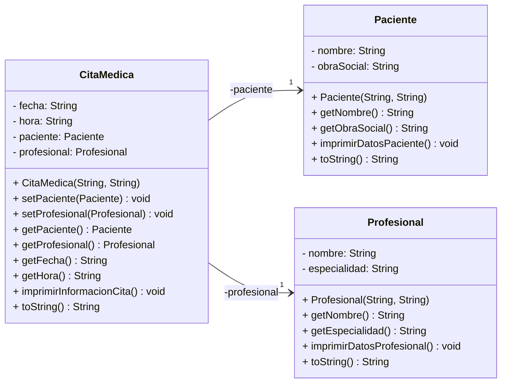
```mermaid
    classDiagram
    direction LR
        class CitaMedica {
            - fecha: String
            - hora: String
            - paciente: Paciente
            - profesional: Profesional
            + CitaMedica(String, String)
            + setPaciente(Paciente) void
            + setProfesional(Profesional) void
            + getPaciente() Paciente
            + getProfesional() Profesional
            + getFecha() String
            + getHora() String
            + imprimirInformacionCita() void
            + toString() String
        }
        class Paciente {
            - nombre: String
            - obraSocial: String
            + Paciente(String, String)
            + getNombre() String
            + getObraSocial() String
            + imprimirDatosPaciente() void
            + toString() String
        }
        class Profesional {
            - nombre: String
            - especialidad: String
            + Profesional(String, String)
            + getNombre() String
            + getEspecialidad() String
            + imprimirDatosProfesional() void
            + toString() String
        }
        CitaMedica --> "1" Paciente : -paciente
        CitaMedica --> "1" Profesional : -profesional
```

<!-- 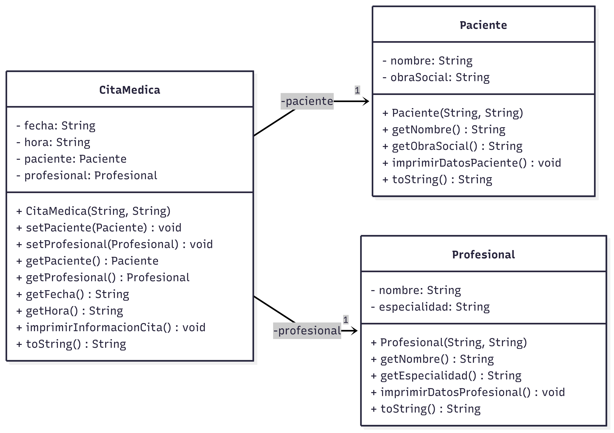 -->

- **Código**

```java
    package TP05.ejercicio09;
    public class Ejercicio09 {
        public static void main(String[] args) {
            Paciente paciente = new Paciente("María López", "OSDE 310");
            Profesional profesional = new Profesional(
                    "Dra. Carolina Rodríguez", "Cardiología");
            CitaMedica cita = new CitaMedica("2024-03-25", "10:30");
            cita.setPaciente(paciente);
            cita.setProfesional(profesional);
            cita.imprimirInformacionCita();
            System.out.println("\n--- Información del paciente ---");
            paciente.imprimirDatosPaciente();
            System.out.println("\n--- Información del profesional ---");
            profesional.imprimirDatosProfesional();
        }
    }
```

```java
    package TP05.ejercicio09;
    public class CitaMedica {
        private String fecha;
        private String hora;
        private Paciente paciente;
        private Profesional profesional;
        public CitaMedica(String fecha, String hora) {
            this.fecha = fecha;
            this.hora = hora;
        }
        public void setPaciente(Paciente paciente) {
            this.paciente = paciente;
        }
        public void setProfesional(Profesional profesional) {
            this.profesional = profesional;
        }
        public Paciente getPaciente() {
            return paciente;
        }
        public Profesional getProfesional() {
            return profesional;
        }
        public String getFecha() {
            return fecha;
        }
        public String getHora() {
            return hora;
        }
        public void imprimirInformacionCita() {
            System.out.println("=== CITA MÉDICA ===");
            System.out.println("Fecha: " + fecha);
            System.out.println("Hora: " + hora);
            if (paciente != null) {
                System.out.println("Paciente: " + paciente.getNombre());
            }
            if (profesional != null) {
                System.out.println("Profesional: " + profesional.getNombre() +
                                " - " + profesional.getEspecialidad());
            }
        }
        @Override
        public String toString() {
            return "CitaMedica{" + "fecha=" + fecha + ", hora=" + hora +
                ", paciente=" + paciente + ", profesional=" + profesional + '}';
        }
    }
```

```java
    package TP05.ejercicio09;
    public class Paciente {
        private String nombre;
        private String obraSocial;
        public Paciente(String nombre, String obraSocial) {
            this.nombre = nombre;
            this.obraSocial = obraSocial;
        }
        public String getNombre() {
            return nombre;
        }
        public String getObraSocial() {
            return obraSocial;
        }
        public void imprimirDatosPaciente() {
            System.out.println("Paciente: " + nombre);
            System.out.println("Obra Social: " + obraSocial);
        }
        @Override
        public String toString() {
            return "Paciente{" + "nombre="
                    + nombre + ", obraSocial=" + obraSocial + '}';
        }
    }
```

```java
    package TP05.ejercicio09;
    public class Profesional {
        private String nombre;
        private String especialidad;
        public Profesional(String nombre, String especialidad) {
            this.nombre = nombre;
            this.especialidad = especialidad;
        }
        public String getNombre() {
            return nombre;
        }
        public String getEspecialidad() {
            return especialidad;
        }
        public void imprimirDatosProfesional() {
            System.out.println("Profesional: " + nombre);
            System.out.println("Especialidad: " + especialidad);
        }
        @Override
        public String toString() {
            return "Profesional{" + "nombre=" + nombre
                    + ", especialidad=" + especialidad + '}';
        }
    }
```

- **Consola**

```console
    === CITA MÉDICA ===
    Fecha: 2024-03-25
    Hora: 10:30
    Paciente: María López
    Profesional: Dra. Carolina Rodríguez - Cardiología

    --- Información del paciente ---
    Paciente: María López
    Obra Social: OSDE 310

    --- Información del profesional ---
    Profesional: Dra. Carolina Rodríguez
    Especialidad: Cardiología
```

---

#### 10. CuentaBancaria - ClaveSeguridad - Titular

> - **Composición**: CuentaBancaria → ClaveSeguridad
> - **Asociación bidireccional**: CuentaBancaria ↔ Titular
> - **Clases y atributos**:
>   - CuentaBancaria: cbu, saldo
>   - ClaveSeguridad: codigo, ultimaModificacion
>   - Titular: nombre, dni

- **Diagrama UML**

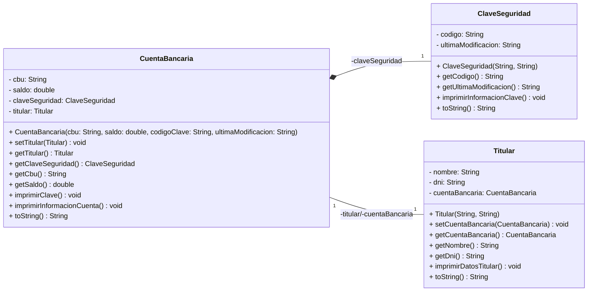
```mermaid
    classDiagram
    direction LR
        class CuentaBancaria {
            - cbu: String
            - saldo: double
            - claveSeguridad: ClaveSeguridad
            - titular: Titular
            + CuentaBancaria(cbu: String, saldo: double, codigoClave: String, ultimaModificacion: String)
            + setTitular(Titular) void
            + getTitular() Titular
            + getClaveSeguridad() ClaveSeguridad
            + getCbu() String
            + getSaldo() double
            + imprimirClave() void
            + imprimirInformacionCuenta() void
            + toString() String
        }
        class ClaveSeguridad {
            - codigo: String
            - ultimaModificacion: String
            + ClaveSeguridad(String, String)
            + getCodigo() String
            + getUltimaModificacion() String
            + imprimirInformacionClave() void
            + toString() String
        }
        class Titular {
            - nombre: String
            - dni: String
            - cuentaBancaria: CuentaBancaria
            + Titular(String, String)
            + setCuentaBancaria(CuentaBancaria) void
            + getCuentaBancaria() CuentaBancaria
            + getNombre() String
            + getDni() String
            + imprimirDatosTitular() void
            + toString() String
        }
        CuentaBancaria *-- "1" ClaveSeguridad : -claveSeguridad
        CuentaBancaria "1" -- "1" Titular : -titular/-cuentaBancaria
```

<!-- 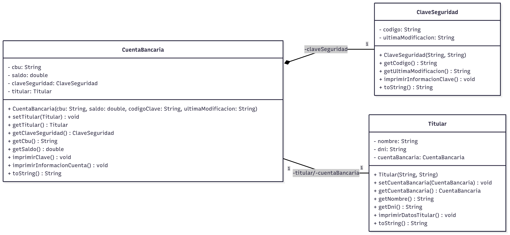 -->

- **Código**

```java
    package TP05.ejercicio10;
    public class Ejercicio10 {
        public static void main(String[] args) {
            Titular titular = new Titular("Juan Carlos Pérez", "30123456");
            CuentaBancaria cuenta = new CuentaBancaria("0170099540000001234567",
                    150000.75, "A1B2C3D4", "2024-03-15 14:33:00");
            cuenta.setTitular(titular);
            System.out.println("--- Información del titular ---");
            titular.imprimirDatosTitular();
            System.out.println("\n--- Información de la cuenta ---");
            cuenta.imprimirInformacionCuenta();
            System.out.println("\n--- Información de seguridad ---");
            cuenta.imprimirClave();
        }
    }
```

```java
    package TP05.ejercicio10;
    public class CuentaBancaria {
        private String cbu;
        private double saldo;
        private ClaveSeguridad claveSeguridad;
        private Titular titular;
        public CuentaBancaria(String cbu, double saldo, String codigoClave,
                            String ultimaModificacion) {
            this.cbu = cbu;
            this.saldo = saldo;
            this.claveSeguridad = new ClaveSeguridad(
                    codigoClave, ultimaModificacion);
        }
        public void setTitular(Titular titular) {
            this.titular = titular;
            if (titular != null && titular.getCuentaBancaria() != this) {
                titular.setCuentaBancaria(this);
            }
        }
        public Titular getTitular() {
            return titular;
        }
        public ClaveSeguridad getClaveSeguridad() {
            return claveSeguridad;
        }
        public String getCbu() {
            return cbu;
        }
        public double getSaldo() {
            return saldo;
        }
        public void imprimirClave() {
            claveSeguridad.imprimirInformacionClave();
        }
        public void imprimirInformacionCuenta() {
            System.out.println("CBU: " + cbu);
            System.out.println("Saldo: $" + String.format("%,.2f", saldo));
            if (titular != null) {
                System.out.println("Titular: " + titular.getNombre());
            }
            if (claveSeguridad != null) {
                System.out.println("Última modificación clave: "
                        + claveSeguridad.getUltimaModificacion());
            }
        }
        @Override
        public String toString() {
            return "CuentaBancaria{" + "cbu=" + cbu + ", saldo=" + saldo
                    + ", claveSeguridad=" + claveSeguridad
                    + ", titular=" + titular + '}';
        }
    }
```

```java
    package TP05.ejercicio10;
    public class ClaveSeguridad {
        private String codigo;
        private String ultimaModificacion;
        public ClaveSeguridad(String codigo, String ultimaModificacion) {
            this.codigo = codigo;
            this.ultimaModificacion = ultimaModificacion;
        }
        public String getCodigo() {
            return codigo;
        }
        public String getUltimaModificacion() {
            return ultimaModificacion;
        }
        public void imprimirInformacionClave() {
            System.out.println("Código de seguridad: "
                    + codigo.substring(0, 2) + "******");
            System.out.println("Última modificación: " + ultimaModificacion);
        }
        @Override
        public String toString() {
            return "ClaveSeguridad{" + "codigo=" + codigo
                    + ", ultimaModificacion=" + ultimaModificacion + '}';
        }
    }
```

```java
    package TP05.ejercicio10;
    public class Titular {
        private String nombre;
        private String dni;
        private CuentaBancaria cuentaBancaria;
        public Titular(String nombre, String dni) {
            this.nombre = nombre;
            this.dni = dni;
        }
        public void setCuentaBancaria(CuentaBancaria cuentaBancaria) {
            this.cuentaBancaria = cuentaBancaria;
            if (cuentaBancaria != null && cuentaBancaria.getTitular() != this) {
                cuentaBancaria.setTitular(this);
            }
        }
        public CuentaBancaria getCuentaBancaria() {
            return cuentaBancaria;
        }
        public String getNombre() {
            return nombre;
        }
        public String getDni() {
            return dni;
        }
        public void imprimirDatosTitular() {
            System.out.println("Titular: " + nombre);
            System.out.println("DNI: " + dni);
            if (cuentaBancaria != null) {
                System.out.println("CBU: " + cuentaBancaria.getCbu());
                System.out.println("Saldo: $"
                        + String.format("%,.2f", cuentaBancaria.getSaldo()));
            } else {
                System.out.println("No tiene cuenta bancaria asignada");
            }
        }
        @Override
        public String toString() {
            return "Titular{" + "nombre=" + nombre + ", dni=" + dni +
                ", cuentaBancaria=" + cuentaBancaria + '}';
        }
    }
```

- **Consola**

```console
    --- Información del titular ---
    Titular: Juan Carlos Pérez
    DNI: 30123456
    CBU: 0170099540000001234567
    Saldo: $150.000,75

    --- Información de la cuenta ---
    CBU: 0170099540000001234567
    Saldo: $150.000,75
    Titular: Juan Carlos Pérez
    Última modificación clave: 2024-03-15 14:33:00

    --- Información de seguridad ---
    Código de seguridad: A1******
    Última modificación: 2024-03-15 14:33:00
```

---

### Ejercicios de Dependencia de Uso

#### 11. Reproductor - Canción - Artista

> - **Asociación unidireccional**: Canción → Artista
> - **Dependencia de uso**: Reproductor.reproducir(Cancion)
> - **Clases y atributos**:
>   - Canción: titulo
>   - Artista: nombre, genero
>   - Reproductor: void reproducir(Cancion cancion)

- **Diagrama UML**

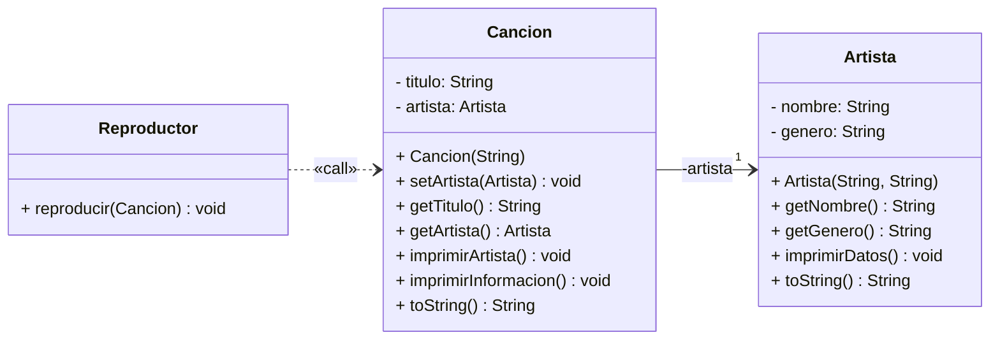
```mermaid
    classDiagram
    direction LR
        class Reproductor {
            + reproducir(Cancion) void
        }
        class Cancion {
            - titulo: String
            - artista: Artista
            + Cancion(String)
            + setArtista(Artista) void
            + getTitulo() String
            + getArtista() Artista
            + imprimirArtista() void
            + imprimirInformacion() void
            + toString() String
        }
        class Artista {
            - nombre: String
            - genero: String
            + Artista(String, String)
            + getNombre() String
            + getGenero() String
            + imprimirDatos() void
            + toString() String
        }
        Cancion --> "1" Artista : -artista
        Reproductor ..> Cancion : «call»
```

<!-- 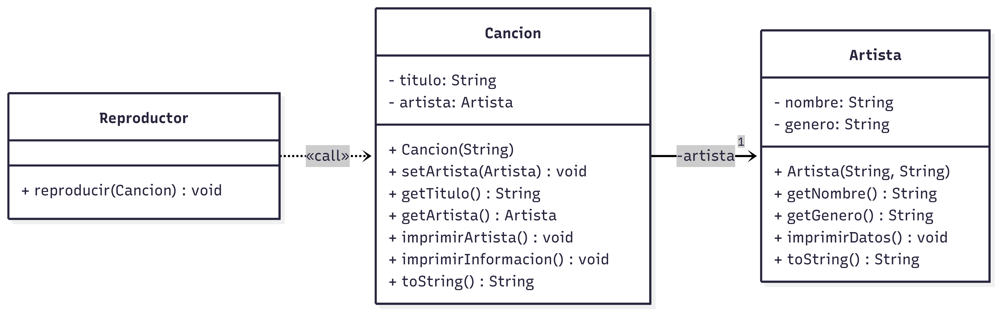 -->

- **Código**

```java
    package TP05.ejercicio11;
    public class Ejercicio11 {
        public static void main(String[] args) {
            Artista artista = new Artista("The Weeknd", "R&B/Pop");
            Cancion cancion = new Cancion("Blinding Lights");
            cancion.setArtista(artista);
            Reproductor reproductor = new Reproductor();
            cancion.imprimirInformacion();
            System.out.println("\n--- Reproduciendo canción ---");
            reproductor.reproducir(cancion);
        }
    }
```

```java
    package TP05.ejercicio11;
    public class Reproductor {
        public void reproducir(Cancion cancion) {
            if (cancion != null) {
                System.out.println("Reproduciendo: " + cancion.getTitulo());
                cancion.imprimirArtista();
            } else {
                System.out.println(
                        "Error: No se puede reproducir una canción nula");
            }
        }
    }
```

```java
    package TP05.ejercicio11;
    public class Cancion {
        private String titulo;
        private Artista artista;
        public Cancion(String titulo) {
            this.titulo = titulo;
        }
        public void setArtista(Artista artista) {
            this.artista = artista;
        }
        public String getTitulo() {
            return titulo;
        }
        public Artista getArtista() {
            return artista;
        }
        public void imprimirArtista() {
            artista.imprimirDatos();
        }
        public void imprimirInformacion() {
            System.out.println("=== INFORMACIÓN DE LA CANCIÓN ===");
            System.out.println("Título: " + titulo);
            if (artista != null) {
                System.out.println("Artista: " + artista.getNombre());
                System.out.println("Género: " + artista.getGenero());
            }
        }
        @Override
        public String toString() {
            return "Cancion{" + "titulo=" + titulo
                    + ", artista=" + artista + '}';
        }
    }
```

```java
    package TP05.ejercicio11;
    public class Artista {
        private String nombre;
        private String genero;
        public Artista(String nombre, String genero) {
            this.nombre = nombre;
            this.genero = genero;
        }
        public String getNombre() {
            return nombre;
        }
        public String getGenero() {
            return genero;
        }
        public void imprimirDatos() {
            System.out.println("Artista: " + nombre);
            System.out.println("Género musical: " + genero);
        }
        @Override
        public String toString() {
            return "Artista{" + "nombre=" + nombre + ", genero=" + genero + '}';
        }
    }
```

- **Consola**

```console
    === INFORMACIÓN DE LA CANCIÓN ===
    Título: Blinding Lights
    Artista: The Weeknd
    Género: R&B/Pop

    --- Reproduciendo canción ---
    Reproduciendo: Blinding Lights
    Artista: The Weeknd
    Género musical: R&B/Pop
```

---

#### 12. Impuesto - Contribuyente - Calculadora

> - **Asociación unidireccional**: Impuesto → Contribuyente
> - **Dependencia de uso**: Calculadora.calcular(Impuesto)
> - **Clases y atributos**:
>   - Impuesto: monto
>   - Contribuyente: nombre, cuil
>   - Calculadora: void calcular(Impuesto impuesto)

- **Diagrama UML**

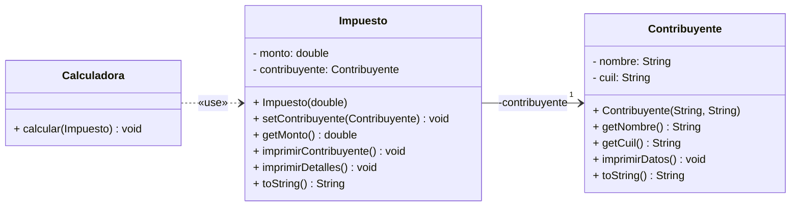
```mermaid
    classDiagram
    direction LR
        class Calculadora {
            + calcular(Impuesto) void
        }
        class Impuesto {
            - monto: double
            - contribuyente: Contribuyente
            + Impuesto(double)
            + setContribuyente(Contribuyente) void
            + getMonto() double
            + imprimirContribuyente() void
            + imprimirDetalles() void
            + toString() String
        }
        class Contribuyente {
            - nombre: String
            - cuil: String
            + Contribuyente(String, String)
            + getNombre() String
            + getCuil() String
            + imprimirDatos() void
            + toString() String
        }
        Impuesto --> "1" Contribuyente : -contribuyente
        Calculadora ..> Impuesto : «use»
```

<!-- 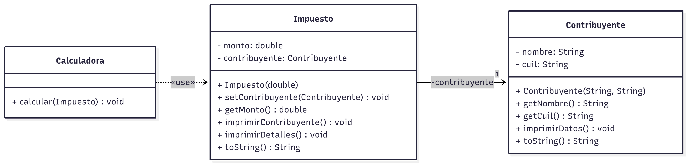 -->

- **Código**

```java
    package TP05.ejercicio12;
    public class Ejercicio12 {
        public static void main(String[] args) {
            Contribuyente contribuyente = new Contribuyente(
                    "María Elena García", "27-12345678-9");
            Impuesto impuesto = new Impuesto(12500.75);
            impuesto.setContribuyente(contribuyente);
            Calculadora calculadora = new Calculadora();
            impuesto.imprimirDetalles();
            calculadora.calcular(impuesto);
        }
    }
```

```java
    package TP05.ejercicio12;
    public class Calculadora {
        public void calcular(Impuesto impuesto) {
            if (impuesto != null) {
                System.out.println("\nCALCULADORA FISCAL");
                System.out.println("======================");
                double montoBase = impuesto.getMonto();
                double iva = montoBase * 0.21;
                double iibb = montoBase * 0.035;
                double total = montoBase + iva + iibb;
                impuesto.imprimirContribuyente();
                System.out.println("Monto base: $"
                        + String.format("%,.2f", montoBase));
                System.out.println("IVA (21%): $"
                        + String.format("%,.2f", iva));
                System.out.println("IIBB (3.5%): $"
                        + String.format("%,.2f", iibb));
                System.out.println("TOTAL: $"
                        + String.format("%,.2f", total));
                System.out.println("Fecha de cálculo: "
                        + java.time.LocalDate.now());
            } else {
                System.out.println("Error: No se puede calcular un impuesto nulo");
            }
        }
    }
```

```java
    package TP05.ejercicio12;
    public class Impuesto {
        private double monto;
        private Contribuyente contribuyente;
        public Impuesto(double monto) {
            this.monto = monto;
        }
        public void setContribuyente(Contribuyente contribuyente) {
            this.contribuyente = contribuyente;
        }
        public double getMonto() {
            return monto;
        }
        public void imprimirContribuyente() {
            contribuyente.imprimirDatos();
        }
        public void imprimirDetalles() {
            System.out.println("=== DETALLES DEL IMPUESTO ===");
            System.out.println("Monto: $" + String.format("%,.2f", monto));
            if (contribuyente != null) {
                System.out.println("Contribuyente: " + contribuyente.getNombre());
                System.out.println("CUIL: " + contribuyente.getCuil());
            }
        }
        @Override
        public String toString() {
            return "Impuesto{" + "monto=" + monto
                    + ", contribuyente=" + contribuyente + '}';
        }
    }
```

```java
    package TP05.ejercicio12;
    public class Contribuyente {
        private String nombre;
        private String cuil;
        public Contribuyente(String nombre, String cuil) {
            this.nombre = nombre;
            this.cuil = cuil;
        }
        public String getNombre() {
            return nombre;
        }
        public String getCuil() {
            return cuil;
        }
        public void imprimirDatos() {
            System.out.println("Contribuyente: " + nombre);
            System.out.println("CUIL: " + cuil);
        }
        @Override
        public String toString() {
            return "Contribuyente{" + "nombre=" + nombre
                    + ", cuil=" + cuil + '}';
        }
    }
```

- **Consola**

```console
    === DETALLES DEL IMPUESTO ===
    Monto: $12.500,75
    Contribuyente: María Elena García
    CUIL: 27-12345678-9

    CALCULADORA FISCAL
    ======================
    Contribuyente: María Elena García
    CUIL: 27-12345678-9
    Monto base: $12.500,75
    IVA (21%): $2.625,16
    IIBB (3.5%): $437,53
    TOTAL: $15.563,43
    Fecha de cálculo: 2025-09-13
```

---

### Ejercicios de Dependencia de Creación

#### 13. GeneradorQR - Usuario - CódigoQR

> - **Asociación unidireccional**: CódigoQR → Usuario
> - **Dependencia de creación**: GeneradorQR.generar(String, Usuario)
> - **Clases y atributos**:
>   - CodigoQR: valor
>   - Usuario: nombre, email
>   - GeneradorQR: void generar(String valor, Usuario usuario)

- **Diagrama UML**

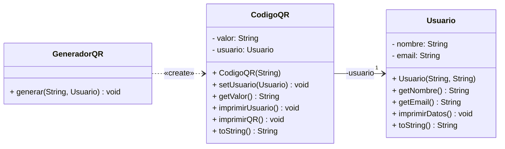
```mermaid
    classDiagram
    direction LR
        class GeneradorQR {
            + generar(String, Usuario) void
        }
        class CodigoQR {
            - valor: String
            - usuario: Usuario
            + CodigoQR(String)
            + setUsuario(Usuario) void
            + getValor() String
            + imprimirUsuario() void
            + imprimirQR() void
            + toString() String
        }
        class Usuario {
            - nombre: String
            - email: String
            + Usuario(String, String)
            + getNombre() String
            + getEmail() String
            + imprimirDatos() void
            + toString() String
        }
        CodigoQR --> "1" Usuario : -usuario
        GeneradorQR ..> CodigoQR : «create»
```

<!-- 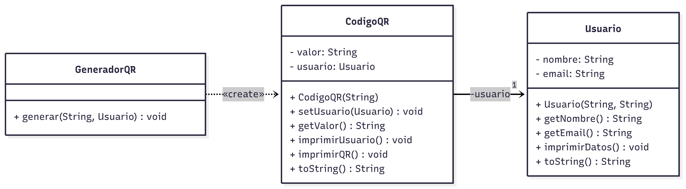 -->

- **Código**

```java
    package TP05.ejercicio13;
    public class Ejercicio13 {
        public static void main(String[] args) {
            Usuario usuario = new Usuario("Ana Torres", "ana.torres@empresa.com");
            GeneradorQR generador = new GeneradorQR();
            System.out.println("=== GENERADOR DE CÓDIGOS QR ===");
            usuario.imprimirDatos();
            System.out.println("\n--- Generando código QR ---");
            generador.generar("https://www.elblog.com/perfil/ana-torres", usuario);
        }
    }
```

```java
    package TP05.ejercicio13;
    public class GeneradorQR {
        public void generar(String valor, Usuario usuario) {
            if (valor != null && usuario != null) {
                // Creación del código QR (dependencia de creación)
                CodigoQR codigo = new CodigoQR(valor);
                codigo.setUsuario(usuario);
                System.out.println("Código QR generado exitosamente!");
                System.out.println("Contenido: " + codigo.getValor());
                codigo.imprimirUsuario();
            } else {
                System.out.println("Error: No se puede generar QR con datos nulos");
            }
        }
    }
```

```java
    package TP05.ejercicio13;
    public class CodigoQR {
        private String valor;
        private Usuario usuario;
        public CodigoQR(String valor) {
            this.valor = valor;
        }
        public void setUsuario(Usuario usuario) {
            this.usuario = usuario;
        }
        public String getValor() {
            return valor;
        }
        public void imprimirUsuario() {
            System.out.println("Autor: " + usuario.getNombre());
            System.out.println("Email: " + usuario.getEmail());
        }
        public void imprimirQR() {
            System.out.println("=== CÓDIGO QR ===");
            System.out.println("Valor: " + valor);
            if (usuario != null) {
                System.out.println("Usuario asociado: " + usuario.getNombre());
                System.out.println("Email: " + usuario.getEmail());
            }
            System.out.println("Fecha creación: " + java.time.LocalDateTime.now());
        }
        @Override
        public String toString() {
            return "CodigoQR{" + "valor=" + valor + ", usuario=" + usuario + '}';
        }
    }
```

```java
    package TP05.ejercicio13;
    public class Usuario {
        private String nombre;
        private String email;
        public Usuario(String nombre, String email) {
            this.nombre = nombre;
            this.email = email;
        }
        public String getNombre() {
            return nombre;
        }
        public String getEmail() {
            return email;
        }
        public void imprimirDatos() {
            System.out.println("Usuario: " + nombre);
            System.out.println("Email: " + email);
        }
        @Override
        public String toString() {
            return "Usuario{" + "nombre=" + nombre + ", email=" + email + '}';
        }
    }
```

- **Consola**

```console
    === GENERADOR DE CÓDIGOS QR ===
    Usuario: Ana Torres
    Email: ana.torres@empresa.com

    --- Generando código QR ---
    Código QR generado exitosamente!
    Contenido: https://www.elblog.com/perfil/ana-torres
    Autor: Ana Torres
    Email: ana.torres@empresa.com
```

---

#### 14. EditorVideo - Proyecto - Render

> - **Asociación unidireccional**: Render → Proyecto
> - **Dependencia de creación**: EditorVideo.exportar(String, Proyecto)
> - **Clases y atributos**:
>   - Render: formato
>   - Proyecto: nombre, duracionMin
>   - EditorVideo: void exportar(String formato, Proyecto proyecto)

- **Diagrama UML**

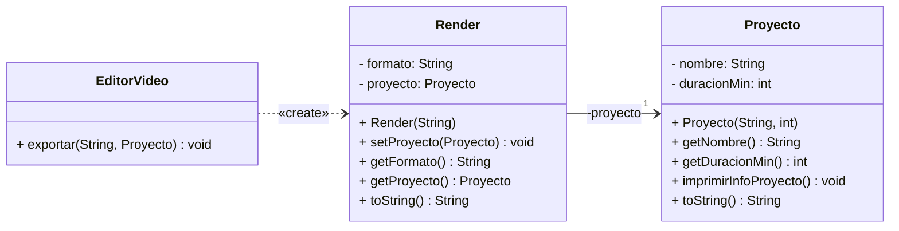
```mermaid
    classDiagram
    direction LR
        class EditorVideo {
            + exportar(String, Proyecto) void
        }
        class Render {
            - formato: String
            - proyecto: Proyecto
            + Render(String)
            + setProyecto(Proyecto) void
            + getFormato() String
            + getProyecto() Proyecto
            + toString() String
        }
        class Proyecto {
            - nombre: String
            - duracionMin: int
            + Proyecto(String, int)
            + getNombre() String
            + getDuracionMin() int
            + imprimirInfoProyecto() void
            + toString() String
        }
        Render --> "1" Proyecto : -proyecto
        EditorVideo ..> Render : «create»
```

<!-- 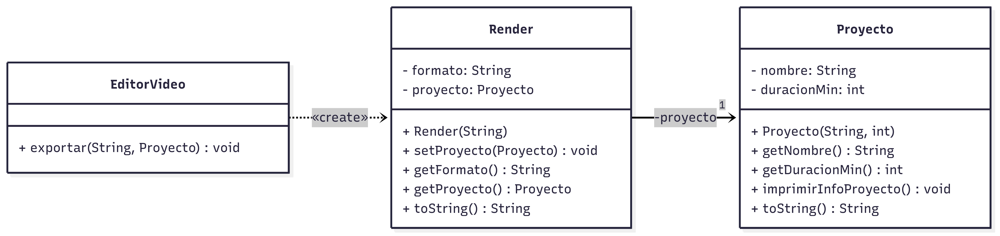 -->

- **Código**

```java
    package TP05.ejercicio14;
    public class Ejercicio14 {
        public static void main(String[] args) {
            Proyecto proyecto = new Proyecto("Documental Dinosaurios", 45);
            EditorVideo editor = new EditorVideo();
            System.out.println("=== EDITOR DE VIDEO PROFESIONAL ===");
            proyecto.imprimirInfoProyecto();
            System.out.println("\n--- Exportando proyecto ---");
            editor.exportar("MP4", proyecto);
        }
    }
```

```java
    package TP05.ejercicio14;
    public class EditorVideo {
        public void exportar(String formato, Proyecto proyecto) {
            if (formato != null && proyecto != null) {
                // Creación del Render (dependencia de creación)
                Render render = new Render(formato);
                render.setProyecto(proyecto);
                System.out.println("Iniciando exportación...");
                System.out.println("Formato: " + formato);
                System.out.println("Proyecto: " + proyecto.getNombre());
                System.out.println("Duración: " + proyecto.getDuracionMin()
                        + " minutos");
                System.out.println("Exportación completada exitosamente!");
                System.out.println("Archivo generado: "
                        + proyecto.getNombre().toLowerCase().replace(" ", "-")
                        + "." + formato.toLowerCase());
            } else {
                System.out.println(
                        "Error: No se puede exportar con parámetros nulos");
            }
        }
    }
```

```java
    package TP05.ejercicio14;
    public class Render {
        private String formato;
        private Proyecto proyecto;
        public Render(String formato) {
            this.formato = formato;
        }
        public void setProyecto(Proyecto proyecto) {
            this.proyecto = proyecto;
        }
        public String getFormato() {
            return formato;
        }
        public Proyecto getProyecto() {
            return proyecto;
        }
        @Override
        public String toString() {
            return "Render{" + "formato=" + formato
                    + ", proyecto=" + proyecto + '}';
        }
    }
```

```java
    package TP05.ejercicio14;
    public class Proyecto {
        private String nombre;
        private int duracionMin;
        public Proyecto(String nombre, int duracionMin) {
            this.nombre = nombre;
            this.duracionMin = duracionMin;
        }
        public String getNombre() {
            return nombre;
        }
        public int getDuracionMin() {
            return duracionMin;
        }
        public void imprimirInfoProyecto() {
            System.out.println("Proyecto: " + nombre);
            System.out.println("Duración: " + duracionMin + " minutos");
            System.out.println("Tipo: "
                    + (duracionMin > 30 ? "Largometraje" : "Cortometraje"));
        }
        @Override
        public String toString() {
            return "Proyecto{" + "nombre=" + nombre
                    + ", duracionMin=" + duracionMin + '}';
        }
    }
```

- **Consola**

```console
    === EDITOR DE VIDEO PROFESIONAL ===
    Proyecto: Documental Dinosaurios
    Duración: 45 minutos
    Tipo: Largometraje

    --- Exportando proyecto ---
    Iniciando exportación...
    Formato: MP4
    Proyecto: Documental Dinosaurios
    Duración: 45 minutos
    Exportación completada exitosamente!
    Archivo generado: documental-dinosaurios.mp4
```

---

## ✅ Conclusiones esperadas

- Diferenciar claramente los tipos de relaciones entre clases (asociación, agregación, composición).
- Representar las relaciones con la dirección adecuada en diagramas UML.
- Comprender e implementar dependencias de uso y de creación.
- Aplicar relaciones 1 a 1 en el diseño e implementación de clases en Java.
- Reforzar el análisis de modelos orientados a objetos y la capacidad de abstracción.
