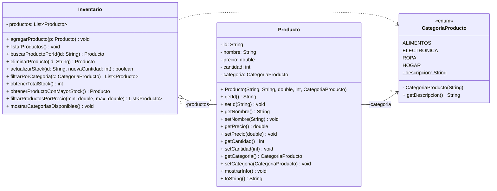
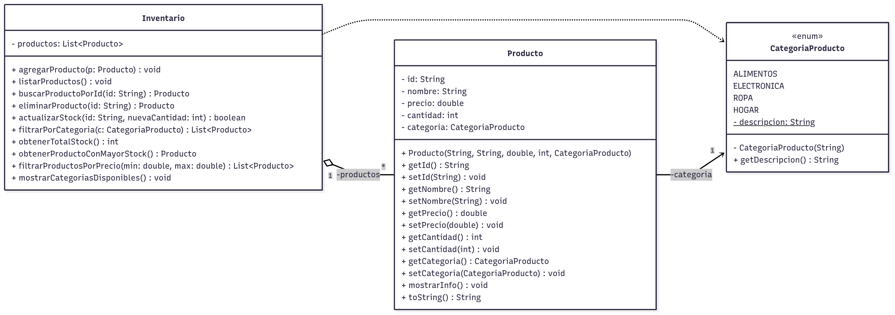
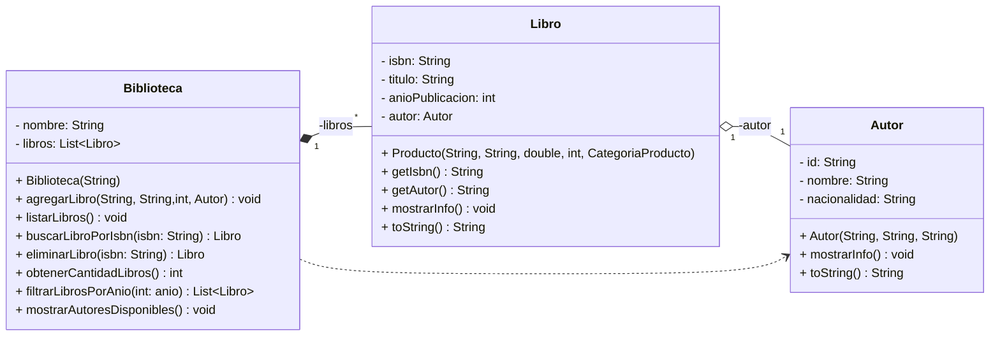
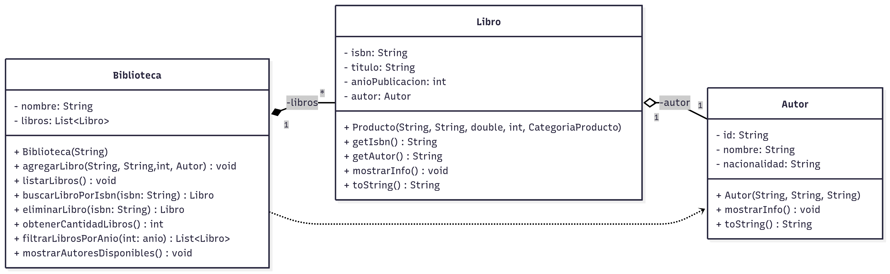
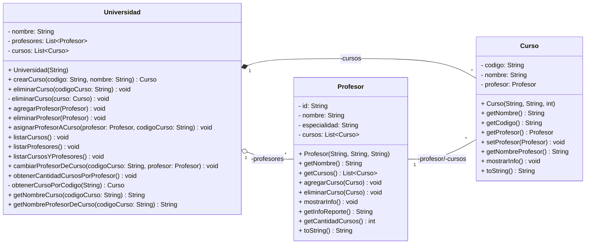
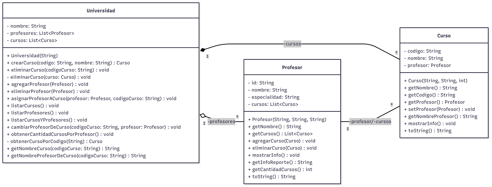

# TP06 - Colecciones y Sistema de Stock

   [](https://github.com/m415x/UTN-TUPaD-P2/tree/main/src/TP06)

## ✨ Alumno

- **Nombre:** Cristian Daniel Lahoz Piantanida
- **Matrícula:** 101424
- **Comisión:** Ag25-2C 08

## 🎯 Objetivo general

Aplicar el uso de colecciones en Java (`ArrayList`, `HashMap`, etc.) para gestionar sistemas de stock, bibliotecas y universidades, modelando entidades con relaciones 1 a N y N a N.

---

## 📚 Marco teórico

| Concepto             | Aplicación en el proyecto                                    |
| -------------------- | ------------------------------------------------------------ |
| Colecciones          | Gestión dinámica de conjuntos de objetos (productos, libros) |
| ArrayList            | Manejo de listas ordenadas de elementos                      |
| HashMap              | Acceso rápido por clave-valor (ej. legajo → alumno)          |
| Relación 1 a N       | Un objeto posee una colección de otros                       |
| Relación N a N       | Asociación múltiple entre dos entidades                      |
| Encapsulamiento      | Métodos controlan la manipulación de las colecciones         |
| Iteración y búsqueda | Recorrer colecciones para encontrar, filtrar o modificar     |
| UML + métodos        | Diagrama con atributos y operaciones                         |

---

## 🧪 Caso práctico

### Ejercicio 1: Sistema de Stock

Desarrollar un sistema de stock que permita gestionar productos en una tienda, controlando su disponibilidad, precios y categorías.
**Tareas a realizar:**

1. Crear al menos cinco productos con diferentes categorías y agregarlos al inventario.
2. Listar todos los productos mostrando su información y categoría.
3. Buscar un producto por ID y mostrar su información.
4. Filtrar y mostrar productos que pertenezcan a una categoría específica.
5. Eliminar un producto por su ID y listar los productos restantes.
6. Actualizar el stock de un producto existente.
7. Mostrar el total de stock disponible.
8. Obtener y mostrar el producto con mayor stock.
9. Filtrar productos con precios entre $1000 y $3000.
10. Mostrar las categorías disponibles con sus descripciones.

- **Diagrama UML**



<!--  -->

- **Código**

```java
    package TP06.ejercicio1;

    public enum CategoriaProducto {

        ALIMENTOS("Productos comestibles"),
        ELECTRONICA("Dispositivos electrónicos"),
        ROPA("Prendas de vestir"),
        HOGAR("Artículos para el hogar");

        private final String descripcion;

        private CategoriaProducto(String descripcion) {
            this.descripcion = descripcion;
        }

        public String getDescripcion() {
            return descripcion;
        }

    }
```

```java
    package TP06.ejercicio1;

    public class Producto {

        private String id;
        private String nombre;
        private double precio;
        private int cantidad;
        private CategoriaProducto categoria;

        public Producto(String id, String nombre, double precio, int cantidad,
                CategoriaProducto categoria) {
            this.id = id;
            this.nombre = nombre;
            this.precio = precio;
            this.cantidad = cantidad;
            this.categoria = categoria;
        }

        public String getId() {
            return id;
        }

        public void setId(String id) {
            this.id = id;
        }

        public String getNombre() {
            return nombre;
        }

        public void setNombre(String nombre) {
            this.nombre = nombre;
        }

        public double getPrecio() {
            return precio;
        }

        public void setPrecio(double precio) {
            this.precio = precio;
        }

        public int getCantidad() {
            return cantidad;
        }

        public void setCantidad(int cantidad) {
            this.cantidad = cantidad;
        }

        public CategoriaProducto getCategoria() {
            return categoria;
        }

        public void setCategoria(CategoriaProducto categoria) {
            this.categoria = categoria;
        }

        public void mostrarInfo() {
            System.out.println("Producto{"
                    + "id=" + id
                    + ", nombre=" + nombre
                    + ", precio=" + precio
                    + ", cantidad=" + cantidad
                    + ", categoria=" + categoria + '}');
        }

        @Override
        public String toString() {
            return "Producto{"
                    + "id=" + id
                    + ", nombre=" + nombre
                    + ", precio=" + precio
                    + ", cantidad=" + cantidad
                    + ", categoria=" + categoria + '}';
        }

    }
```

```java
    package TP06.ejercicio1;

    import java.util.ArrayList;
    import java.util.Collections;
    import java.util.List;

    public class Inventario {

        private List<Producto> productos = new ArrayList<>();

        public void agregarProducto(Producto p) {
            if (p != null && !productos.contains(p)) {
                productos.add(p);
            }
        }

        public void listarProductos() {
            for (Producto p : productos) {
                System.out.println("id=" + p.getId()
                        + ", nombre=" + p.getNombre()
                        + ", precio=" + p.getPrecio()
                        + ", cantidad=" + p.getCantidad()
                        + ", categoria=" + p.getCategoria());
            }
        }

        public Producto buscarProductoPorId(String id) {
            int i = 0;
            Producto encontrado = null;
            while (i < productos.size()
                    && !this.productos.get(i).getId().equals(id)) {
                i++;
            }
            if (i < productos.size()) {
                encontrado = this.productos.get(i);
            }
            if (encontrado == null) {
                System.out.println("id " + id + " no encontrado");
            }
            return encontrado;
        }

        public Producto eliminarProducto(String id) {
            Producto eliminar = buscarProductoPorId(id);
            this.productos.remove(eliminar);
            return eliminar;
        }

        public boolean actualizarStock(String id, int nuevaCantidad) {
            Producto stock = buscarProductoPorId(id);
            if(stock == null) return false;
            stock.setCantidad(nuevaCantidad);
            return true;
        }

        public List<Producto> filtrarPorCategoria(CategoriaProducto c) {
            List<Producto> encontrados = new ArrayList<>();
            for (Producto p : productos) {
                if (p.getCategoria() == c) {
                    encontrados.add(p);
                }
            }
            return  Collections.unmodifiableList(encontrados);
        }

        public int obtenerTotalStock() {
            int totalStock = 0;
            for (Producto p : productos) {
                totalStock += p.getCantidad();
            }
            return totalStock;
        }

        public Producto obtenerProductoConMayorStock() {
            Producto prodMayorStock = null;
            int mayorStock = 0;
            for (Producto p : productos) {
                if(p.getCantidad() > mayorStock){
                    mayorStock = p.getCantidad();
                    prodMayorStock = p;
                }
            }
            return prodMayorStock;
        }

        public List<Producto> filtrarProductosPorPrecio(double min, double max) {
            List<Producto> prodFiltrados = new ArrayList<>();
            for (Producto p : productos) {
                if(p.getPrecio() >= min && p.getPrecio() <= max){
                    prodFiltrados.add(p);
                }
            }
            return Collections.unmodifiableList(prodFiltrados);
        }

        public void mostrarCategoriasDisponibles() {
            for (CategoriaProducto c : CategoriaProducto.values()) {
                System.out.println(c.name() + ": " + c.getDescripcion());
            }
        }

    }
```

```java
    package TP06.ejercicio1;

    public class Main {

        public static void main(String[] args) {
            // Instanciamos el inventario
            Inventario inv = new Inventario();

            // Instanciamos productos
            Producto p1 = new Producto("01", "Remera", 50000.5, 6, CategoriaProducto.ROPA);
            Producto p2 = new Producto("03", "Hamburguesas", 1325, 15, CategoriaProducto.ALIMENTOS);
            Producto p3 = new Producto("09", "Gaseosa", 2000, 30, CategoriaProducto.ALIMENTOS);
            Producto p4 = new Producto("13", "Pantalón", 130716.45, 3, CategoriaProducto.ROPA);
            Producto p5 = new Producto("23", "Placard", 300000, 2, CategoriaProducto.HOGAR);
            Producto p6 = new Producto("19", "Placa Madre", 550000, 5, CategoriaProducto.ELECTRONICA);
            Producto p7 = new Producto("35", "TV", 650000, 15, CategoriaProducto.ELECTRONICA);
            Producto p8 = new Producto("27", "Smartphone", 2000000, 6, CategoriaProducto.ELECTRONICA);
            Producto p9 = new Producto("31", "Parlante", 80000, 8, CategoriaProducto.ELECTRONICA);

            // Añadimos los productos al inventario
            inv.agregarProducto(p1);
            inv.agregarProducto(p2);
            inv.agregarProducto(p3);
            inv.agregarProducto(p4);
            inv.agregarProducto(p5);
            inv.agregarProducto(p6);
            inv.agregarProducto(p7);
            inv.agregarProducto(p8);
            inv.agregarProducto(p9);

            // Mostramos todos los productos
            System.out.println("Lista de productos:");
            inv.listarProductos();

            // Buscamos producto por id
            System.out.println("\nBuscar por id");
            System.out.println(inv.buscarProductoPorId("19"));
            System.out.println(inv.buscarProductoPorId("20"));

            // Filtramos por categoría
            System.out.println("\nFiltrar por categoría");
            System.out.println(inv.filtrarPorCategoria(CategoriaProducto.ROPA));
            System.out.println(inv.filtrarPorCategoria(CategoriaProducto.ELECTRONICA));

            // Eliminamos un producto y mostramos la lista actualizada
            System.out.println("\nSe eliminó: " + inv.eliminarProducto("35"));
            System.out.println("\nLista actualizada de productos:");
            inv.listarProductos();

            // Actualizamos el stock de un producto
            System.out.println("\nProducto antes de actualizar stock");
            System.out.println(inv.buscarProductoPorId("13"));
            inv.actualizarStock("13", 20);
            System.out.println("Producto después de actualizar stock");
            System.out.println(inv.buscarProductoPorId("13"));

            // Mostramos el total de stock
            System.out.println("\nEl total de stock es: "
                    + inv.obtenerTotalStock());

            // Mostramos producto con mayor stock
            System.out.println("\nEl producto con mayor stock es: "
                    + inv.obtenerProductoConMayorStock());

            // Filtramos productos con precios entre $1000 y $3000
            System.out.println("\nProductos con precios entre 1000 y 3000: "
                    + inv.filtrarProductosPorPrecio(1000, 3000));

            // Mostramos las categorías disponibles con sus descripciones
            System.out.println("\nCategorías disponibles:");
            inv.mostrarCategoriasDisponibles();
        }

    }
```

- **Consola**

```console
    Lista de productos:
    id=01, nombre=Remera, precio=50000.5, cantidad=6, categoria=ROPA
    id=03, nombre=Hamburguesas, precio=1325.0, cantidad=15, categoria=ALIMENTOS
    id=09, nombre=Gaseosa, precio=2000.0, cantidad=30, categoria=ALIMENTOS
    id=13, nombre=Pantalón, precio=130716.45, cantidad=3, categoria=ROPA
    id=23, nombre=Placard, precio=300000.0, cantidad=2, categoria=HOGAR
    id=19, nombre=Placa Madre, precio=550000.0, cantidad=5, categoria=ELECTRONICA
    id=35, nombre=TV, precio=650000.0, cantidad=15, categoria=ELECTRONICA
    id=27, nombre=Smartphone, precio=2000000.0, cantidad=6, categoria=ELECTRONICA
    id=31, nombre=Parlante, precio=80000.0, cantidad=8, categoria=ELECTRONICA

    Buscar por id
    Producto{id=19, nombre=Placa Madre, precio=550000.0, cantidad=5, categoria=ELECTRONICA}
    id 20 no encontrado
    null

    Filtrar por categoría
    [Producto{id=01, nombre=Remera, precio=50000.5, cantidad=6, categoria=ROPA}, Producto{id=13, nombre=Pantalón, precio=130716.45, cantidad=3, categoria=ROPA}]
    [Producto{id=19, nombre=Placa Madre, precio=550000.0, cantidad=5, categoria=ELECTRONICA}, Producto{id=35, nombre=TV, precio=650000.0, cantidad=15, categoria=ELECTRONICA}, Producto{id=27, nombre=Smartphone, precio=2000000.0, cantidad=6, categoria=ELECTRONICA}, Producto{id=31, nombre=Parlante, precio=80000.0, cantidad=8, categoria=ELECTRONICA}]

    Se eliminó: Producto{id=35, nombre=TV, precio=650000.0, cantidad=15, categoria=ELECTRONICA}

    Lista actualizada de productos:
    id=01, nombre=Remera, precio=50000.5, cantidad=6, categoria=ROPA
    id=03, nombre=Hamburguesas, precio=1325.0, cantidad=15, categoria=ALIMENTOS
    id=09, nombre=Gaseosa, precio=2000.0, cantidad=30, categoria=ALIMENTOS
    id=13, nombre=Pantalón, precio=130716.45, cantidad=3, categoria=ROPA
    id=23, nombre=Placard, precio=300000.0, cantidad=2, categoria=HOGAR
    id=19, nombre=Placa Madre, precio=550000.0, cantidad=5, categoria=ELECTRONICA
    id=27, nombre=Smartphone, precio=2000000.0, cantidad=6, categoria=ELECTRONICA
    id=31, nombre=Parlante, precio=80000.0, cantidad=8, categoria=ELECTRONICA

    Producto antes de actualizar stock
    Producto{id=13, nombre=Pantalón, precio=130716.45, cantidad=3, categoria=ROPA}
    Producto después de actualizar stock
    Producto{id=13, nombre=Pantalón, precio=130716.45, cantidad=20, categoria=ROPA}

    El total de stock es: 92

    El producto con mayor stock es: Producto{id=09, nombre=Gaseosa, precio=2000.0, cantidad=30, categoria=ALIMENTOS}

    Productos con precios entre 1000 y 3000: [Producto{id=03, nombre=Hamburguesas, precio=1325.0, cantidad=15, categoria=ALIMENTOS}, Producto{id=09, nombre=Gaseosa, precio=2000.0, cantidad=30, categoria=ALIMENTOS}]

    Categorías disponibles:
    ALIMENTOS: Productos comestibles
    ELECTRONICA: Dispositivos electrónicos
    ROPA: Prendas de vestir
    HOGAR: Artículos para el hogar
```

---

### Ejercicio 2: Biblioteca (Composición 1 a N)

Desarrollar un sistema para gestionar una biblioteca, en la cual se registren los libros disponibles y sus autores.
**Tareas a realizar:**

1. Crear una biblioteca.
2. Crear al menos tres autores.
3. Agregar 5 libros asociados a alguno de los Autores a la biblioteca.
4. Listar todos los libros con su información y la del autor.
5. Buscar un libro por su ISBN y mostrar su información.
6. Filtrar y mostrar los libros publicados en un año específico.
7. Eliminar un libro por su ISBN y listar los libros restantes.
8. Mostrar la cantidad total de libros en la biblioteca.
9. Listar todos los autores de los libros disponibles en la biblioteca.

- **Diagrama UML**



<!--  -->

- **Código**

```java
    package TP06.ejercicio2;

    public class Autor {

        private String id;
        private String nombre;
        private String nacionalidad;

        public Autor(String id, String nombre, String nacionalidad) {
            this.id = id;
            this.nombre = nombre;
            this.nacionalidad = nacionalidad;
        }

        public void mostrarInfo() {
            System.out.println("{id=" + id
                    + ", nombre=" + nombre
                    + ", nacionalidad=" + nacionalidad + '}');
        }

        @Override
        public String toString() {
            return "{id=" + id
                    + ", nombre=" + nombre
                    + ", nacionalidad=" + nacionalidad + '}';
        }

    }
```

```java
    package TP06.ejercicio2;

    public class Libro {

        private String isbn;
        private String titulo;
        private int anioPublicacion;
        private Autor autor;

        public Libro(String isbn, String titulo, int anio, Autor autor) {
            this.isbn = isbn;
            this.titulo = titulo;
            this.anioPublicacion = anio;
            this.autor = autor;
        }

        public String getIsbn() {
            return isbn;
        }

        public int getAnioPublicacion() {
            return anioPublicacion;
        }

        public Autor getAutor() {
            return autor;
        }

        public void mostrarInfo() {
            System.out.println("Libro{" + "isbn=" + isbn
                    + ", titulo=" + titulo
                    + ", anioPublicacion=" + anioPublicacion
                    + ", autor=" + autor + '}');
        }

        @Override
        public String toString() {
            return "Libro{" + "isbn=" + isbn
                    + ", titulo=" + titulo
                    + ", anioPublicacion=" + anioPublicacion
                    + ", autor=" + autor + '}';
        }

    }
```

```java
    package TP06.ejercicio2;

    import java.util.ArrayList;
    import java.util.Collections;
    import java.util.List;

    public class Biblioteca {

        private String nombre;
        private List<Libro> libros;

        public Biblioteca(String nombre) {
            this.nombre = nombre;
            this.libros = new ArrayList<>();
        }

        public void agregarLibro(String isbn, String titulo, int anioPublicacion,
                Autor autor) {
            libros.add(new Libro(isbn, titulo, anioPublicacion, autor));
        }

        public void listarLibros() {
            for (Libro libro : libros) {
                libro.mostrarInfo();
            }
        }

        public Libro buscarLibroPorIsbn(String isbn) {
            int i = 0;
            Libro libroEncontrado = null;
            while (i < libros.size()
                    && !this.libros.get(i).getIsbn().equalsIgnoreCase(isbn)) {
                i++;
            }
            if (i < libros.size()) {
                libroEncontrado = this.libros.get(i);
            }
            if (libroEncontrado == null) {
                System.out.println("isbn " + isbn + " no encontrado");
            }
            return libroEncontrado;
        }

        public Libro eliminarLibro(String isbn) {
            Libro eliminarLibro = buscarLibroPorIsbn(isbn);
            this.libros.remove(eliminarLibro);
            return eliminarLibro;
        }

        public int obtenerCantidadLibros() {
            return libros.size();
        }

        public List<Libro> filtrarLibrosPorAnio(int anio) {
            List<Libro> librosEncontrados = new ArrayList<>();
            for (Libro libro : libros) {
                if (libro.getAnioPublicacion() == anio) {
                    librosEncontrados.add(libro);
                }
            }
            return Collections.unmodifiableList(librosEncontrados);
        }

        public void mostrarAutoresDisponibles() {
            List<Autor> autoresEncontrados = new ArrayList<>();
            for (Libro libro : libros) {
                if (!autoresEncontrados.contains(libro.getAutor())) {
                    autoresEncontrados.add(libro.getAutor());
                    System.out.println(libro.getAutor());
                }
            }
        }

    }
```

```java
    package TP06.ejercicio2;

    public class Main {

        public static void main(String[] args) {
            // Creamos autores
            Autor autor1 = new Autor("01", "Gabriel García Márquez", "Colombiano");
            Autor autor2 = new Autor("02", "J.K. Rowling", "Británica");
            Autor autor3 = new Autor("03", "Michael Crichton", "Estadounidense");
            Autor autor4 = new Autor("04", "J.R.R. Tolkien", "Británico");

            // Creamos biblioteca
            Biblioteca biblioteca = new Biblioteca("Popular");

            // Agregamos libros a la biblioteca
            biblioteca.agregarLibro("9788422614166", "Cronica de una muerte anunciada", 1982, autor1);
            biblioteca.agregarLibro("9788478884452", "Harry Potter y la piedra filosofal", 1997, autor2);
            biblioteca.agregarLibro("9780345325815", "El Silmarillion", 1985, autor4);
            biblioteca.agregarLibro("9780345538987", "Jurassic Park", 1990, autor3);
            biblioteca.agregarLibro("9788472230088", "Relato de un naufrago", 1988, autor1);

            // Listamos todos los libros
            System.out.println("Listado de libros en la biblioteca:");
            biblioteca.listarLibros();

            // Buscamos libros por ISBN
            System.out.println("\nResultado de buscar libro por ISBN:");
            System.out.println(biblioteca.buscarLibroPorIsbn("9780345538987"));
            System.out.println(biblioteca.buscarLibroPorIsbn("9780345538988"));

            // Filtramos por año
            System.out.println("\nResultado de filtrar libro por año:");
            System.out.println(biblioteca.filtrarLibrosPorAnio(1985));

            // Eliminamos libro por ISBN y mostramos libros restantes
            System.out.println("\nEliminamos un libro y mostramos los que quedan:");
            biblioteca.eliminarLibro("9788422614166");
            biblioteca.listarLibros();

            // Mostramos la cantidad total de libros en la biblioteca
            System.out.println("\nCantidad total de libros en la biblioteca: "
                    + biblioteca.obtenerCantidadLibros());

            // Listamos todos los autores de los libros disponibles en la biblioteca
            System.out.println("\nSe encontraron los siguientes autores:");
            biblioteca.mostrarAutoresDisponibles();
        }

    }
```

- **Consola**

```console
    Listado de libros en la biblioteca:
    Libro{isbn=9788422614166, titulo=Cronica de una muerte anunciada, anioPublicacion=1982, autor={id=01, nombre=Gabriel García Márquez, nacionalidad=Colombiano}}
    Libro{isbn=9788478884452, titulo=Harry Potter y la piedra filosofal, anioPublicacion=1997, autor={id=02, nombre=J.K. Rowling, nacionalidad=Británica}}
    Libro{isbn=9780345325815, titulo=El Silmarillion, anioPublicacion=1985, autor={id=04, nombre=J.R.R. Tolkien, nacionalidad=Británico}}
    Libro{isbn=9780345538987, titulo=Jurassic Park, anioPublicacion=1990, autor={id=03, nombre=Michael Crichton, nacionalidad=Estadounidense}}
    Libro{isbn=9788472230088, titulo=Relato de un naufrago, anioPublicacion=1988, autor={id=01, nombre=Gabriel García Márquez, nacionalidad=Colombiano}}

    Resultado de buscar libro por ISBN:
    Libro{isbn=9780345538987, titulo=Jurassic Park, anioPublicacion=1990, autor={id=03, nombre=Michael Crichton, nacionalidad=Estadounidense}}
    isbn 9780345538988 no encontrado
    null

    Resultado de filtrar libro por año:
    [Libro{isbn=9780345325815, titulo=El Silmarillion, anioPublicacion=1985, autor={id=04, nombre=J.R.R. Tolkien, nacionalidad=Británico}}]

    Eliminamos un libro y mostramos los que quedan:
    Libro{isbn=9788478884452, titulo=Harry Potter y la piedra filosofal, anioPublicacion=1997, autor={id=02, nombre=J.K. Rowling, nacionalidad=Británica}}
    Libro{isbn=9780345325815, titulo=El Silmarillion, anioPublicacion=1985, autor={id=04, nombre=J.R.R. Tolkien, nacionalidad=Británico}}
    Libro{isbn=9780345538987, titulo=Jurassic Park, anioPublicacion=1990, autor={id=03, nombre=Michael Crichton, nacionalidad=Estadounidense}}
    Libro{isbn=9788472230088, titulo=Relato de un naufrago, anioPublicacion=1988, autor={id=01, nombre=Gabriel García Márquez, nacionalidad=Colombiano}}

    Cantidad total de libros en la biblioteca: 4

    Se encontraron los siguientes autores:
    {id=02, nombre=J.K. Rowling, nacionalidad=Británica}
    {id=04, nombre=J.R.R. Tolkien, nacionalidad=Británico}
    {id=03, nombre=Michael Crichton, nacionalidad=Estadounidense}
    {id=01, nombre=Gabriel García Márquez, nacionalidad=Colombiano}
```

---

### Ejercicio 3: Universidad (Profesor - Curso - Universidad, bidireccional 1 a N)

Modelar un sistema académico donde un Profesor dicta muchos Cursos y cada Curso tiene exactamente un Profesor responsable.
**Tareas a realizar:**

1. Crear al menos 3 profesores y 5 cursos.
2. Agregar profesores y cursos a la universidad.
3. Asignar profesores a cursos usando `asignarProfesorACurso(...)`.
4. Listar cursos con su profesor y profesores con sus cursos.
5. Cambiar el profesor de un curso y verificar que ambos lados quedan sincronizados.
6. Remover un curso y confirmar que ya no aparece en la lista del profesor.
7. Remover un profesor y dejar `profesor = null` en los cursos que dictaba.
8. Mostrar un reporte: cantidad de cursos por profesor.

> Invariante de asociación: cada vez que se asigne o cambie el profesor de un curso, debe actualizarse en los dos lados (agregar/quitar en la lista del profesor correspondiente).

- **Diagrama UML**



<!--  -->

- **Código**

```java
    package TP06.ejercicio3;

    public class Curso {

        private String codigo;
        private String nombre;
        private Profesor profesor;

        public Curso(String codigo, String nombre) {
            this.codigo = codigo;
            this.nombre = nombre;
        }

        public String getNombre() {
            return nombre;
        }

        public String getCodigo() {
            return codigo;
        }

        public Profesor getProfesor() {
            return profesor;
        }

        public void setProfesor(Profesor profesor) {
            // Remover de la lista del profesor anterior
            if (this.profesor != null) {
                this.profesor.eliminarCurso(this);
            }

            // Asignar nuevo profesor
            this.profesor = profesor;

            // Agregar a la lista del nuevo profesor
            if (profesor != null) {
                profesor.agregarCurso(this);
            }
        }

        public String getNombreProfesor() {
            return (profesor != null) ? profesor.getNombre() : "Sin asignar";
        }

        public void mostrarInfo() {
            System.out.println("Curso{codigo=" + codigo
                    + ", nombre=" + nombre
                    + ", profesor=" + getNombreProfesor() + "}");
        }

        @Override
        public String toString() {
            String profesorInfo = (profesor != null)
                    ? profesor.getNombre()
                    : "Sin asignar";
            return "Curso{codigo=" + codigo
                    + ", nombre=" + nombre
                    + ", profesor=" + profesorInfo + "}";
        }
    }
```

```java
    package TP06.ejercicio3;

    import java.util.ArrayList;
    import java.util.Collections;
    import java.util.List;

    public class Profesor {

        private String id;
        private String nombre;
        private String especialidad;
        private List<Curso> cursos;

        public Profesor(String id, String nombre, String especialidad) {
            this.id = id;
            this.nombre = nombre;
            this.especialidad = especialidad;
            this.cursos = new ArrayList<>();
        }

        public String getNombre() {
            return nombre;
        }

        public List<Curso> getCursos() {
            return cursos;
        }

        public void agregarCurso(Curso curso) {
            if (curso != null && !cursos.contains(curso)) {
                cursos.add(curso);
            }
        }

        public void eliminarCurso(Curso curso) {
            cursos.remove(curso);
        }

        public void mostrarInfo() {
            System.out.println("Profesor{id=" + id
                    + ", nombre=" + nombre
                    + ", especialidad=" + especialidad + "}");
            System.out.println("Cursos a cargo (" + cursos.size() + "):");
            for (Curso curso : cursos) {
                System.out.println("  - " + curso.getNombre()
                        + " (" + curso.getCodigo() + ")");
            }
        }

        public String getInfoReporte() {
            return "El Profesor " + nombre + " tiene " + cursos.size() + " cursos a cargo.";
        }

        public int getCantidadCursos() {
            return cursos.size();
        }

        @Override
        public String toString() {
            return "Profesor{id=" + id
                    + ", nombre=" + nombre
                    + ", especialidad=" + especialidad + "}";
        }
    }
```

```java
    package TP06.ejercicio3;

    import java.util.ArrayList;
    import java.util.List;

    public class Universidad {

        private String nombre;
        private List<Profesor> profesores;
        private List<Curso> cursos;

        public Universidad(String nombre) {
            this.nombre = nombre;
            this.profesores = new ArrayList<>();
            this.cursos = new ArrayList<>();
        }

        public Curso crearCurso(String codigo, String nombre) {
            Curso nuevoCurso = null;
            if (obtenerCursoPorCodigo(codigo) == null) {
                nuevoCurso = new Curso(codigo, nombre);
                cursos.add(nuevoCurso);
            }
            return nuevoCurso;
        }

        public void eliminarCurso(String codigoCurso) {
            Curso cursoAEliminar = obtenerCursoPorCodigo(codigoCurso);
            if (cursoAEliminar != null) {
                eliminarCurso(cursoAEliminar);
            }
        }

        private void eliminarCurso(Curso curso) {
            if (curso != null && cursos.contains(curso)) {

                // Remover el curso de la lista de su profesor
                if (curso.getProfesor() != null) {
                    curso.getProfesor().eliminarCurso(curso);
                }
                cursos.remove(curso);
            }
        }

        public void agregarProfesor(Profesor profesor) {
            if (profesor != null && !profesores.contains(profesor)) {
                profesores.add(profesor);
            }
        }

        public void eliminarProfesor(Profesor profesor) {
            if (profesor != null && profesores.contains(profesor)) {

                // Dejar sin profesor todos los cursos que dictaba
                for (Curso curso : new ArrayList<>(profesor.getCursos())) {
                    curso.setProfesor(null);
                }
                profesores.remove(profesor);
            }
        }

        public void asignarProfesorACurso(Profesor profesor, String codigoCurso) {
            Curso cursoParaAsignar = obtenerCursoPorCodigo(codigoCurso);
            if (profesor != null
                    && cursoParaAsignar != null
                    && profesores.contains(profesor)
                    && cursos.contains(cursoParaAsignar)) {
                cursoParaAsignar.setProfesor(profesor);
            }
        }

        public void listarCursos() {
            System.out.println("Lista de cursos:\n");
            for (Curso curso : cursos) {
                curso.mostrarInfo();
            }
        }

        public void listarProfesores() {
            System.out.println("Lista de profesores:\n");
            for (Profesor profesor : profesores) {
                profesor.mostrarInfo();
                System.out.println("");
            }
        }

        public void listarCursosYProfesores() {
            listarCursos();
            System.out.println();
            listarProfesores();
        }

        public void cambiarProfesorDeCurso(String codigoCurso, Profesor nuevoProfesor) {
            Curso cursoParaAsignar = obtenerCursoPorCodigo(codigoCurso);
            if (cursoParaAsignar != null
                    && nuevoProfesor != null
                    && cursos.contains(cursoParaAsignar)
                    && profesores.contains(nuevoProfesor)) {
                cursoParaAsignar.setProfesor(nuevoProfesor);
            }
        }

        public void obtenerCantidadCursosPorProfesor() {
            System.out.println("Reporte (cantidad de cursos por profesor):");

            // Mostrar profesor con cantidad de cursos
            for (Profesor profesor : profesores) {
                System.out.println("- " + profesor.getInfoReporte());
            }
        }

        private Curso obtenerCursoPorCodigo(String codigo) {
            for (Curso curso : cursos) {
                if (curso.getCodigo().equalsIgnoreCase(codigo)) {
                    return curso;
                }
            }
            return null;
        }

        public String getNombreCurso(String codigoCurso) {
            Curso curso = obtenerCursoPorCodigo(codigoCurso);
            return (curso != null) ? curso.getNombre() : "Curso no encontrado";
        }

        public String getNombreProfesorDeCurso(String codigoCurso) {
            Curso curso = obtenerCursoPorCodigo(codigoCurso);
            return (curso != null) ? curso.getNombreProfesor() : "Profesor no encontrado";
        }

    }
```

```java
    package TP06.ejercicio3;

    public class Main {

        public static void main(String[] args) {
            // Creamos la universidad
            Universidad utn = new Universidad("Universidad Tecnológica Nacional");

            // Creamos profesores
            Profesor profe1 = new Profesor("P001", "Cinthia Rigoni", "Programación");
            Profesor profe2 = new Profesor("P002", "Gabriela Arguindegui", "Matemáticas");
            Profesor profe3 = new Profesor("P003", "Verónica García", "Inglés");

            // COMPOSICIÓN: La universidad crea los cursos
            utn.crearCurso("C001", "Matemática");
            utn.crearCurso("C002", "Probabilidad y Estadística");
            utn.crearCurso("C003", "Programación I");
            utn.crearCurso("C004", "Programación II");
            utn.crearCurso("C005", "Inglés I");
            utn.crearCurso("C006", "Base de Datos I");
            utn.crearCurso("C007", "Inglés II");

            // Agregamos profesores y cursos a la universidad
            utn.agregarProfesor(profe1);
            utn.agregarProfesor(profe2);
            utn.agregarProfesor(profe3);

            // Asignamos profesores a cursos
            System.out.println("=== ASIGNACIÓN INICIAL DE PROFESORES ===\n");
            utn.asignarProfesorACurso(profe1, "C003");
            utn.asignarProfesorACurso(profe1, "C004");
            utn.asignarProfesorACurso(profe1, "C006");
            utn.asignarProfesorACurso(profe2, "C001");
            utn.asignarProfesorACurso(profe2, "C002");
            utn.asignarProfesorACurso(profe3, "C005");
            utn.asignarProfesorACurso(profe3, "C007");

            utn.listarCursosYProfesores();

            // Cambiamos profesor de un curso
            System.out.println("=== CAMBIO DE PROFESOR EN CURSO ===\n");
            System.out.println("Cambio profesor de " + utn.getNombreCurso("C001")
                    + " de " + utn.getNombreProfesorDeCurso("C001")
                    + " a " + profe3.getNombre() + "\n");
            utn.cambiarProfesorDeCurso("C001", profe3);

            utn.listarCursosYProfesores();

            // Removemos un curso
            System.out.println("=== ELIMINACIÓN DE CURSO ===\n");
            System.out.println("Se eliminó curso: "
                    + utn.getNombreCurso("C007") + "\n");
            utn.eliminarCurso("C007");

            utn.listarCursosYProfesores();

            // Removemos un profesor
            System.out.println("=== ELIMINACIÓN DE PROFESOR ===\n");
            System.out.println("Eliminando profesor: " + profe2.getNombre() + "\n");
            utn.eliminarProfesor(profe2);

            utn.listarCursosYProfesores();

            // Reporte final
            System.out.println("=== REPORTE FINAL ===\n");
            utn.obtenerCantidadCursosPorProfesor();
        }

    }
```

- **Consola**

```console
    === ASIGNACIÓN INICIAL DE PROFESORES ===

    Lista de cursos:

    Curso{codigo=C001, nombre=Matemática, profesor=Gabriela Arguindegui}
    Curso{codigo=C002, nombre=Probabilidad y Estadística, profesor=Gabriela Arguindegui}
    Curso{codigo=C003, nombre=Programación I, profesor=Cinthia Rigoni}
    Curso{codigo=C004, nombre=Programación II, profesor=Cinthia Rigoni}
    Curso{codigo=C005, nombre=Inglés I, profesor=Verónica García}
    Curso{codigo=C006, nombre=Base de Datos I, profesor=Cinthia Rigoni}
    Curso{codigo=C007, nombre=Inglés II, profesor=Verónica García}

    Lista de profesores:

    Profesor{id=P001, nombre=Cinthia Rigoni, especialidad=Programación}
    Cursos a cargo (3):
    - Programación I (C003)
    - Programación II (C004)
    - Base de Datos I (C006)

    Profesor{id=P002, nombre=Gabriela Arguindegui, especialidad=Matemáticas}
    Cursos a cargo (2):
    - Matemática (C001)
    - Probabilidad y Estadística (C002)

    Profesor{id=P003, nombre=Verónica García, especialidad=Inglés}
    Cursos a cargo (2):
    - Inglés I (C005)
    - Inglés II (C007)

    === CAMBIO DE PROFESOR EN CURSO ===

    Cambio profesor de Matemática de Gabriela Arguindegui a Verónica García

    Lista de cursos:

    Curso{codigo=C001, nombre=Matemática, profesor=Verónica García}
    Curso{codigo=C002, nombre=Probabilidad y Estadística, profesor=Gabriela Arguindegui}
    Curso{codigo=C003, nombre=Programación I, profesor=Cinthia Rigoni}
    Curso{codigo=C004, nombre=Programación II, profesor=Cinthia Rigoni}
    Curso{codigo=C005, nombre=Inglés I, profesor=Verónica García}
    Curso{codigo=C006, nombre=Base de Datos I, profesor=Cinthia Rigoni}
    Curso{codigo=C007, nombre=Inglés II, profesor=Verónica García}

    Lista de profesores:

    Profesor{id=P001, nombre=Cinthia Rigoni, especialidad=Programación}
    Cursos a cargo (3):
    - Programación I (C003)
    - Programación II (C004)
    - Base de Datos I (C006)

    Profesor{id=P002, nombre=Gabriela Arguindegui, especialidad=Matemáticas}
    Cursos a cargo (1):
    - Probabilidad y Estadística (C002)

    Profesor{id=P003, nombre=Verónica García, especialidad=Inglés}
    Cursos a cargo (3):
    - Inglés I (C005)
    - Inglés II (C007)
    - Matemática (C001)

    === ELIMINACIÓN DE CURSO ===

    Se eliminó curso: Inglés II

    Lista de cursos:

    Curso{codigo=C001, nombre=Matemática, profesor=Verónica García}
    Curso{codigo=C002, nombre=Probabilidad y Estadística, profesor=Gabriela Arguindegui}
    Curso{codigo=C003, nombre=Programación I, profesor=Cinthia Rigoni}
    Curso{codigo=C004, nombre=Programación II, profesor=Cinthia Rigoni}
    Curso{codigo=C005, nombre=Inglés I, profesor=Verónica García}
    Curso{codigo=C006, nombre=Base de Datos I, profesor=Cinthia Rigoni}

    Lista de profesores:

    Profesor{id=P001, nombre=Cinthia Rigoni, especialidad=Programación}
    Cursos a cargo (3):
    - Programación I (C003)
    - Programación II (C004)
    - Base de Datos I (C006)

    Profesor{id=P002, nombre=Gabriela Arguindegui, especialidad=Matemáticas}
    Cursos a cargo (1):
    - Probabilidad y Estadística (C002)

    Profesor{id=P003, nombre=Verónica García, especialidad=Inglés}
    Cursos a cargo (2):
    - Inglés I (C005)
    - Matemática (C001)

    === ELIMINACIÓN DE PROFESOR ===

    Eliminando profesor: Gabriela Arguindegui

    Lista de cursos:

    Curso{codigo=C001, nombre=Matemática, profesor=Verónica García}
    Curso{codigo=C002, nombre=Probabilidad y Estadística, profesor=Sin asignar}
    Curso{codigo=C003, nombre=Programación I, profesor=Cinthia Rigoni}
    Curso{codigo=C004, nombre=Programación II, profesor=Cinthia Rigoni}
    Curso{codigo=C005, nombre=Inglés I, profesor=Verónica García}
    Curso{codigo=C006, nombre=Base de Datos I, profesor=Cinthia Rigoni}

    Lista de profesores:

    Profesor{id=P001, nombre=Cinthia Rigoni, especialidad=Programación}
    Cursos a cargo (3):
    - Programación I (C003)
    - Programación II (C004)
    - Base de Datos I (C006)

    Profesor{id=P003, nombre=Verónica García, especialidad=Inglés}
    Cursos a cargo (2):
    - Inglés I (C005)
    - Matemática (C001)

    === REPORTE FINAL ===

    Reporte (cantidad de cursos por profesor):
    - El Profesor Cinthia Rigoni tiene 3 cursos a cargo.
    - El Profesor Verónica García tiene 2 cursos a cargo.
```

---

## ✅ Conclusiones esperadas

- Utilizar colecciones de Java para modelar relaciones 1 a N y N a N.
- Gestionar entidades dinámicas como productos, libros y alumnos sin límites fijos de tamaño.
- Comprender el uso de ArrayList y HashMap como estructuras básicas.
- Reforzar encapsulamiento y reducción de acoplamiento mediante métodos bien definidos.
- Integrar UML, código y pruebas en un TP coherente.
