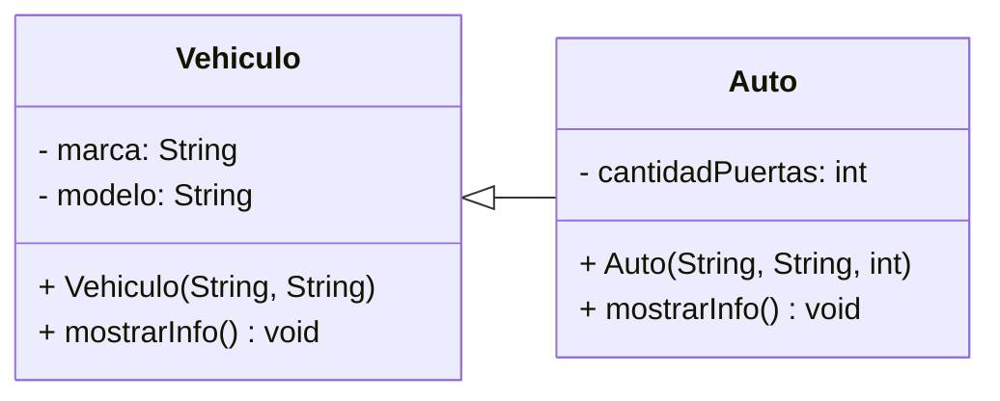
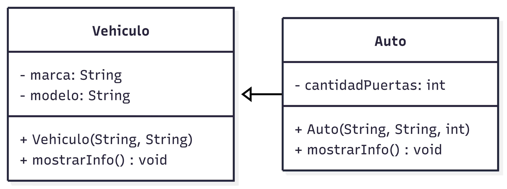
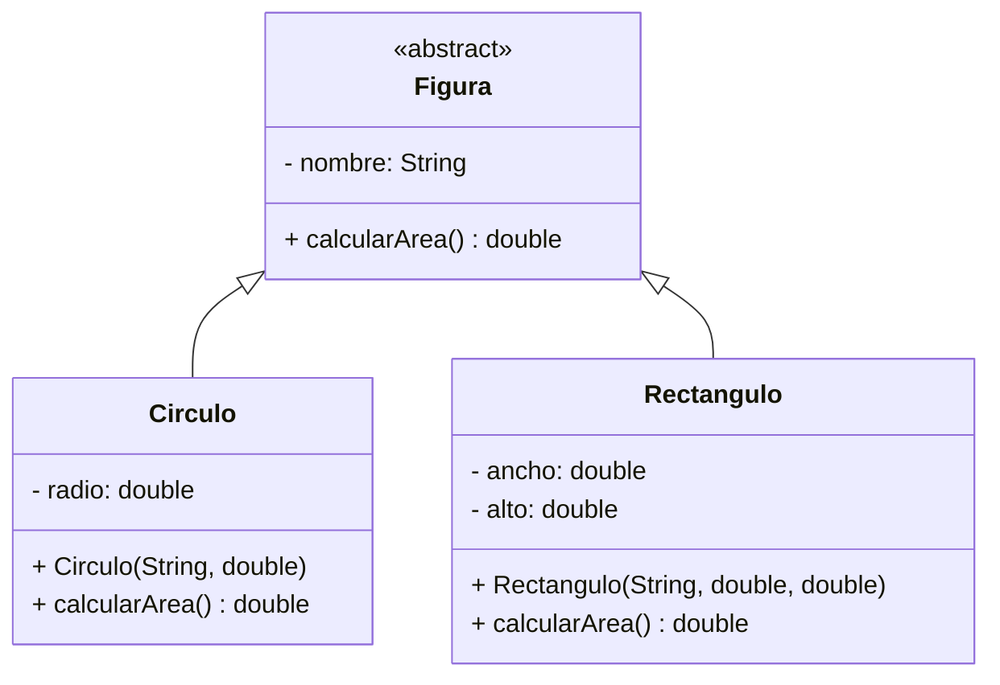
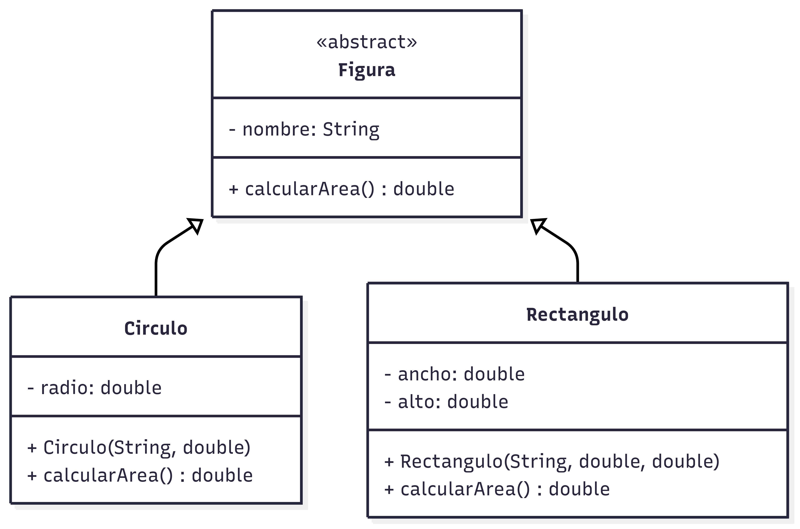
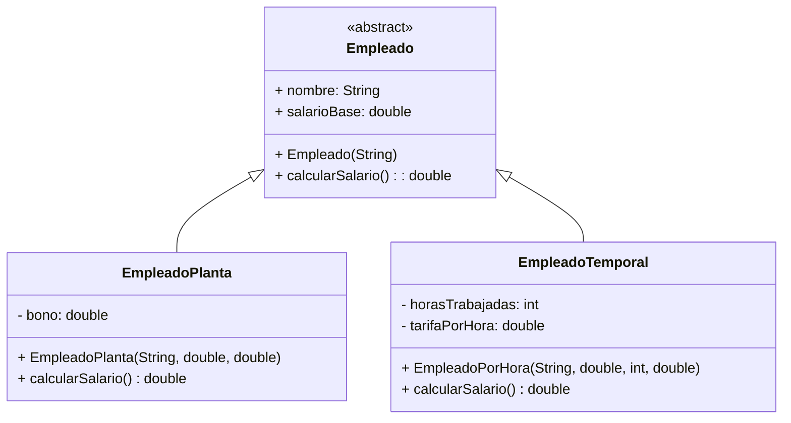
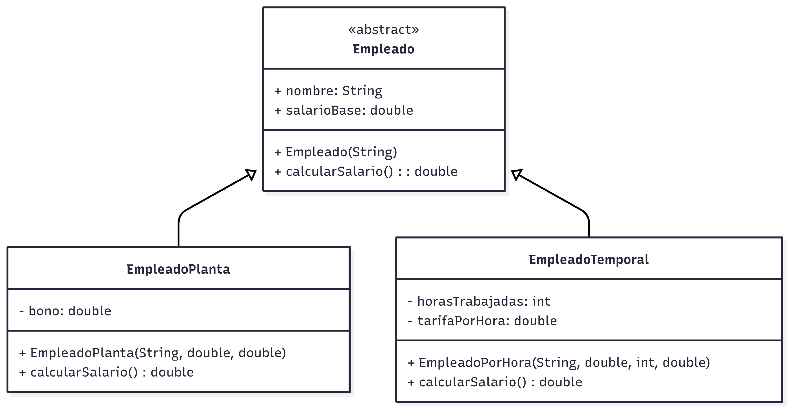
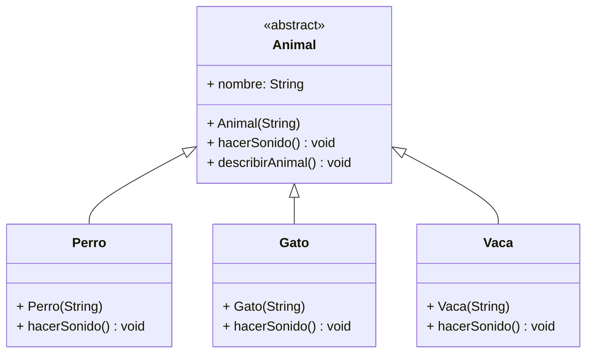
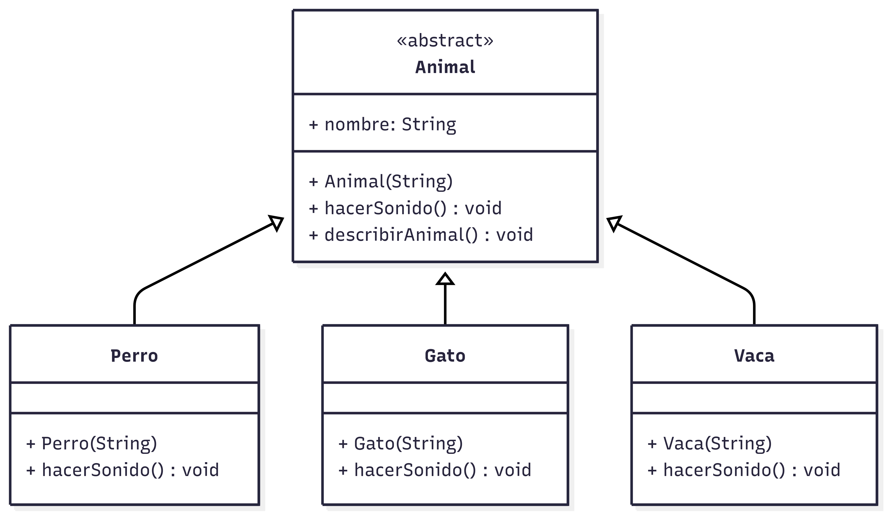
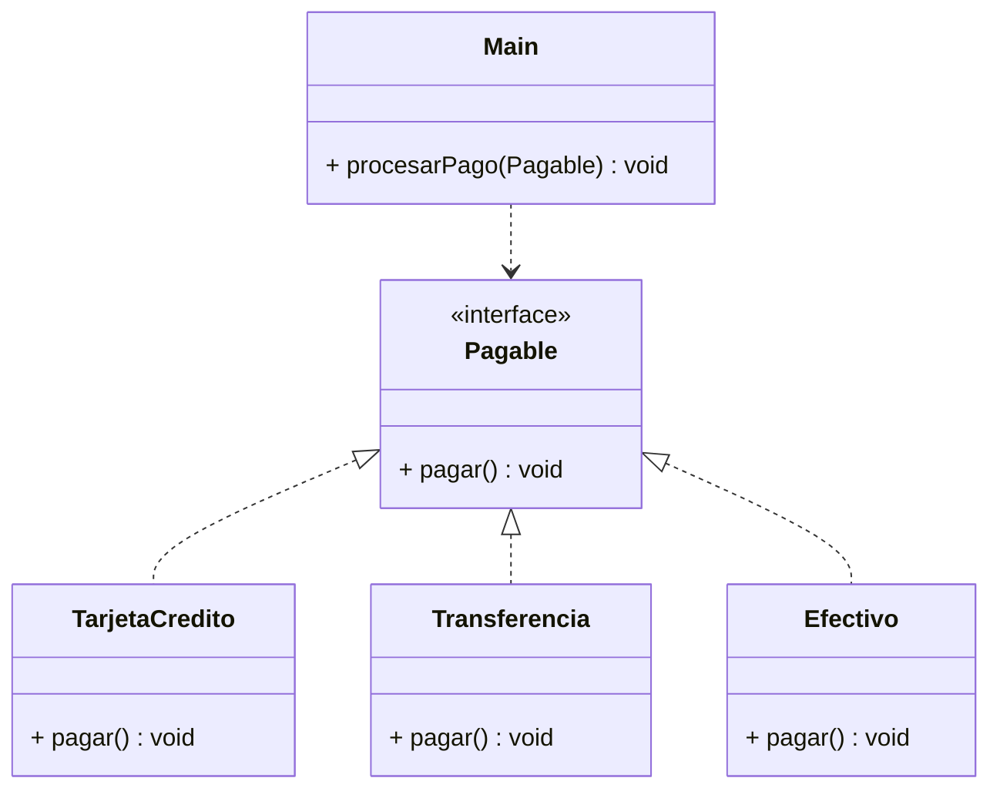
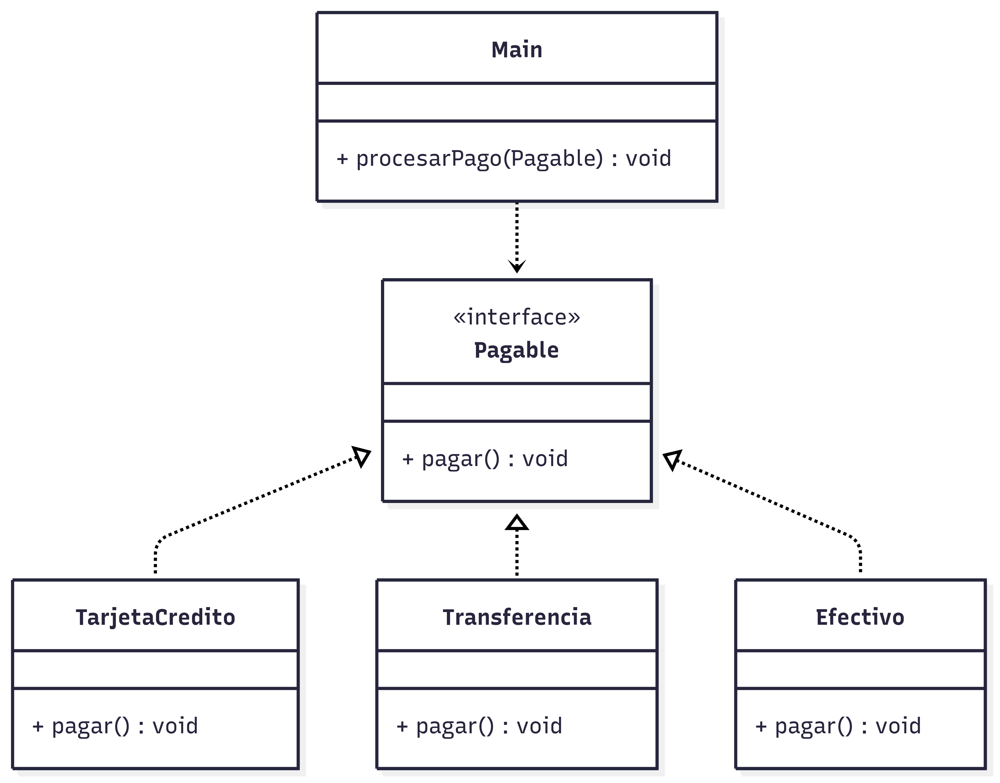

# TP07 - Herencia y Polimorfismo

   [](https://github.com/m415x/UTN-TUPaD-P2/tree/main/src/TP07)

## ✨ Alumno

- **Nombre:** Cristian Daniel Lahoz Piantanida
- **Matrícula:** 101424
- **Comisión:** Ag25-2C 08

## 🎯 Objetivo general

Comprender y aplicar los principios de **herencia** y **polimorfismo** en Java, construyendo jerarquías de clases con relaciones de tipo "es un" y "tiene un", sobrescritura de métodos y uso de constructores en clases derivadas.

---

## 📚 Marco teórico

| Concepto                 | Aplicación en el proyecto                                                                            |
| ------------------------ | ---------------------------------------------------------------------------------------------------- |
| Herencia                 | Permite que las clases hijas reutilicen atributos y métodos de la clase base.                        |
| Superclase y Subclase    | Definen la jerarquía y comportamiento común entre objetos relacionados.                              |
| Polimorfismo             | Permite tratar objetos de distintas clases de manera uniforme mediante referencias de tipo genérico. |
| Sobrescritura de métodos | Personaliza comportamientos heredados de la clase base.                                              |
| Uso de `super()`         | Facilita la inicialización de atributos y métodos del padre desde la subclase.                       |
| Clases abstractas        | Definen comportamientos comunes sin implementación concreta.                                         |
| Métodos abstractos       | Obligan a las subclases a implementar comportamientos específicos.                                   |
| `instanceof` y casting   | Permiten verificar y convertir tipos de objetos dentro de jerarquías de clases.                      |

---

## 🧪 Caso Práctico

### KATA 1 - Herencia de Vehículos

Crear una jerarquía de clases para representar distintos tipos de vehículos.

1. Crear una clase **Vehiculo** con:

   - atributo: marca
   - atributo: modelo
   - método: `mostrarInfo()` que imprima la información básica del vehículo.

2. Crear una subclase **Auto** que herede de Vehiculo y agregue:

   - atributo adicional: cantidadPuertas
   - método sobrescrito: `mostrarInfo()` que incluya también la cantidad de puertas.

3. En el método `main()`, crear instancias de Auto y mostrar su información.

- **Diagrama UML**



<!--  -->

- **Código**

```java
package TP07.ejercicio1;

public abstract class Vehiculo {

    private final String marca;
    private final String modelo;

    public Vehiculo(String marca, String modelo) {
        this.marca = marca;
        this.modelo = modelo;
    }

    public void mostrarInfo() {
        System.out.println("Marca: " + marca
                + "\nModelo: " + modelo);
    }

}
```

```java
package TP07.ejercicio1;

class Auto extends Vehiculo {

    private int cantidadPuertas;

    public Auto(String marca, String modelo, int cantidadPuertas) {
        super(marca, modelo);
        this.cantidadPuertas = cantidadPuertas;
    }

    @Override
    public void mostrarInfo() {
        super.mostrarInfo();
        System.out.println("Cantidad de puertas: " + cantidadPuertas);
    }

}
```

```java
package TP07.ejercicio1;

public class Main {

    public static void main(String[] args) {
        Auto a1 = new Auto("Toyota Corola", "2020", 4);
        Auto a2 = new Auto("Peugeot 3008", "2018", 5);
        Auto a3 = new Auto("Fiat Palio", "2010", 5);

        a1.mostrarInfo();
        a2.mostrarInfo();
        a3.mostrarInfo();
    }

}
```

- **Consola**

```console
Marca: Toyota Corola
Modelo: 2020
Cantidad de puertas: 4
Marca: Peugeot 3008
Modelo: 2018
Cantidad de puertas: 5
Marca: Fiat Palio
Modelo: 2010
Cantidad de puertas: 5
```

---

### KATA 2 - Figuras geométricas

Implementar una jerarquía de clases para figuras geométricas que permita calcular áreas mediante polimorfismo.

1. Crear una clase abstracta **Figura** con:

   - atributo: nombre
   - método abstracto: `calcularArea()`

2. Crear las subclases:

   - Circulo
   - Rectangulo

3. Implementar los métodos de cálculo en cada subclase.

4. En el `main()`, crear un array o lista de Figura y recorrerlo mostrando área de cada figura.

- **Diagrama UML**



<!--  -->

- **Código**

```java
package TP07.kata2;

public abstract class Figura {

    public String nombre;

    public Figura(String nombre) {
        this.nombre = nombre;
    }

    public abstract double calcularArea();

}
```

```java
package TP07.kata2;

public class Circulo extends Figura {

    private double radio;

    public Circulo(String nombre, double radio) {
        super(nombre);
        this.radio = radio;
    }

    @Override
    public double calcularArea() {
        return Math.PI * radio * radio;
    }

}
```

```java
package TP07.kata2;

public class Rectangulo extends Figura {

    private double ancho;
    private double alto;

    public Rectangulo(String nombre, double ancho, double alto) {
        super(nombre);
        this.ancho = ancho;
        this.alto = alto;
    }

    @Override
    public double calcularArea() {
        return ancho * alto;
    }

}
```

```java
package TP07.kata2;

import java.util.ArrayList;
import java.util.List;

public class Main {

    public static void main(String[] args) {
        List<Figura> figuras = new ArrayList();

        Circulo c1 = new Circulo("Circulo 1", 6);
        Circulo c2 = new Circulo("Circulo 2", 3);
        Rectangulo r1 = new Rectangulo("Rectangulo 1", 7, 12);
        Rectangulo r2 = new Rectangulo("Rectangulo 2", 4, 3);

        figuras.add(c1);
        figuras.add(c2);
        figuras.add(r1);
        figuras.add(r2);

        for (Figura figura : figuras) {
            System.out.println("Área del "+ figura.nombre + ": "
                    + String.format("%.2f", figura.calcularArea()) + " cm2");
        }
    }

}
```

- **Consola**

```console
Área del Circulo 1: 113,10 cm2
Área del Circulo 2: 28,27 cm2
Área del Rectangulo 1: 84,00 cm2
Área del Rectangulo 2: 12,00 cm2
```

---

### KATA 3 - Herencia con Empleados

Diseñar una jerarquía para representar distintos tipos de empleados.

1. Clase abstracta **Empleado**:

   - atributo: nombre
   - método: `calcularSalario()`

2. Subclases:

   - EmpleadoPlanta
   - EmpleadoTemporal

3. Sobrescribir `calcularSalario()` en cada subclase.

4. En el `main()`, crear una lista de empleados y mostrar el salario total de cada uno.

- **Diagrama UML**



<!--  -->

- **Código**

```java
package TP07.kata3;

public abstract class Empleado {

    public String name;
    public double salarioBase;

    public Empleado(String name, double salarioBase) {
        this.name = name;
        this.salarioBase = salarioBase;
    }

    public abstract double calcularSalario();

}
```

```java
package TP07.kata3;

public class EmpleadoPlanta extends Empleado {

    private double bono;

    public EmpleadoPlanta(String name, double salarioBase, double bono) {
        super(name, salarioBase);
        this.bono = bono;
    }

    @Override
    public double calcularSalario() {
        return salarioBase + bono;
    }

}
```

```java
package TP07.kata3;

public class EmpleadoTemporal extends Empleado {

    private int horasTrabajadas;
    private double tarifaPorHora;

    public EmpleadoTemporal(String name, int horasTrabajadas, double tarifaPorHora) {
        super(name, 0);
        this.horasTrabajadas = horasTrabajadas;
        this.tarifaPorHora = tarifaPorHora;
    }

    @Override
    public double calcularSalario() {
        return horasTrabajadas * tarifaPorHora;
    }

}
```

```java
package TP07.kata3;

import java.util.ArrayList;
import java.util.List;

public class Main {

    public static void main(String[] args) {
        List<Empleado> empleados = new ArrayList();

        EmpleadoPlanta e1 = new EmpleadoPlanta("Juan Pérez", 700000, 150000);
        EmpleadoPlanta e2 = new EmpleadoPlanta("Pablo Marmol", 560750.5, 0);
        EmpleadoTemporal e3 = new EmpleadoTemporal("Miguel Cervantes", 40, 10000);
        EmpleadoTemporal e4 = new EmpleadoTemporal("Elena Nito", 50, 12358.33);

        empleados.add(e1);
        empleados.add(e2);
        empleados.add(e3);
        empleados.add(e4);

        for (Empleado empleado : empleados) {
            System.out.println(empleado.name + ", salario: $" + empleado.calcularSalario());
        }
    }

}
```

- **Consola**

```console
Juan Pérez, salario: $850000.0
Pablo Marmol, salario: $560750.5
Miguel Cervantes, salario: $400000.0
Elena Nito, salario: $617916.5
```

---

### KATA 4 - Animales (polimorfismo en acción)

Crear una jerarquía para representar distintos tipos de animales.

1. Clase abstracta Animal:

   - atributo: nombre
   - método: `hacerSonido()`
   - método: `describirAnimal()`

2. Subclases:

   - Perro
   - Gato
   - Vaca

3. Cada subclase debe sobrescribir `hacerSonido()` con un comportamiento distinto.

4. En el `main()`, crear una lista de animales y recorrerla invocando sus métodos.

- **Diagrama UML**



<!--  -->

- **Código**

```java
package TP07.kata4;

public abstract class Animal {

    public String name;

    public Animal(String name) {
        this.name = name;
    }

    public abstract String hacerSonido();

    public String describirAnimal() {
        return name + " hace " + hacerSonido();
    };

}
```

```java
package TP07.kata4;

public class Perro extends Animal {

    public Perro(String name) {
        super(name);
    }

    @Override
    public String hacerSonido() {
        return "Guau Guau";
    }

}
```

```java
package TP07.kata4;

public class Gato extends Animal {

    public Gato(String name) {
        super(name);
    }

    @Override
    public String hacerSonido() {
        return "Miaaauuu";
    }

}
```

```java
package TP07.kata4;

public class Vaca extends Animal {

    public Vaca(String name) {
        super(name);
    }

    @Override
    public String hacerSonido() {
        return "Muuuuuuuu";
    }

}
```

```java
package TP07.kata4;

import java.util.ArrayList;
import java.util.List;

public class Main {

    public static void main(String[] args) {
        List<Animal> animales = new ArrayList();

        Perro pedro = new Perro("Pedro");
        Gato bastet = new Gato("Bastet");
        Vaca milka = new Vaca("Milka");

        animales.add(pedro);
        animales.add(bastet);
        animales.add(milka);

        for (Animal animal : animales) {
            System.out.println(animal.describirAnimal());
        }
    }

}
```

- **Consola**

```console
Pedro hace Guau Guau
Bastet hace Miaaauuu
Milka hace Muuuuuuuu
```

---

### KATA 5 - Sistema de Pagos (polimorfismo avanzado)

Modelar un sistema de pagos que use interfaces para representar distintos medios de pago.

1. Crear una interfaz Pagable con:

   - método: `pagar()`

2. Implementar las clases:

   - TarjetaCredito
   - Transferencia
   - Efectivo

3. Cada clase debe implementar el método `pagar()` con un mensaje específico.

4. En el `main()`, crear una lista de objetos Pagable, un método `procesarPago(Pagable medio)` genérico para todos los tipos y recorrer la lista ejecutando `procesarPago()`.

- **Diagrama UML**



<!--  -->

- **Código**

```java
package TP07.kata5;

public interface Pagable {

    void pagar();
}
```

```java
package TP07.kata5;

public class TarjetaCredito implements Pagable {

    @Override
    public void pagar() {
        System.out.println("Pagado con Tarjeta de Crédito");
    }

}
```

```java
package TP07.kata5;

public class Transferencia implements Pagable {

    @Override
    public void pagar() {
        System.out.println("Pagado con Transferencia");
    }

}
```

```java
package TP07.kata5;

public class Efectivo implements Pagable {

    @Override
    public void pagar() {
        System.out.println("Pagado con Efectivo");
    }

}
```

```java
package TP07.kata5;

import java.util.ArrayList;
import java.util.List;

public class Main {

    public static void main(String[] args) {
        List<Pagable> formas = new ArrayList();

        formas.add(new TarjetaCredito());
        formas.add(new Transferencia());
        formas.add(new Efectivo());

        for (Pagable forma : formas) {
            procesarPago(forma);
        }
    }

    public static void procesarPago(Pagable medio) {
        medio.pagar();
    }
}
```

- **Consola**

```console
Pagado con Tarjeta de Crédito
Pagado con Transferencia
Pagado con Efectivo
```

---

## ✅ Conclusiones esperadas

- Comprender el uso de herencia para reutilizar código y crear jerarquías lógicas de clases.
- Aplicar polimorfismo para permitir comportamientos diferentes en objetos del mismo tipo.
- Practicar la sobrescritura de métodos y el uso de super() para extender comportamientos.
- Implementar interfaces para lograr flexibilidad y bajo acoplamiento entre clases.
- Diseñar jerarquías coherentes y bien estructuradas aplicando principios de POO en Java.
