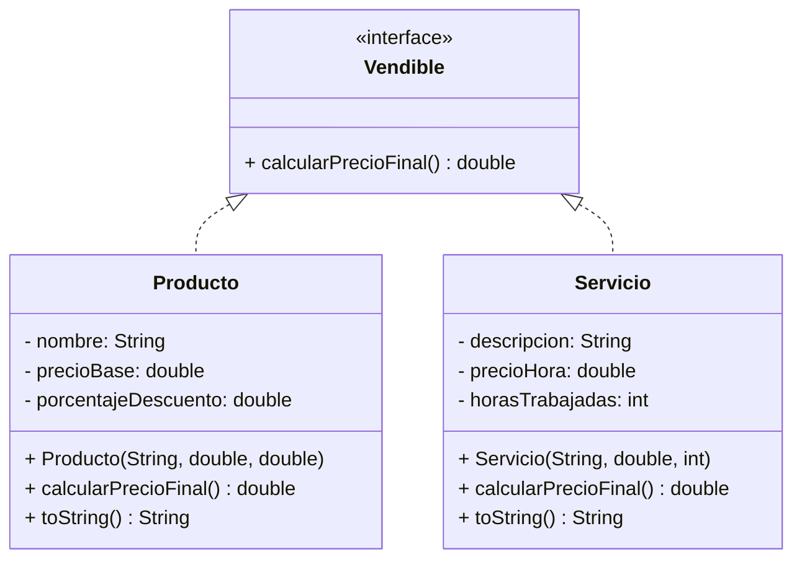
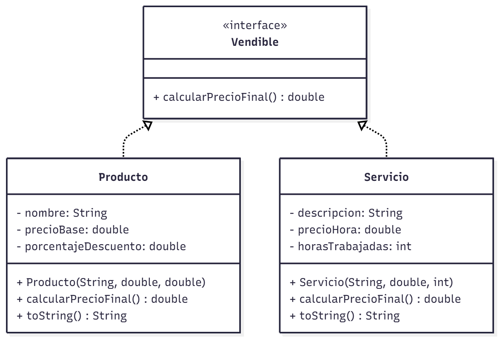
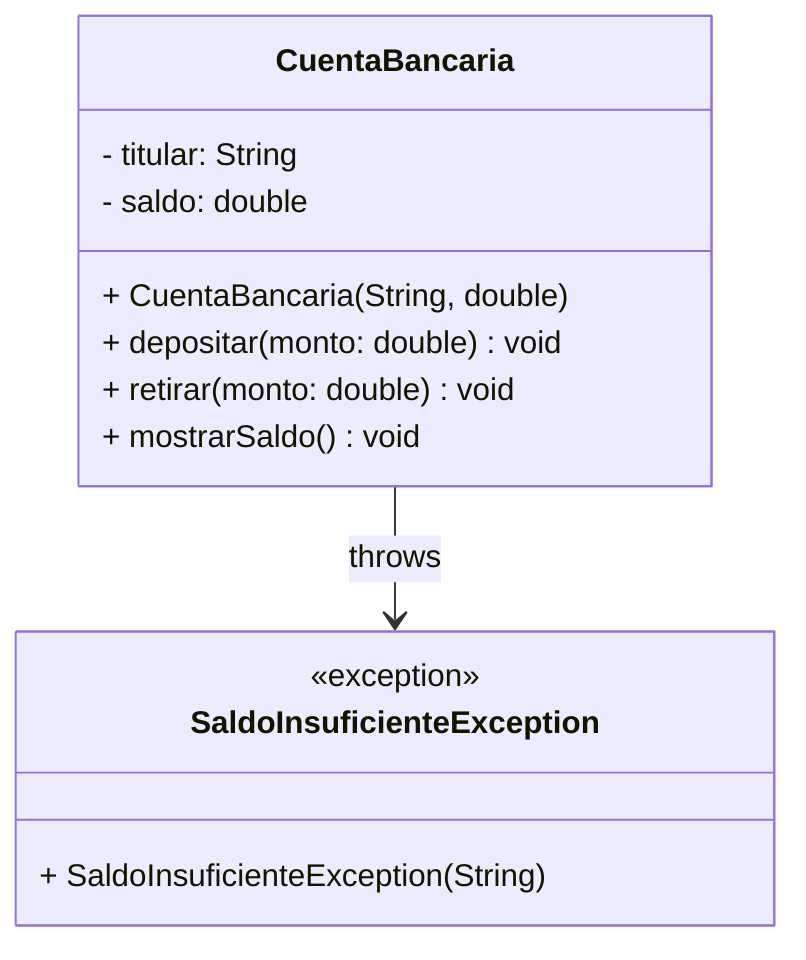
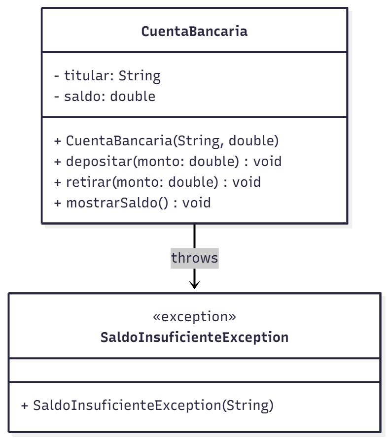

# TP08 - Interfaces y Excepciones en Java

   [](https://github.com/m415x/UTN-TUPaD-P2/tree/main/src/TP08)

## ✨ Alumno

- **Nombre:** Cristian Daniel Lahoz Piantanida
- **Matrícula:** 101424
- **Comisión:** Ag25-2C 08

## 🎯 Objetivo general

Comprender el uso de **interfaces** y **excepciones** en Java, aplicándolos en el diseño de sistemas con comportamiento polimórfico y manejo robusto de errores.

---

## 📚 Marco teórico

| Concepto                   | Aplicación en el proyecto                                               |
| -------------------------- | ----------------------------------------------------------------------- |
| Interfaces                 | Definen contratos de comportamiento común entre clases no relacionadas. |
| Implementación múltiple    | Permite que una clase adopte varios comportamientos.                    |
| Excepciones                | Mecanismo para manejar errores en tiempo de ejecución.                  |
| `try-catch-finally`        | Control estructurado de errores.                                        |
| Excepciones personalizadas | Creación de tipos propios para casos de negocio específicos.            |
| `throw` y `throws`         | Palabras clave para lanzar y propagar excepciones.                      |
| Polimorfismo de interfaces | Invocación genérica de métodos sin conocer la clase concreta.           |

---

## 🧪 Caso Práctico

### Parte 1 - Interfaces

**Consigna: Implementación de Interfaces en un Sistema de E-commerce**

En este ejercicio se implementará un sistema simple de E-commerce utilizando interfaces para representar comportamientos comunes entre diferentes clases.

1. Crear la interfaz **Vendible** que declare el método:

   - `double calcularPrecioFinal()`

2. Crear la clase **Producto** que implemente la interfaz `Vendible`.

   - Atributos: `nombre`, `precioBase`, `porcentajeDescuento`
   - Implementar el método `calcularPrecioFinal()` aplicando el descuento correspondiente.

3. Crear la clase **Servicio** que también implemente la interfaz `Vendible`.

   - Atributos: `descripcion`, `precioHora`, `horasTrabajadas`
   - Implementar el método `calcularPrecioFinal()` multiplicando el precio por hora por las horas trabajadas.

4. En la clase principal, crear una lista de elementos `Vendible` (productos y servicios) y mostrar el precio final de cada uno.

#### UML



<!--  -->

- **Código**

```java
package TP08.parte1;

public interface Vendible {

    double calcularPrecioFinal();

}
```

```java
package TP08.parte1;

public class Producto implements Vendible {

    private String nombre;
    private double precioBase;
    private double porcentajeDescuento;

    public Producto(String nombre, double precioBase, double porcentajeDescuento) {
        this.nombre = nombre;
        this.precioBase = precioBase;
        this.porcentajeDescuento = porcentajeDescuento;
    }

    @Override
    public double calcularPrecioFinal() {
        return precioBase - (precioBase * porcentajeDescuento / 100);
    }

    @Override
    public String toString() {
        return nombre + " - Precio final: $" + String.format("%.2f", calcularPrecioFinal());
    }

}
```

```java
package TP08.parte1;

public class Servicio implements Vendible {

    private String descripcion;
    private double precioHora;
    private int horasTrabajadas;

    public Servicio(String descripcion, double precioHora, int horasTrabajadas) {
        this.descripcion = descripcion;
        this.precioHora = precioHora;
        this.horasTrabajadas = horasTrabajadas;
    }

    @Override
    public double calcularPrecioFinal() {
        return precioHora * horasTrabajadas;
    }

    @Override
    public String toString() {
        return descripcion + " - Precio final: $" + String.format("%.2f", calcularPrecioFinal());
    }

}
```

```java
package TP08.parte1;

import java.util.ArrayList;
import java.util.List;

public class Main {

    public static void main(String[] args) {
        List<Vendible> items = new ArrayList<>();
        items.add(new Producto("Monitor", 150000, 10));
        items.add(new Producto("Teclado", 25000, 5));
        items.add(new Servicio("Instalación de software", 5000, 2));
        items.add(new Servicio("Mantenimiento técnico", 8000, 3));

        System.out.println("Listado de items:");
        for (Vendible v : items) {
            System.out.println(v);
        }
    }

}
```

- **Consola**

```console
Listado de items:
Monitor - Precio final: $135000,00
Teclado - Precio final: $23750,00
Instalación de software - Precio final: $10000,00
Mantenimiento técnico - Precio final: $24000,00
```

---

### Parte 2 - Excepciones

**Consigna:** Manejo de Excepciones en un Sistema de Cuentas Bancarias

En este ejercicio se aplicarán excepciones para validar operaciones sobre cuentas bancarias.

1. Crear la clase **CuentaBancaria** con:

   - Atributos: `titular`, `saldo`
   - Métodos: `depositar(double monto)`, `retirar(double monto)`, `mostrarSaldo()`

2. Crear una excepción personalizada SaldoInsuficienteException que extienda de `Exception`, mostrando un mensaje adecuado.

3. En la clase principal, simular distintas operaciones de depósito y retiro, capturando y mostrando el mensaje de error cuando corresponda.

4. Utilizar bloques `try-catch-finally` para garantizar la ejecución del bloque final independientemente de si ocurre una excepción.

- **Diagrama UML**



<!--  -->

- **Código**

```java
package TP08.parte2;

public class SaldoInsuficienteException extends Exception {

    public SaldoInsuficienteException(String mensaje) {
        super(mensaje);
    }

}
```

```java
package TP08.parte2;

public class CuentaBancaria {

    private String titular;
    private double saldo;

    public CuentaBancaria(String titular, double saldoInicial) {
        this.titular = titular;
        this.saldo = saldoInicial;
    }

    public void depositar(double monto) {
        saldo += monto;
        System.out.println("Depósito exitoso: $" + monto);
    }

    public void retirar(double monto) throws SaldoInsuficienteException {
        if (monto > saldo) {
            throw new SaldoInsuficienteException("Saldo insuficiente para retirar $" + monto);
        }
        saldo -= monto;
        System.out.println("Retiro exitoso: $" + monto);
    }

    public void mostrarSaldo() {
        System.out.println("Saldo actual: $" + String.format("%.2f", saldo));
    }

}
```

```java
package TP08.parte2;

public class Main {

    public static void main(String[] args) {
        CuentaBancaria cuenta = new CuentaBancaria("Cristian Lahoz", 10000);

        try {
            cuenta.mostrarSaldo();
            cuenta.retirar(5000);
            cuenta.retirar(7000);
        } catch (SaldoInsuficienteException e) {
            cuenta.mostrarSaldo();
            System.err.println("Error: " + e.getMessage());
        } finally {
            cuenta.mostrarSaldo();
            System.out.println("Operación finalizada.");
        }
    }

}
```

- **Consola**

```console
Saldo actual: $10000,00
Retiro exitoso: $5000.0
Saldo actual: $5000,00
Error: Saldo insuficiente para retirar $7000.0
Saldo actual: $5000,00
Operación finalizada.
```

---

## ✅ Conclusiones esperadas

- Aplicar interfaces para definir comportamientos comunes sin herencia directa.
- Comprender cómo implementar polimorfismo mediante interfaces.
- Identificar y manejar errores en tiempo de ejecución mediante excepciones.
- Crear y utilizar excepciones personalizadas según la lógica de negocio.
- Utilizar try, catch y finally de forma apropiada para asegurar la estabilidad del programa.
- Consolidar conceptos de abstracción, encapsulamiento y reutilización en Java.
